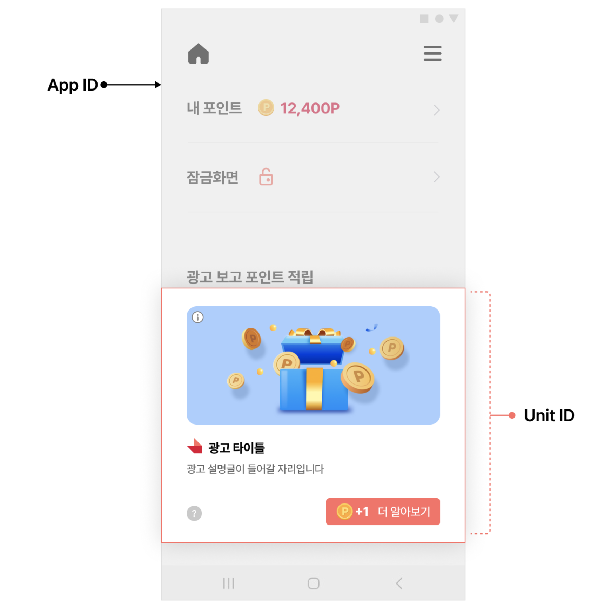
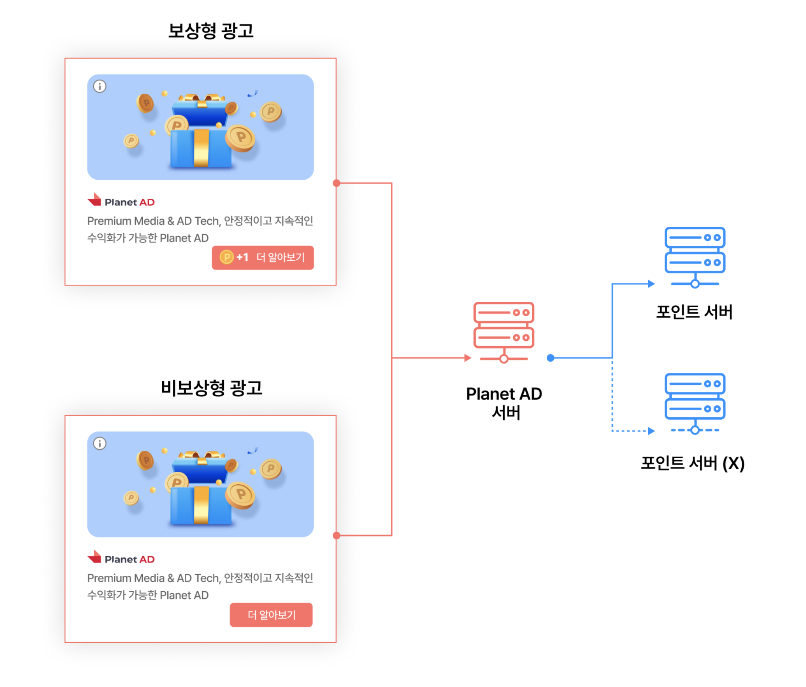
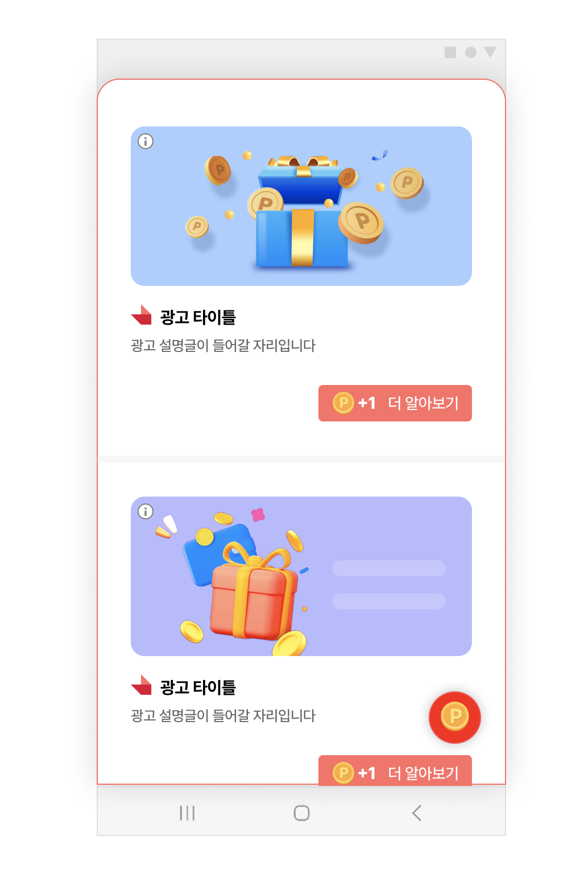
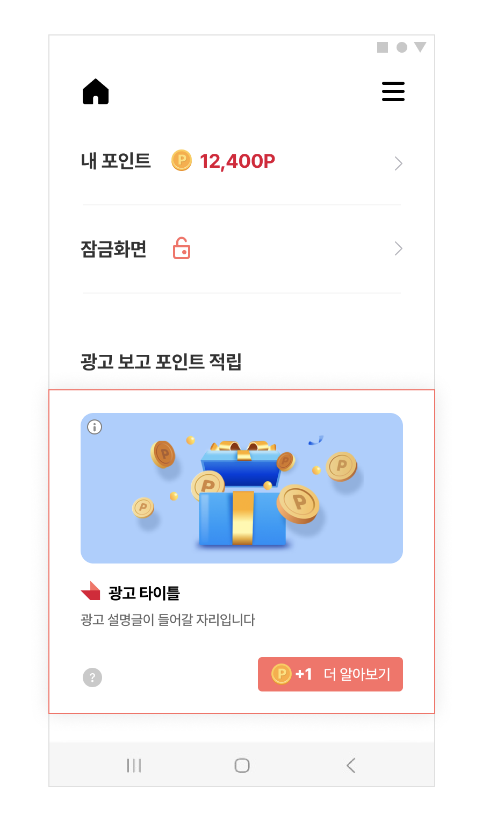
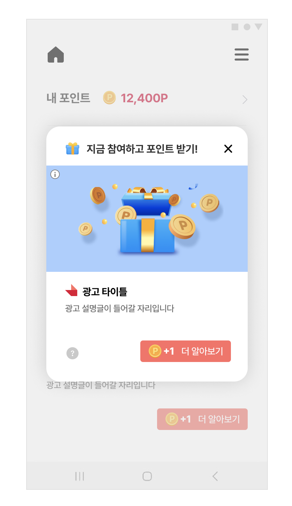

# 01. 시작하기

> [!NOTE]
> **Planet AD SDK 연동의 시작점**입니다.
>
> 이 문서를 순서대로 따라 하면 SDK 설치 → 초기화 → 사용자 프로필 등록까지 마치고, 앱에 광고 지면을 붙일 준비를 완료할 수 있습니다.

## 개요

Planet AD SDK는 앱에 보상형/비보상형 광고 지면을 붙일 수 있게 해주는 SDK입니다. 이 문서는 다음 5단계를 차례로 안내합니다.

1. **기본 요건** 확인 — 내 프로젝트가 SDK를 쓸 수 있는 환경인지 점검

2. **SDK 설치** — Gradle 저장소·라이브러리 설정

3. **SDK 초기화** — App ID 등록 및 SKPAdBenefit 초기화

4. **사용자 프로필 설정** — 광고 할당에 필요한 유저 정보 등록

5. **광고 지면 추가** — Feed / Native / Interstitial 중 원하는 지면 연동

아래 화면처럼, 앱에는 발급받은 **App ID**(앱 식별자)와 **Unit ID**(지면 식별자)를 이용해 광고가 노출됩니다.



## 기본 요건

시작하기 전에, 내 개발 환경이 아래 요건을 모두 만족하는지 확인하세요.

- [ ] Android 4.1 Jellybean (API 레벨 16) 이상
- [ ] Android Studio 3.2 이상
- [ ] Gradle 4.0.1 이상
- [ ] compileSdkVersion 31 이상
- [ ] AndroidX 사용
- [ ] JDK 1.11

## 준비 사항

Planet AD SDK를 연동하려면 아래 두 가지 식별자가 필요합니다.

| ID | 설명 | 비고 |
|---|---|---|
| **App ID** | 앱별 고유 식별자 | 발급이 필요한 경우 SKP 담당자에게 문의 바랍니다. |
| **Unit ID** | 광고 지면별 고유 식별자 | 지면(Feed/Native/Interstitial)마다 발급됩니다. |

### 포인트 적립 서버 연동

SKP 광고에는 참여 시 포인트를 지급하는 **보상형 광고**와, 지급하지 않는 **비보상형 광고**가 있습니다. 사용자가 보상형 광고에 참여하면 포인트 적립 요청을 처리할 서버가 필요할 수 있습니다. 연동 방식에 따라 차이가 있으니 아래 표를 확인해 진행하세요.



| 광고 포인트 지급 여부 | 자체 포인트 시스템 여부 | 설명 |
|---|---|---|
| 지급하지 않음 | - | 비보상형 광고로 연동합니다. 서버 간 연동은 불필요합니다. |
| 지급을 원함 | 없음 | 네이버페이 포인트 등 제3의 포인트 시스템을 이용하여 포인트를 부여할 수 있습니다. SKP 담당자에게 문의하시기 바랍니다. |
| 지급을 원함 | 있음 | 포스트백 연동을 통해 서버 간 연동을 진행할 수 있습니다. |

## SDK 설치

### STEP 1. 프로젝트 레벨 build.gradle에 저장소 추가

먼저 프로젝트 레벨의 build.gradle 파일에 Planet AD SDK 저장소를 설정합니다.

**프로젝트 레벨 build.gradle**

```groovy
// 프로젝트 레벨의 build.gradle
allprojects {
    repositories {
        ...생략...
        // Planet AD 저장소
        maven { url "https://asia-northeast3-maven.pkg.dev/planetad-379102/planetad" }
        ...생략...
    }
}
```

### STEP 2. 모듈 레벨 build.gradle에 라이브러리 추가

그다음 모듈 레벨의 build.gradle 파일에 Planet AD SDK 라이브러리를 설정합니다.

**모듈 레벨 build.gradle**

```groovy
// 모듈 레벨의 build.gradle
dependencies {
    ...생략...
    // Planet AD SDK
    implementation ("com.skplanet.sdk.ad:skpad-benefit:1.17.0") { changing = true }
    ...생략...
}
```

### STEP 3. compileSdkVersion / targetSdkVersion 업데이트

같은 모듈 레벨의 build.gradle에서 compileSdkVersion과 targetSdkVersion을 35로 업데이트합니다.

**모듈 레벨 build.gradle**

```groovy
android {
    compileSdkVersion 35
    defaultConfig {
        targetSdkVersion 35
    }
}
```

## SDK 초기화

### STEP 4. App ID 추가 (AndroidManifest.xml)

AndroidManifest.xml에 APP_KEY를 추가합니다. 아래 예시의 app-pub-000000000000 중 숫자 부분(000000000000)을 발급받은 App ID로 대체합니다.

> [!TIP]
> 예시) 발급받은 App ID가 123456789123일 경우 → android:value="app-pub-123456789123"

**AndroidManifest.xml**

```xml
<manifest>
    <application>
        <!-- Planet AD SDK App id -->
        <meta-data
            android:name="com.skplanet.APP_KEY"
            android:value="app-pub-000000000000" />
    </application>
</manifest>
```

### STEP 5. SKPAdBenefit 초기화 (Application.onCreate)

Application의 onCreate에서 SKPAdBenefit을 초기화합니다.

**Application.onCreate()**

```java
public class App extends Application {
    @Override
    public void onCreate() {
        super.onCreate();
        // SKPAdBenefit 초기화
        final SKPAdBenefitConfig skpAdBenefitConfig = new SKPAdBenefitConfig.Builder(context).build();
        SKPAdBenefit.init(this, skpAdBenefitConfig);
    }
}
```

## 사용자 프로필 설정

사용자 프로필은 **광고 할당 요청 전에** 등록해야 합니다.

> [!WARNING]
> - **필수 정보**를 등록하지 않으면 광고 할당이 되지 않습니다.
> - **권장 정보**를 제외하면 유저 정보 기반의 광고가 할당에서 제외됩니다.

| 구분 | 유저 프로필 | 설명 | 비고 |
|---|---|---|---|
| 필수 | userId | 사용자 고유 식별자 | 서비스 도중에 변하지 않는 값. 앱 삭제 후 재설치 시 유저 ID 값이 변경되는 등, 고정된 유저 ID를 사용하지 못하는 경우 SKP 담당자에게 문의 바랍니다. |
| 권장 | gender | 사용자의 성별 | 남성: UserProfile.Gender.MALE<br>여성: UserProfile.Gender.FEMALE |
| 권장 | birthYear | 사용자의 출생연도 | - |

프로필은 아래와 같이 UserProfile.Builder로 등록합니다.

**사용자 프로필 등록**

```java
// 유저 정보를 등록합니다.
final UserProfile.Builder builder = new UserProfile.Builder(SKPAdBenefit.getUserProfile());
final UserProfile userProfile = builder
    .userId("USER_ID")
    .gender(UserProfile.Gender.MALE)
    .birthYear(1985)
    .build();
SKPAdBenefit.setUserProfile(userProfile);
```

등록한 프로필을 삭제하려면 null을 전달합니다.

**사용자 프로필 삭제**

```java
// SDK에 등록한 사용자 프로필을 삭제합니다.
SKPAdBenefit.setUserProfile(null);
```

> [!IMPORTANT]
> 이후 광고 할당에 문제가 있다면 광고 할당 trouble shooting을 참고하시기 바랍니다.

## 광고 지면 추가

여기까지 왔다면 Planet AD SDK 연동을 위한 기본 설정은 완료된 것입니다. 이제 필요한 광고 지면을 아래 3종 중에서 골라 연동하세요. 지면별 상세 연동 방법은 각 문서에서 안내합니다.

### Feed — 리스트 형태의 광고 지면

여러 광고 카드가 세로로 나열되는 리스트 형태의 지면입니다.



→ [03-1. Feed-기본설정](03-1_feed-basic.md)

### Native — 커스텀 광고 지면

원하는 위치에 자유롭게 배치할 수 있는 커스텀 광고 지면입니다. 배너 타입의 광고도 Native 지면으로 연동할 수 있습니다.



→ [02-1. Native-기본설정](02-1_native-basic.md)

### Interstitial — 전면 광고 지면

화면 전체 또는 팝업 형태로 노출되는 전면 광고 지면입니다.



→ [04-1. Interstitial 기본설정](04-1_interstitial-basic.md)

> **다음 단계**
>
> - [03-1. Feed-기본설정](03-1_feed-basic.md) — 리스트 형태 광고 지면 연동
> - [02-1. Native-기본설정](02-1_native-basic.md) — 커스텀/배너 광고 지면 연동
> - [04-1. Interstitial 기본설정](04-1_interstitial-basic.md) — 전면 광고 지면 연동
> - [05-1. POP-기본설정](05-1_pop-basic.md) - POP 광고 지면 연동
> - [06. 디자인 커스터마이징](06_design-customizing.md) - 디자인 커스터마이징
> - [07. Web Android SDK 연동 가이드](07_web-android-sdk-guide.md) - Web SDK 연동 가이드
