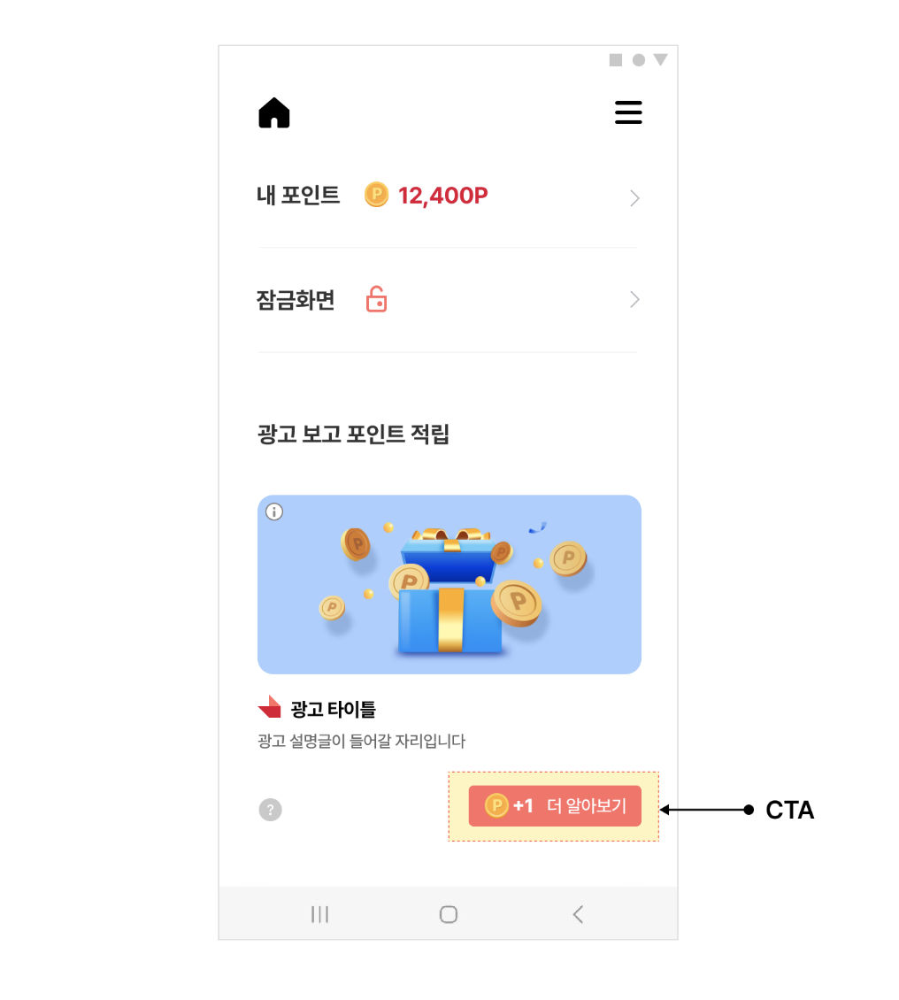

# 02-2. Native-고급설정

> [!NOTE]
> **Native 고급설정**은 [02-1. Native-기본설정](02-1_native-basic.md)에서 만든 지면을 한 단계 더 다듬기 위한 기능 모음입니다.<br>이 문서를 참고하면 CTA 버튼 직접 구현, 여러 광고 동시 로드, 비디오·체류형 광고 처리, 동영상 플레이어 커스터마이징 등 필요한 기능만 골라 적용할 수 있습니다.

## 개요

본 가이드는 Native 지면에서 추가로 제공하는 기능들을 설명합니다. 기본 연동을 마친 뒤 필요에 따라 아래 항목을 골라 참고하면 지면을 더욱 고도화할 수 있습니다.

> [!IMPORTANT]
> 이 문서의 기능들은 서로 독립적입니다. 필요한 항목만 골라 적용하면 되며, 순서대로 모두 적용할 필요는 없습니다.

## CtaView 버튼 커스터마이징

Planet AD SDK가 기본으로 제공하는 CtaView UI 및 처리 로직을 사용하지 않고 직접 구현하려는 경우, 다음과 같이 수정할 수 있습니다.



**populateAd() — 커스텀 CTA 뷰 사용**

```java
public void populateAd(final NativeAd nativeAd) {
    final NativeAdView view = findViewById(R.id.native_ad_view);

    final Ad ad = nativeAd.getAd();

    // create ad component
    ...생략...

    final YourCtaView ctaView = view.findViewById(R.id.your_cta_view);
    updateCtaStatus(ctaView, nativeAd);

    ...생략...
    final List<View> clickableViews = new ArrayList<>();
    clickableViews.add(customizedCtaView);

    ...생략...
    nativeAdView.addOnNativeAdEventListener(new NativeAdView.OnNativeAdEventListener() {
        ...(생략)...
        @Override
        public void onClicked(@NonNull NativeAdView view, @NonNull NativeAd nativeAd) {
            updateCtaStatus(ctaView, nativeAd);;
        }

        @Override
        public void onParticipated(@NonNull NativeAdView view, @NonNull NativeAd nativeAd) {
            updateCtaStatus(ctaView, nativeAd);
        }
    });
}
// 기획에 따라 수정될 수 있는 예시 코드입니다.
void updateCtaStatus(YourCtaView ctaView, NativeAd nativeAd) {
    final String callToAction = nativeAd.getAd().getCallToAction();
    final int reward = nativeAd.getAvailableReward();
    final int totalReward = nativeAd.getAd().getReward();
    final boolean participated = nativeAd.isParticipated();
    final boolean isClicked = nativeAd.isClicked();
    final boolean isActionType = nativeAd.getAd().isActionType();

    if (isClicked && isActionType && !participated) {
        ctaView.setCtaText("참여 확인 중");
        ctaView.setRewardIcon(null);
        ctaView.setRewardText(null);
    } else {
        if (totalReward > 0 && participated) {
            ctaView.setRewardIcon(R.drawable.your_reward_received_icon);
            ctaView.setRewardText(null);
            ctaView.setCtaText("참여 완료");
        } else if (reward > 0) {
            ctaView.showRewardImage(R.drawable.your_reward_icon);
            ctaView.setRewardText(String.format(Locale.US, "+%,d", reward));
            ctaView.setCtaText(callToAction);
        } else {
            ctaView.showRewardImage(null);
            ctaView.setRewardText(null);
            ctaView.setCtaText(callToAction);
        }
    }
}
```

## 한번에 여러 개의 광고 로드

한 번의 광고 요청으로 여러 개의 광고를 할당받을 수 있습니다.

다음은 NATIVE_ADS_COUNT를 지정하여 여러 개의 광고를 할당받는 예시입니다.

> [!IMPORTANT]
> Count를 0으로 설정하면 해당 Unit의 Target Fill 설정값을 따릅니다.

**여러 개 광고 로드**

```java
final NativeAdLoader loader = new NativeAdLoader("YOUR_NATIVE_AD_UNIT_ID");
loader.loadAds(new NativeAdLoader.OnAdsLoadedListener() {
    @Override
    public void onLoadError(@NonNull AdError adError) {
        ...
    }

    @Override
    public void onAdsLoaded(@NonNull Collection<NativeAd> collection) {
        ...
    }
}, NATIVE_ADS_COUNT);
```

## 비디오 광고 리스너 등록

비디오형 광고에서 발생하는 이벤트를 수신할 수 있습니다.

다음은 MediaView에 비디오 광고 이벤트 리스너를 등록하는 예시입니다.

**비디오 이벤트 리스너 등록**

```java
mediaView.setVideoEventListener(new VideoEventListener() {
    @Override
    public void onVideoStarted() {
    }

    @Override
    public void onError(@NonNull VideoErrorStatus videoErrorStatus, @Nullable String errorMessage) {
        if (errorMessage != null) {
            Toast.makeText(mediaView.getContext(), errorMessage, Toast.LENGTH_SHORT).show();
        }
    }

    @Override
    public void onResume() {
    }

    @Override
    public void onPause() {
    }

    @Override
    public void onReplay() {
    }

    @Override
    public void onVideoEnded() {
        // 동영상 재생 완료시 필요한 처리
    }

    @Override
    public void onLanding() {
        // 동영상 광고 랜딩시 필요한 처리
    }
});
```

## 체류형 광고 설정 `v1.16.0+`

일부 광고는 체류형 광고로 설정 시 가변적인 체류 시간과 포인트를 가집니다. 체류 시간의 단위는 초(s)이며, 소수도 설정할 수 있습니다(예: 3.5초).

> [!IMPORTANT]
> 체류형 광고는 P.AD SDK **v1.16.0부터** 지원됩니다.

### 광고 표시 예시

앱에서 체류형 광고에 대한 고지가 필요할 경우, 아래와 같이 현재 광고가 체류형인지, 또 체류 시간이 얼마인지 확인할 수 있습니다.

**체류형 광고 여부 확인**

```java
private View populateAd(final NativeAd nativeAd) {
    final Ad ad = nativeAd.getAd();
    (...중략...)
    float rewardDelay = nativeAd.getAd().getRewardDelay();
    boolean isStayAd = nativeAd.getAd().isStayAd();

    // 체류형 광고인지 확인
    if (isStayAd) {
        // 체류형 광고인 경우 필요시 사용자에게 고지
        labelText.setText("체류형 광고입니다. 보상지급 딜레이 : " + rewardDelay + "초");
    }
```

### 광고 Event 처리 예시

광고 클릭 시 고지가 필요한 경우, 아래와 같이 사용자에게 체류형 광고 시나리오를 안내할 수 있습니다.

**체류형 광고 이벤트 처리**

```java
nativeAdView.addOnNativeAdEventListener(new NativeAdView.OnNativeAdEventListener() {
    @Override
    public void onImpressed(final @NonNull NativeAdView view, final @NonNull NativeAd nativeAd) {
    }

    @Override
    public void onClicked(@NonNull NativeAdView view, @NonNull NativeAd nativeAd) {
        ctaPresenter.bind(nativeAd);
        // 체류형 광고인 경우, 참여하지 않은 광고에만 사용자 고지
        if (nativeAd.getAd().isStayAd() && !nativeAd.isParticipated()) {
            showMessage(view.getContext(), "체류형 광고입니다." + nativeAd.getAd().getRewardDelay() + "초만큼 머물러 주세요", Toast.LENGTH_SHORT).show();
        }
    }

    @Override
    public void onRewardRequested(@NonNull NativeAdView view, @NonNull NativeAd nativeAd) {
    }

    @Override
    public void onRewarded(@NonNull NativeAdView view, @NonNull NativeAd nativeAd, @Nullable RewardResult rewardResult) {
        // 빠른 복귀 시에 사용자 고지.
        if (rewardResult == RewardResult.TOO_SHORT_TO_PARTICIPATE) {
            showMessage(view.getContext(), "너무 빨리 돌아 오셨어요" + nativeAd.getAd().getRewardDelay() + "초만큼 머물러 주세요", Toast.LENGTH_SHORT).show();
        }
    }

    @Override
    public void onParticipated(final @NonNull NativeAdView view, final @NonNull NativeAd nativeAd) {
        ctaPresenter.bind(nativeAd);
    }
});
```

> [!IMPORTANT]
> **참고 사항** — 체류형 광고는 0포인트 광고로 설정되지 않습니다. 0포인트 광고인 경우 체류형 체크는 불필요합니다.

## 동영상 자동재생에 대한 설정

동영상 광고의 재생 방식을 변경할 수 있습니다.

다음은 동영상 광고를 자동재생으로 설정하는 예시입니다.

**동영상 자동재생 설정**

```java
SKPAdBenefit.setUserPreferences(
    new UserPreferences.Builder(SKPAdBenefit.getUserPreferences())
        .autoplayType(동영상 자동 재생 타입)
        .build()
```

선택 가능한 설정값은 다음과 같습니다.

| Type Name | Description |
|---|---|
| AutoplayType.DISABLED | 자동 재생을 사용하지 않습니다. |
| AutoplayType.ENABLED | 항상 자동 재생됩니다. |
| AutoplayType.ON_WIFI | WiFi 환경에서만 자동 재생됩니다. |

앱에서 직접 설정하지 않는 경우 Admin의 Unit 설정값을 따라 동작합니다. 명시적으로 서버 설정을 따르게 하려면 아래와 같이 null을 전달하면 됩니다.

**서버 설정 따르기 (null 전달)**

```java
SKPAdBenefit.setUserPreferences(
    new UserPreferences.Builder(SKPAdBenefit.getUserPreferences())
        .autoplayType(null)
        .build()
```

## 동영상 Player 커스터마이징

동영상 재생 시 표시되는 Sound Button, FullScreen Button, Remaining Time View를 커스터마이징할 수 있습니다.

### 아이콘 변경

아이콘 변경을 위해 SDK는 VideoUIConfig 클래스를 제공합니다. 아래는 아이콘을 변경하는 예시입니다.

**플레이어 아이콘 변경**

```java
final MediaView mediaView = (MediaView) feedNativeAdView.findViewById(R.id.mediaView);

mediaView.setVideoUIConfig(new VideoUIConfig.Builder()
    .fullscreenIcon(R.drawable.skpad_ic_fullscreen)   // FullScreen Icon
    .soundIconSelector(R.drawable.skpad_ic_volume)     // Sound(Mute) Icon
    .playButtonIcon(R.drawable.exo_icon_play)          // Play Icon
    .build()
);
```

### 버튼, 적립 잔여 시간 위치 변경

Player에 표시되는 버튼들의 노출 여부와 위치를 변경하기 위해 SDK는 VideoPlayerOverlayView 클래스를 제공합니다. 앱에서는 이 클래스를 상속받아 레이아웃에 직접 뷰들의 위치를 설정함으로써 위치를 변경할 수 있습니다.

다음은 동영상 OverlayView를 커스터마이징하는 예시입니다.

<details>
<summary>VideoPlayerOverlayView 상속 클래스 예시 보기</summary>

**YourVideoPlayerOverlayView.java**

```java
public class YourVideoPlayerOverlayView extends VideoPlayerOverlayView {

    private TextView timeLeftTextView;
    private ImageView soundImageView;
    private ImageView fullScreenView;

    public SKPAdVideoPlayerOverlayView(Context context) {
        super(context);
        LayoutInflater.from(context).inflate(R.layout.your_video_overlayview_layout, this, true);

        timeLeftTextView = findViewById(R.id.overlay_time_left);
        soundImageView = findViewById(R.id.sound_button);
        fullScreenView = findViewById(R.id.fullscreen_button);
    }

    @Override
    public ImageView getSoundButton() {
        return soundImageView;
    }

    @Override
    public View getRemainingTimeView() {
        return timeLeftTextView;
    }

    @Override
    public View getFullscreenButton() {
        return fullScreenView;
    }

    @Override
    public void onVideoPlayTimeUpdated(long videoDuration, long currentTime, long minimumTimeForReward) {
        long remainingTimeForReward = Math.max(0, (minimumTimeForReward - currentTime) / 1000);

        String timeLeftForRewardText;

        if (remainingTimeForReward > 0) {
            long minutes = remainingTimeForReward / 60;
            long seconds = remainingTimeForReward % 60;
            timeLeftForRewardText = String.format("%02d:%02d", minutes, seconds);
        } else {
            timeLeftForRewardText = "";
        }

        timeLeftTextView.setText(timeLeftForRewardText);
    }
}
```

</details>

<details>
<summary>your_video_overlayview_layout.xml 예시 보기</summary>

**res/layout/your_video_overlayview_layout.xml**

```xml
<?xml version="1.0" encoding="utf-8"?>
<FrameLayout xmlns:android="http://schemas.android.com/apk/res/android"
    xmlns:app="http://schemas.android.com/apk/res-auto"
    android:layout_height="match_parent"
    android:layout_width="match_parent" >
    <ImageButton
        android:id="@+id/fullscreen_button"
        android:layout_width="wrap_content"
        android:layout_height="wrap_content"
        android:layout_gravity="bottom|right"
        android:background="@null"
        android:padding="8dp"
        android:src="@drawable/skpad_ic_fullscreen"
        />
    <ImageView
        android:id="@+id/sound_button"
        android:layout_width="wrap_content"
        android:layout_height="wrap_content"
        android:layout_gravity="bottom|left"
        android:background="@null"
        android:padding="8dp"
        android:clickable="true"
        android:src="@drawable/skpad_ic_volume" />
    <TextView
        android:id="@+id/overlay_time_left"
        android:layout_width="wrap_content"
        android:layout_height="wrap_content"
        android:layout_gravity="top|left"
        android:layout_marginTop="12dp"
        android:layout_marginLeft="13dp"
        android:layout_marginRight="8dp"
        android:gravity="center"
        android:minWidth="50dp"
        android:minHeight="22dp"
        android:padding="4.5dp"
        android:textColor="#FF0000"
        android:textSize="30sp"
        android:visibility="invisible"/>
</FrameLayout>
```

</details>

마지막으로 커스텀 OverlayView를 MediaView에 설정합니다.

**MediaView에 커스텀 OverlayView 설정**

```java
final MediaView mediaView = (MediaView) feedNativeAdView.findViewById(R.id.mediaView);
mediaView.setVideoPlayerOverlayView(new YourVideoPlayerOverlayView(parent.getContext()));
```

> **다음 단계**
>
> - [02-1. Native-기본설정](02-1_native-basic.md) — Native 지면 기본 연동
> - [02-3. Native-HTML Banner](02-3_native-html-banner.md) — HTML 배너 타입 연동
> - [02-4. Native-TOP DA](02-4_native-top-da.md) — TOP DA 이미지 타입 연동
> - [02-5. Native-CarouselView](02-5_native-carousel-view.md) — 좌우 스와이프 캐러셀 타입 연동
