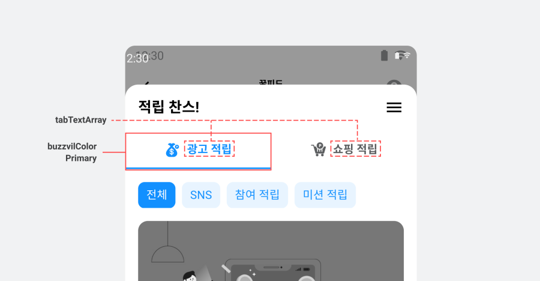
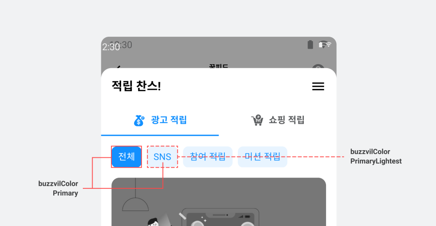

# 03-3. Feed-디자인 커스터마이징

> [!NOTE]
> **Feed 디자인 커스터마이징**은 Planet AD SDK가 제공하는 UI의 **기본 구성은 그대로 유지**하면서, 색상과 문구만 바꿔 앱에 어울리게 다듬는 방법입니다.<br>이 문서를 따라 하면 탭과 필터의 디자인을 손쉽게 변경할 수 있습니다.

## 개요

이 문서에서는 Planet AD SDK가 제공하는 UI의 구성을 지키면서 디자인을 변경하는 방법을 안내합니다.

> [!TIP]
> 구성 자체를 바꾸는 등 더 폭넓은 디자인 변경이 필요하면, [03-2. Feed-고급설정](03-2_feed-advanced.md)에서 UI를 **자체 구현**하는 방법으로 진행하세요.

## 탭 UI 변경

탭의 디자인은 아래 두 가지 방법으로 수정합니다.

- **색상**: 테마 적용을 통해 변경합니다. (buzzvilColorPrimary 등)
- **문구**: FeedConfig를 설정해 변경합니다.



탭에 들어갈 문구는 tabTextArray로 지정합니다.

**FeedConfig — 탭 문구 변경**

```java
final FeedConfig feedConfig = new FeedConfig.Builder(context, "YOUR_FEED_UNIT_ID")
    .tabTextArray(new String[] { FIRST_TAB_NAME, SECOND_TAB_NAME }) // 탭에 들어갈 문구
    .build();
```

## 필터 UI 변경

필터의 디자인은 아래처럼 색상으로 수정합니다. 필터의 색상을 변경하려면 **테마 적용**을 참고하세요.



- 선택된 필터: buzzvilColorPrimary
- 선택되지 않은 필터: buzzvilColorPrimaryLightest

> **다음 단계**
>
> - [03-1. Feed-기본설정](03-1_feed-basic.md) — Feed 지면 초기화·표시·preload 기본기
> - [03-2. Feed-고급설정](03-2_feed-advanced.md) — 탭·필터 자체 구현, 광고 UI 커스터마이징
> - [03-4. Feed-고급설정-Grid 타입](03-4_feed-advanced-grid.md) — 2열 그리드 형태 연동
