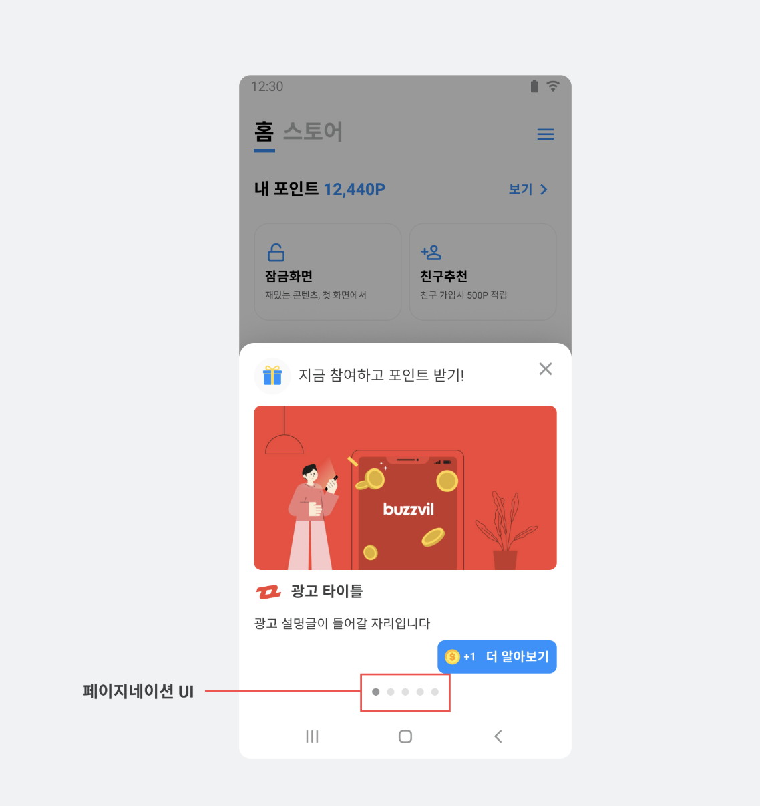
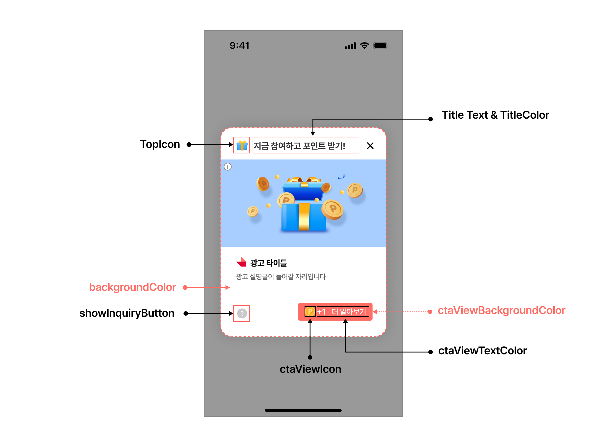

# 04-2. Interstitial 고급설정 - Dialog, BottomSheet

> [!NOTE]
> **Dialog · BottomSheet 고급설정**은 Interstitial 지면의 광고 개수, 종료·요청 결과 콜백, 지면 UI 디자인을 세밀하게 제어하는 방법입니다.<br>이 문서를 따라 하면 광고 개수를 지정하고, 이벤트 콜백을 받고, 지면 UI를 원하는 디자인으로 바꿀 수 있습니다.

## 개요

이 문서는 Planet AD SDK의 Interstitial 지면(Dialog, BottomSheet) 연동에서 사용할 수 있는 기능과 각 기능의 사용 방법을 안내합니다.

> [!IMPORTANT]
> 시작 전 [04-1. Interstitial 기본설정](04-1_interstitial-basic.md)으로 기본 연동을 먼저 완료하세요.

## 광고 개수 설정

바텀시트 형태의 Interstitial 지면은 **복수 개의 광고**를 표시할 수 있습니다. 여러 광고는 페이지네이션 UI로 넘겨볼 수 있습니다.



다음은 3개의 광고를 할당받는 예시입니다.

**광고 개수 지정 후 표시**

```java
InterstitialAdConfig interstitialAdConfig = new InterstitialAdConfig.Builder()
    .adCount(3)
    .build();
interstitialAdHandler.show(context, interstitialAdConfig);
```

> [!IMPORTANT]
> 개수를 지정하지 않거나 0을 지정하면 Admin의 Unit 설정에 설정된 개수대로 전달됩니다.

## 종료에 대한 콜백

Interstitial 지면이 종료되는 이벤트를 수신할 수 있습니다. 필요에 따라 종료 시점에 원하는 기능을 추가할 수 있습니다.

다음은 Interstitial 지면이 종료되는 이벤트를 수신하는 예시입니다.

**종료 콜백 수신**

```java
interstitialAdHandler.show(MainActivity.this, interstitialAdConfig, new InterstitialAdHandler.OnInterstitialAdEventListener() {

    // ...

    @Override
    public void onFinish() {
        // 인터스티셜 종료 시
    }
});
```

## 광고 요청 결과에 대한 콜백

광고 로드의 성공·실패 결과를 콜백으로 받을 수 있습니다.

**로드 결과 콜백 수신**

```java
interstitialAdHandler.show(MainActivity.this, interstitialAdConfig, new InterstitialAdHandler.OnInterstitialAdEventListener() {
    // ...

    @Override
    public void onAdLoaded() {
        // 로드 성공시
    }

    @Override
    public void onAdLoadFailed(AdError error) {
        // 로드 실패시. error를 통해 로드 실패 이유를 알 수 있음
    }
});
```

## 지면 UI의 구성

SKPAdBenefit AOS SDK에서 제공하는 Interstitial 지면 UI의 구성을 지키며 디자인을 변경하는 방법을 안내합니다.

Interstitial 지면 UI는 Config 설정으로 변경할 수 있으며, 일부 설정은 지면 종류에 따라 적용되지 않습니다. 아래는 각 설정 요소가 화면에서 어디에 해당하는지를 보여줍니다.



아래 표에서 지면 종류(Dialog / BottomSheet)에 따라 설정 가능한 Config를 확인할 수 있습니다.

| Config | 설명 | Dialog | BottomSheet |
|---|---|---|---|
| titleText | Interstitial 광고 상단에 있는 Text | O | O |
| titleTextColor | titleText의 색깔 | O | O |
| backgroundColor | Interstitial 광고 전체의 배경 색깔 | O | O |
| showInquiryButton | 문의하기 버튼 노출 여부 (아래 주의 참고) | O | O |
| topIcon | Interstitial 광고 상단에 있는 아이콘 | O | O |
| ctaViewBackgroundColor | CTA의 배경 색깔 | O | O |
| ctaViewIcon | CTA에 포함된 기본 아이콘 | O | O |
| ctaViewTextColor | CTA의 Text 색깔 | O | O |
| adCount | 광고 요청 수 | - | O |

> [!WARNING]
> **showInquiryButton(문의하기 버튼) — 만 14세 미만 처리 주의**
>
> - Planet AD는 만 14세 미만 아동에게 (맞춤형) 리워드 광고를 송출하지 않습니다.
> - 따라서 만 14세 미만 고객에게는 Planet AD SDK가 제공하는 VOC(문의하기) 기능을 제공해서는 안 됩니다.
> - APP에서는 고객이 만 14세 미만일 경우 VOC(문의하기)로 진입할 수 있는 기능을 **비활성화 혹은 숨김 처리**해야 합니다.
> - 제공 여부는 APP 정책에 따라 결정이 필요합니다.

### 지면 UI 변경 예시

다음은 Interstitial 지면 UI를 변경하는 예시입니다. CTA의 배경색·텍스트 색상은 ColorStateList로 상태별 색상을 지정합니다.

<details>
<summary>지면 UI 변경 전체 코드 보기</summary>

**InterstitialAdConfig로 지면 UI 변경**

```java
InterstitialAdConfig interstitialAdConfig = new InterstitialAdConfig.Builder()
    .topIcon("YOUR_ICON_ID")                                          // Interstitial 지면 상단에 있는 아이콘
    .titleText("YOUR_TITLE_TEXT")                                     // Interstitial 지면 상단에 있는 Text
    .textColor("YOUR_TITLE_COLOR")                                    // Interstitial 지면 상단에 있는 Text 색상
    .layoutBackgroundColor("YOUR_BACKGROUND_COLOR")                  // Interstitial 지면 배경색
    .showInquiryButton(true)                                          // 문의하기 버튼 노출 여부
    .ctaViewBackgroundColorList(getBackgroundColorStateList())        // CTA의 배경색
    .ctaViewTextColor(getTextColorStateList())                        // CTA의 Text 색상
    .ctaRewardDrawable                                                // CTA에 포함된 기본 아이콘
    .ctaParticipatedDrawable                                          // CTA의 지급 완료 시점 아이콘
    .adCount(3)                                                       // 광고 요청 갯수(BottomSheet만 지원)
    .build();

// CTA 배경 색상 처리
private fun getBackgroundColorStateList(): ColorStateList {
    val states = arrayOf(
        intArrayOf(android.R.attr.state_enabled),
        intArrayOf(android.R.attr.state_pressed)
    )
    val colors = intArrayOf(
        ContextCompat.getColor(requireActivity(), android.R.color.holo_green_light),
        ContextCompat.getColor(requireActivity(), android.R.color.holo_green_dark)
    )
    return ColorStateList(states, colors)
}

// CTA Text 색상 처리
private fun getTextColorStateList(): ColorStateList {
    val states = arrayOf(
        intArrayOf(android.R.attr.state_enabled),
        intArrayOf(android.R.attr.state_pressed)
    )
    val colors = intArrayOf(
        Color.WHITE,
        Color.WHITE
    )
    return ColorStateList(states, colors)
}
```

</details>

> **다음 단계**
>
> - [04-3. Interstitial 고급설정 - Full Screen Default 타입](04-3_interstitial-advanced-fullscreen-default.md) — 풀스크린 기본 타입 연동
> - [04-4. Interstitial 고급설정 - Fullscreen No Edge 타입](04-4_interstitial-advanced-fullscreen-no-edge.md) — 풀스크린 No Edge 타입 연동
> - [04-5. Interstitial 디자인 커스터마이징](04-5_interstitial-customizing.md) — 타이틀·색상·아이콘 변경
