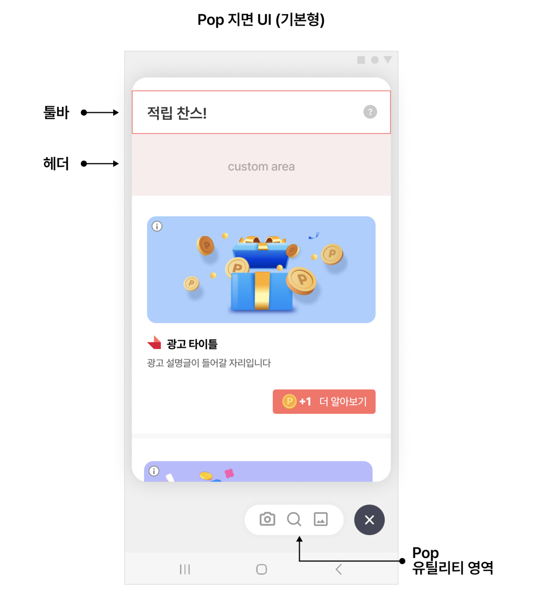
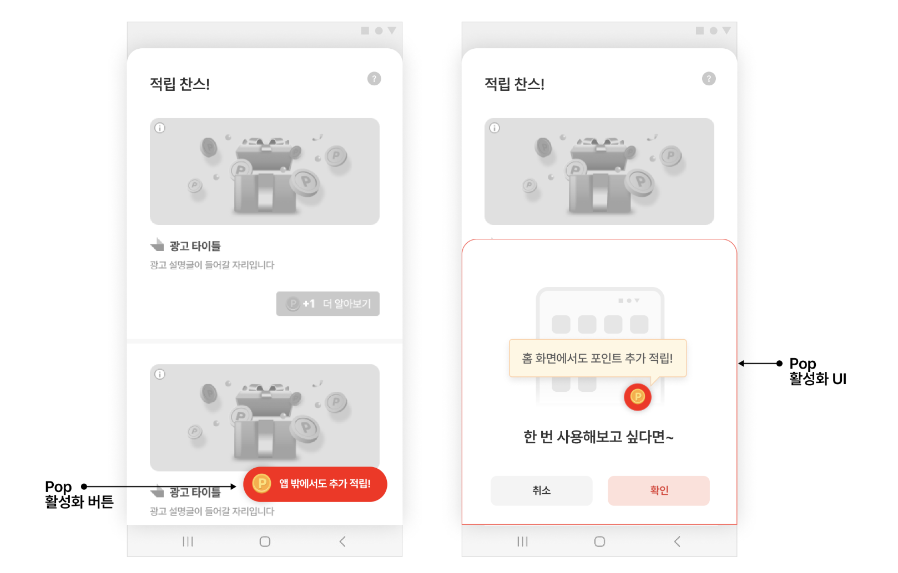
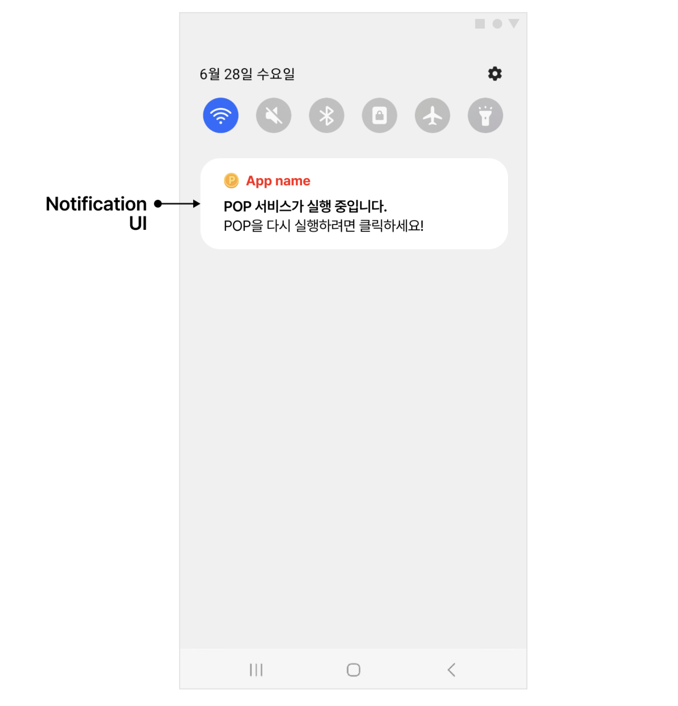
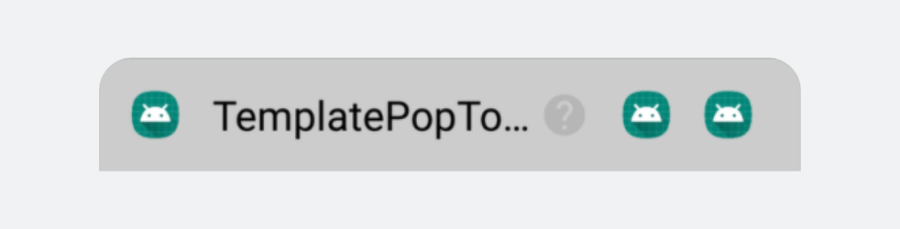
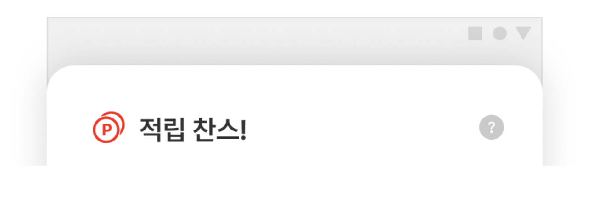
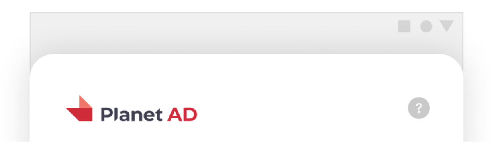
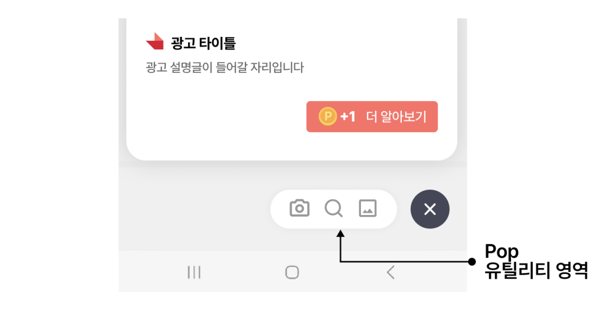
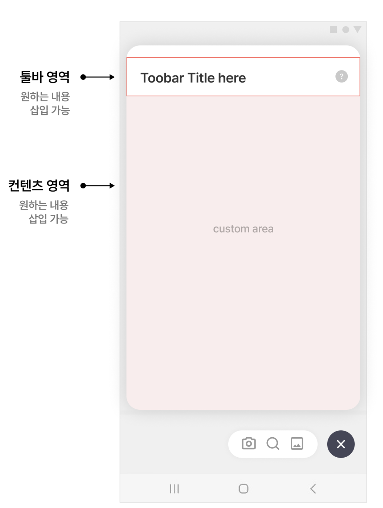

# 05-2. POP-고급설정

> [!NOTE]
> **POP 고급설정**에서는 PopConfig로 Pop 지면의 기능을 세밀하게 제어하고, 활성화 버튼·Notification·툴바·유틸리티 영역을 직접 구현하는 방법을 안내합니다.<br>기본 연동을 마친 뒤, 필요한 기능만 골라서 적용하면 됩니다.

## 개요

본 가이드에서는 Planet AD SDK의 Pop 지면 기능을 설명하고, 각 기능을 변경하는 방법을 설명합니다. 아래는 Pop 지면(기본형)의 각 영역 구성입니다. **툴바**, **헤더**, **유틸리티 영역**을 각각 커스터마이징할 수 있습니다.



## PopConfig 설정

PopConfig를 통해 Pop의 기능을 설정할 수 있습니다. 다음은 PopConfig를 만들어 SKPAdBenefitConfig에 추가하는 예시입니다.

**Application.onCreate() — PopConfig 적용**

```java
PopConfig popConfig = new PopConfig.Builder(getApplicationContext(), "YOUR_POP_UNIT_ID")
    .build();

final SKPAdBenefitConfig skpAdBenefitConfig = new SKPAdBenefitConfig.Builder(context)
    .setPopConfig(popConfig)
    .build();

SKPAdBenefit.init(this, skpAdBenefitConfig);
```

## 콘텐츠 숨기기

Pop에서는 기본적으로 **콘텐츠**를 함께 제공합니다. 콘텐츠는 광고가 아니라 뉴스 기사와 같은 아이템입니다. 콘텐츠가 Pop에서 보이지 않도록 하려면 articlesEnabled(false)로 설정합니다.

**콘텐츠 비활성화**

```java
PopConfig popConfig = new PopConfig.Builder(getApplicationContext(), "YOUR_POP_UNIT_ID")
    .articlesEnabled(false) // 컨텐츠 비활성화
    .build();
```

## Pop 활성화 버튼

Feed 지면에 **Pop 지면 활성화 버튼**을 표시할 수 있습니다. 사용자는 이 버튼을 통해 자연스럽게 Pop을 활성화할 수 있습니다.



사용자에게 Pop 활성화 버튼을 표시하는 방법은 다음 두 가지입니다.

**방법 1 — PopConfig 없이 FeedConfig만 설정한 경우**

**FeedConfig로 활성화 버튼 노출**

```java
FeedConfig feedConfig = new FeedConfig.Builder(getApplicationContext(), "YOUR_FEED_UNIT_ID")
    .optInFeatureList(Collections.singletonList(OptInFeature.Pop))
    .build();
```

**방법 2 — PopConfig를 설정한 경우**

**PopConfig로 활성화 버튼 노출**

```java
PopConfig popConfig = new PopConfig.Builder(getApplicationContext(), "YOUR_POP_UNIT_ID")
    .build();

final SKPAdBenefitConfig skpAdBenefitConfig = new SKPAdBenefitConfig.Builder(context)
    .setPopConfig(popConfig) // PopConfig 설정
    .build();

SKPAdBenefit.init(this, skpAdBenefitConfig);
```

위 조건을 충족하도록 연동했다면, Pop을 활성화하지 않은 사용자에게 Pop 활성화 버튼이 보입니다.

> [!IMPORTANT]
> Pop 활성화 버튼을 **표시하지 않으려면** 아래와 같이 설정합니다. 이렇게 하면 위의 표시 가능 조건과 무관하게 활성화 버튼이 보이지 않습니다.
>
> ```java
> final FeedConfig feedConfig = new FeedConfig.Builder(context, "YOUR_FEED_UNIT_ID")
>     .optInAndShowPopButtonHandlerClass(null) // Pop 활성화 버튼 숨김
>     .build();
> ```

## Pop Service Notification 자체 구현

Pop이 정상적으로 동작하려면 Service가 필요합니다. 그래서 Pop이 활성화되어 있는 동안에는 Service Notification이 보입니다.



여기서는 이 Notification을 SDK가 제공하는 것으로 대체하지 않고, **동작·UI 레이아웃까지 직접 구현**하는 방법을 안내합니다.

> [!TIP]
> SDK가 제공하는 Notification을 기반으로 간단한 UI만 수정하고 싶다면, [05-3. POP-커스터마이징](05-3_pop-customizing.md)의 "Notification UI 수정"을 참고하세요.

Notification을 직접 구현하려면 PopControlService의 상속 클래스를 만듭니다. 필요에 따라 notificationChannel을 생성하거나 View를 등록할 수 있습니다. notificationId는 PopNotificationConfig에서 설정할 수 있으며, 구현한 상속 클래스는 반드시 Manifest에 등록해야 합니다.

PopControlService는 몇 가지 편리한 기능을 제공합니다. 필요에 따라 사용할 수 있습니다.

| API | 설명 |
|---|---|
| getPopPendingIntent(unitId, context) | Pop 지면으로 진입하는 PendingIntent를 제공합니다. |

아래는 Pop Service Notification을 자체 구현하는 예시입니다.

**PopControlService 상속 클래스**

```java
public class YourControlService extends PopControlService {

    @Override
    protected Notification buildForegroundNotification(@NonNull String unitId, @NonNull PopNotificationConfig popNotificationConfig) {
        // Pop을 표시하는 PendingIntent (원형 아이콘)
        PendingIntent popPendingIntent = getPopPendingIntent(unitId, this);

        // 필요에 따라 notificationChannel을 등록합니다.
        NotificationCompat.Builder builder;
        if (Build.VERSION.SDK_INT >= Build.VERSION_CODES.O) {
            createNotificationChannelIfNeeded();
            builder = new NotificationCompat.Builder(this, NOTIFICATION_CHANNEL_ID);
        } else {
            builder = new NotificationCompat.Builder(this);
        }

        // Pop Service Notification 에 사용할 View 를 등록합니다.
        RemoteViews remoteView = new RemoteViews(getPackageName(), R.layout.view_custom_notification);
        builder.setSmallIcon(popNotificationConfig.getSmallIconResId())
            .setContent(remoteView)
            .setContentIntent(popPendingIntent)
            .setPriority(PRIORITY_LOW)
            .setShowWhen(false)
            .setForegroundServiceBehavior(FOREGROUND_SERVICE_IMMEDIATE);
        if (popNotificationConfig.getColor() != null) {
            builder.setColor(popNotificationConfig.getColor());
        }
        return builder.build();
    }

    @TargetApi(Build.VERSION_CODES.O)
    protected void createNotificationChannelIfNeeded() {
        final NotificationManager notificationManager = (NotificationManager) getSystemService(Context.NOTIFICATION_SERVICE);
        if (notificationManager.getNotificationChannel(NOTIFICATION_CHANNEL_ID) == null) {
            final NotificationChannel channel = new NotificationChannel(NOTIFICATION_CHANNEL_ID, NOTIFICATION_CHANNEL_NAME, NotificationManager.IMPORTANCE_LOW);
            channel.setShowBadge(false);
            notificationManager.createNotificationChannel(channel);
        }
    }
}
```

**PopConfig에 상속 서비스 연결**

```java
final PopNotificationConfig popNotificationConfig = new PopNotificationConfig.Builder(getApplicationContext())
    .notificationId(NOTIFICATION_ID)
    .build();

final PopConfig popConfig = new PopConfig.Builder(getApplicationContext(), UNIT_ID_POP)
    .popNotificationConfig(popNotificationConfig)
    .controlService(YourControlService.class)
    .build();

final SKPAdBenefitConfig skpAdBenefitConfig = new SKPAdBenefitConfig.Builder(getApplicationContext())
    .setPopConfig(popConfig)
    .build();
```

구현한 상속 클래스는 Manifest에 서비스로 등록합니다.

**AndroidManifest.xml**

```xml
<application
    ...생략...

    <service android:name=".java.YourControlService" />

    ...생략...
</application>
```

## 툴바 영역 View 자체 구현

Pop 지면의 툴바 영역 UI를 변경할 수 있습니다. Planet AD SDK가 제공하는 UI를 이용하여 변경하는 방법과, 사용하지 않고 직접 구현하는 방법 두 가지가 있습니다.



### 방법 1. SDK에서 제공하는 UI를 이용하여 변경

기본으로 제공되는 UI를 이용하여 변경하는 방법입니다. 간단하지만 제약이 있습니다.



DefaultPopToolbarHolder의 상속 클래스를 구현하여 툴바를 변경합니다. SDK가 제공하는 PopToolbar를 이용하여 정해진 레이아웃 안에서 변경합니다. 상속 클래스는 PopConfig의 feedToolbarHolderClass에 설정합니다.

**SDK 제공 UI로 툴바 구현**

```java
class YourPopToolbarHolder extends DefaultPopToolbarHolder {
    @Override
    public View getView(Activity activity, @NonNull final String unitId) {
        toolbar = new PopToolbar(activity); // PopToolbar 에서 제공하는 기본 Template 사용
        toolbar.setTitle("TemplatePopToolbarHolder"); // 툴바 타이틀 문구를 변경합니다.
        toolbar.setIconResource(R.mipmap.ic_launcher); // 툴바 좌측 아이콘을 변경합니다.
        toolbar.setBackgroundColor(Color.LTGRAY); // 툴바 배경색을 변경합니다.

        addInquiryMenuItemView(activity, unitId); // 문의하기 버튼은 이 함수를 통해 간단하게 추가가 가능합니다.
        addRightMenuItemView1(activity, unitId); // custom 버튼 추가
        return toolbar;
    }

    // custom 버튼 추가는 toolbar.buildPopMenuItemView 를 사용하여 PopMenuImageView 를 생성하고
    // toolbar.addRightMenuButton 를 사용하여 toolbar 에 추가합니다.
    private void addRightMenuItemView1(@NonNull final Activity activity, @NonNull final String unitId) {
        PopMenuImageView menuItemView = toolbar.buildPopMenuItemView(activity, R.mipmap.ic_launcher);
        menuItemView.setOnClickListener(new View.OnClickListener() {
            @Override
            public void onClick(View v) {
                showInquiry(activity, unitId); // 문의하기 페이지로 연결합니다.
            }
        });
        toolbar.addRightMenuButton(menuItemView);
    }
}
```

**PopConfig에 툴바 홀더 연결**

```java
new PopConfig.Builder(getApplicationContext(), "YOUR_POP_UNIT_ID")
    .feedToolbarHolderClass(YourPopToolbarHolder.class)
    .build();
```

### 방법 2. Custom View를 직접 구현하여 UI를 변경

SDK가 제공하는 PopToolbar를 사용하지 않고, 직접 구성한 레이아웃을 사용하는 방법입니다.



DefaultPopToolbarHolder의 상속 클래스를 구현하여, 직접 만든 레이아웃을 반환합니다. 구현한 상속 클래스는 PopConfig에 설정합니다.

**직접 구성한 레이아웃으로 툴바 구현**

```java
public class YourPopToolbarHolder extends DefaultPopToolbarHolder {
    @Override
    public View getView(Activity activity, @NonNull final String unitId) {
        // 직접 구성한 layout 을 사용합니다
        ViewGroup root = (ViewGroup) activity.getLayoutInflater().inflate(R.layout.your_pop_custom_toolbar_layout, null);

        View buttonInquiry = root.findViewById(R.id.yourInquiryButton);
        buttonInquiry.setOnClickListener(new View.OnClickListener() {
            @Override
            public void onClick(View v) {
                // 문의하기 페이지 열기
                showInquiry(activity, unitId);
            }
        });
        return root;
    }
}
```

**PopConfig에 툴바 홀더 연결**

```java
new PopConfig.Builder(getApplicationContext(), "YOUR_POP_UNIT_ID")
    .feedToolbarHolderClass(YourPopToolbarHolder.class)
    .build();
```

## 유틸리티 영역 UI 변경

유틸리티 영역을 활용하여 사용자에게 편리한 기능을 제공할 수 있습니다.



PopUtilityLayoutHandler의 상속 클래스를 구현하고, 구현한 Custom View(your_pop_utility_view)를 추가합니다. 그리고 구현한 클래스를 FeedConfig에 추가합니다.

**유틸리티 영역 커스텀 핸들러**

```java
public final class CustomPopUtilityLayoutHandler extends PopUtilityLayoutHandler {

    private Context context;

    public CustomPopUtilityLayoutHandler(Context context) {
        super(context);
        this.context = context;
    }

    @Override
    public void onLayoutCreated(ViewGroup parent) {
        LayoutInflater inflater = LayoutInflater.from(context);
        final FrameLayout layout = (FrameLayout) inflater.inflate(
            R.layout.your_pop_utility_view,
            parent,
            false
        );
        parent.addView(layout);
    }
}
```

**PopConfig에 유틸리티 핸들러 연결**

```java
new PopConfig.Builder(getApplicationContext(), "YOUR_POP_UNIT_ID")
    .popUtilityLayoutHandlerClass(CustomPopUtilityLayoutHandler.class)
    .build();
```

> [!TIP]
> **유틸리티 영역 아이콘 디자인 규격**
>
> - 추천 이미지 사이즈
>   - 24\*24 dp (mdpi 기준)
>   - 96\*96 px (xxxhdpi까지 지원, 픽셀기준 최대 4배)
> - 아이콘은 PNG 와 벡터이미지가 모두 가능합니다.
> - 컬러 아이콘 사용 가능

## 커스텀 페이지 추가

Pop 지면을 이용하여 원하는 내용을 표시할 수 있습니다. 커스텀 페이지는 **툴바**와 **컨텐츠**로 이루어져 있습니다.



- 툴바에는 타이틀을 설정할 수 있습니다.
- 컨텐츠 영역에 원하는 Fragment를 설정할 수 있습니다.

아래 예시 코드에 따라 구현할 수 있습니다.

**커스텀 페이지 실행**

```java
new PopNavigator().launchCustomFragment(
    context,
    new CustomInAppLandingInfo(
        new YourFragment(),
        R.string.your_title
    )
);
```

커스텀 페이지는 자유롭게 구현하여 사용할 수 있습니다. 예를 들어, 유틸리티 영역 혹은 툴바 영역에 버튼을 추가하고 원하는 페이지를 보여주기 위해 사용합니다. 유틸리티 영역과 툴바 영역의 커스터마이징은 위의 "유틸리티 영역 UI 변경", "툴바 영역 View 자체 구현"에서 확인할 수 있습니다.

## Pop Control Service 상속 시 주의점

> [!WARNING]
> Android Target SDK Version을 34(AOS14) 이상으로 설정할 경우, Foreground Service에 **foreground Service Type 지정**이 필요합니다.<br>Pop Control Service를 상속받은 별도의 서비스를 정의할 때는 아래와 같이 Foreground Service Type을 specialUse로 지정해야 합니다.

**AndroidManifest.xml — Target SDK 34+ 대응**

```xml
<uses-permission android:name="android.permission.FOREGROUND_SERVICE_SPECIAL_USE" />

<service android:name="My Pop Control Service Class"
    android:foregroundServiceType="specialUse">
    <property android:name="android.app.PROPERTY_SPECIAL_USE_FGS_SUBTYPE"
        android:value="@string/explanation_for_special_use"/>
</service>
```

> **다음 단계**
>
> - [05-3. POP-커스터마이징](05-3_pop-customizing.md) — 배경색·아이콘·버튼 문구·Notification 디자인 변경
> - [05-1. POP-기본설정](05-1_pop-basic.md) — Pop 준비·활성화·비활성화 기본 연동
