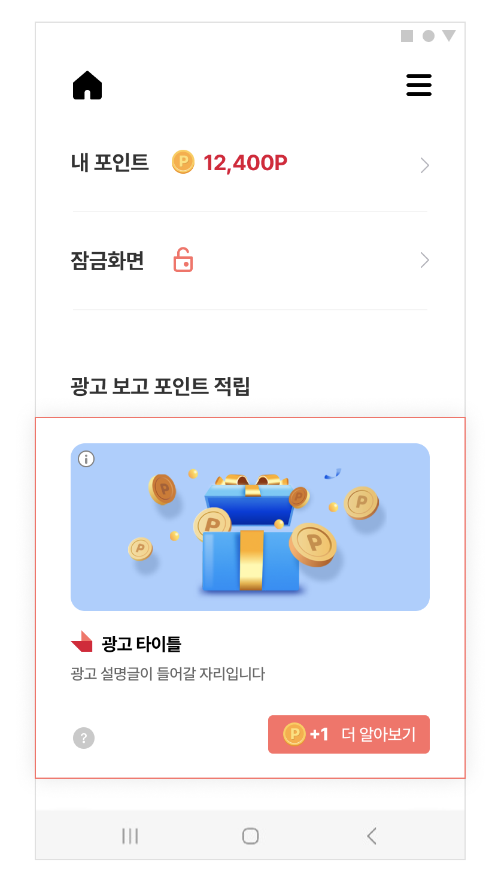

# 02-1. Native-기본설정

> [!NOTE]
> **Native**는 광고 레이아웃을 앱이 직접 구성하는 커스텀 광고 지면입니다.
>
> Feed처럼 정해진 화면을 띄우는 대신, 제목·이미지·버튼 등을 원하는 디자인으로 배치하고 SKP 서버에서 받은 광고 데이터를 채워 넣습니다.<br>이 문서를 순서대로 따라 하면 Native 광고 레이아웃을 만들고, 광고를 할당받아 화면에 표시하는 것까지 완료할 수 있습니다.

## 개요

Native 지면은 광고 지면의 레이아웃을 앱에서 직접 구성한 뒤, SKP 서버로부터 광고 데이터를 할당받아 그 레이아웃에 채워 표시하는 지면입니다. 화면 디자인을 앱에 맞게 자유롭게 구성할 수 있는 것이 특징입니다.

Native 지면은 이미지·동영상뿐 아니라 [HTML Banner](02-3_native-html-banner.md) 같은 다양한 소재(배너) 타입도 같은 방식으로 연동할 수 있는 커스텀 지면입니다. 이 문서에서는 가장 기본이 되는 이미지·동영상 소재 연동 방법을 다룹니다.



## 사전 준비

시작하기 전에 아래 항목이 준비되어 있어야 합니다.

- [ ] [01. 시작하기](01_getting-started.md) 적용 완료 — SDK 설치 및 초기화
- [ ] Native 지면용 **Unit ID** 발급 — 이 문서에서는 YOUR_NATIVE_UNIT_ID 로 표기합니다

## 연동 방법

### STEP 1. 광고 레이아웃 구성

Native 지면은 광고 레이아웃을 자유롭게 구성하여 노출하는 지면입니다. Activity 또는 Fragment 레이아웃 내에 아래 구조에 맞게 Native 광고 레이아웃을 구성합니다.

먼저 레이아웃에 넣어야 할 구성 요소를 확인하세요.

| 항목 | 설명 | 필수 여부 | 비고 |
|---|---|---|---|
| 광고 제목 | 광고의 제목 | Mandatory | 최대 10자<br>생략 부호로 일정 길이 이상은 생략 가능 |
| 광고 소재 | 이미지, 동영상 등 광고 소재 | Mandatory | com.skplanet.skpad.benefit.presentation.media.MediaView 사용 필수<br>종횡비 유지 필수<br>여백 추가 가능 |
| 광고 설명 | 광고에 대한 상세 설명 | Mandatory | 생략 부호로 일정 길이 이상은 생략 가능<br>최대 40자 |
| 광고주 아이콘 | 광고주 아이콘 이미지 | Mandatory | 종횡비 유지 필수<br>이미지 사이즈 80x80 \[px\] |
| CTA 버튼 | 광고의 참여를 유도하는 버튼 | Mandatory | com.skplanet.skpad.benefit.presentation.media.CtaView 사용 필수<br>최대 7자<br>생략 부호로 일정 길이 이상은 생략 가능 |
| 광고 알림 문구 | Sponsored image/text view | Optional | 광고임을 나타내는 텍스트 또는 이미지<br>APP 정책에 맞게 필요하다면 추가<br>예시) "광고", "ad", "스폰서", "Sponsored" |

광고 레이아웃의 최상위 컴포넌트는 NativeAdView이며, 위의 컴포넌트는 모두 NativeAdView의 하위 컴포넌트로 구현해야 합니다.

다음은 NativeAdView의 레이아웃 예시입니다.

**res/layout/your_native_ad_view.xml**

```xml
<com.skplanet.skpad.benefit.presentation.nativead.NativeAdView
    android:id="@+id/native_ad_view"
    ...생략... >

    // MediaView와 CtaView는 NativeAdView의 하위 컴포넌트로 구현해야합니다.

    <com.skplanet.skpad.benefit.presentation.media.MediaView
        android:id="@+id/mediaView"
        ...생략... />
    <TextView
        android:id="@+id/textTitle"
        ...생략... />
    <TextView
        android:id="@+id/textDescription"
        ...생략... />
    <ImageView
        android:id="@+id/imageIcon"
        ...생략... />
    <com.skplanet.skpad.benefit.presentation.media.CtaView
        android:id="@+id/ctaView"
        ...생략... />
    ...생략...
</com.skplanet.skpad.benefit.presentation.nativead.NativeAdView>
```

> [!IMPORTANT]
> Native 지면은 Activity 또는 Fragment에 구현해야 합니다. 만일 이와 다르게 구현해야 한다면 SKP 매니저에 문의하시기 바랍니다.

### STEP 2. 광고 할당 요청

광고를 표시하기 위해 광고 할당을 요청합니다. 아래 예시의 populateAd()는 다음 STEP(광고 표시)에서 구현합니다.

**광고 할당 요청**

```java
final NativeAdLoader loader = new NativeAdLoader("YOUR_NATIVE_UNIT_ID");
loader.loadAd(new NativeAdLoader.OnAdLoadedListener() {
    @Override
    public void onAdLoaded(@NonNull NativeAd nativeAd) {
        populateAd(nativeAd); // 아래 광고 표시 참조
    }

    @Override
    public void onLoadError(@NonNull AdError adError) {
        // 할당된 광고가 없으면 호출됩니다.
        Log.e(TAG, "Failed to load a native ad.", adError);
    }
});
```

### STEP 3. 광고 표시

할당받은 광고 데이터를 STEP 1에서 직접 구현한 광고 레이아웃(your_native_ad_view)에 채워 넣습니다.

아래 예시에서는 이미지 로딩에 ImageLoader 라이브러리를 사용했습니다.

**populateAd() — 광고 데이터를 레이아웃에 채우기**

```java
public void populateAd(final NativeAd nativeAd) {
    final NativeAdView view = findViewById(R.id.your_native_ad_view);

    final Ad ad = nativeAd.getAd();

    final MediaView mediaView = view.findViewById(R.id.mediaView);
    final TextView titleTextView = view.findViewById(R.id.textTitle);
    final ImageView iconView = view.findViewById(R.id.imageIcon);
    final TextView descriptionTextView = view.findViewById(R.id.textDescription);
    final CtaView ctaView = view.findViewById(R.id.ctaView);
    final CtaPresenter ctaPresenter = new CtaPresenter(ctaView); // CtaView should not be null
    ctaPresenter.bind(nativeAd);

    if (mediaView != null) {
        mediaView.setCreative(ad.getCreative());
        mediaView.setVideoEventListener(new VideoEventListener() {
            // Override and implement methods
            // 고급 설정 참조
        });
    }

    if (titleTextView != null) {
        titleTextView.setText(ad.getTitle());
    }

    if (iconView != null) {
        ImageLoader.getInstance().displayImage(ad.getIconUrl(), iconView);
    }

    if (descriptionTextView != null) {
        descriptionTextView.setText(ad.getDescription());
    }

    // clickableViews에 추가된 UI 컴포넌트를 클릭하면 광고 페이지로 이동합니다.
    final List<View> clickableViews = new ArrayList<>();
    clickableViews.add(ctaView);
    clickableViews.add(mediaView);
    clickableViews.add(titleTextView);
    clickableViews.add(descriptionTextView);

    // Advanced : 광고 View를 Scale 해서 사용하는 경우에 한하여 적용
    // view.setScaleValue(SCALE_X_VALUE, SCALE_Y_VALUE);

    // 광고 콜백 이벤트를 수신할 수 있습니다.
    // view.setNativeAd 이전에 호출해야 합니다.
    // 중복하여 호출하면 2개 이상의 리스너가 등록됩니다.

    NativeAdView.OnNativeAdEventListener nativeAdEventListener = new NativeAdView.OnNativeAdEventListener() {
        @Override
        public void onImpressed(@NonNull NativeAdView view, @NonNull NativeAd nativeAd) {

        }

        @Override
        public void onClicked(@NonNull NativeAdView view, @NonNull NativeAd nativeAd) {
            ctaPresenter.bind(nativeAd);
            // 기획에 따른 추가적인 UI 처리
        }

        @Override
        public void onRewardRequested(@NonNull NativeAdView view, @NonNull NativeAd nativeAd) {
            // 기획에 따라 리워드 로딩 이미지를 보여주는 등의 처리
        }

        @Override
        public void onRewarded(@NonNull NativeAdView view, @NonNull NativeAd nativeAd, @Nullable RewardResult rewardResult) {
            // 리워드 적립의 결과 (RewardResult) SUCCESS, ALREADY_PARTICIPATED, MISSING_REWARD 등에 따라서 적절한 유저 커뮤니케이션 처리
        }

        @Override
        public void onParticipated(@NonNull NativeAdView view, @NonNull NativeAd nativeAd) {
            ctaPresenter.bind(nativeAd);
            // 기획에 따른 추가적인 UI 처리
        }
    };
    // 중복하여 addOnNativeAdEventListener를 호출하면 2개 이상의 리스너가 등록됩니다.
    // 하나의 리스너만 등록하기 위해서는 아래와 같이 리스너를 해제하거나, addOnNativeAdEventListener를 한번만 호출하기 위한 로직을 추가해야 합니다.
    view.removeOnNativeAdEventListener(nativeAdEventListener);

    view.addOnNativeAdEventListener(nativeAdEventListener);

    view.setClickableViews(clickableViews);
    view.setMediaView(mediaView);
    view.setNativeAd(nativeAd);
}
```

> [!TIP]
> 광고의 상태별 콜백을 커스터마이즈하려면 [10. 광고 노출/클릭/참여와 관련한 콜백 변화](10_ad-event-callback-changes.md) 문서를 참고해 콜백의 정의와 동작을 파악할 수 있습니다.

## 광고 갱신 제한

광고를 할당받아 UI를 설정할 때, 기존에 설정된 광고에서 적립 등의 동작이 진행 중일 수 있습니다. 이 상태에서 NativeAdView에 새 광고를 치환하면 진행 중이던 적립 동작과 충돌해 오동작이 발생할 수 있습니다.

이를 방지하려면 광고를 할당한 뒤 UI를 설정하기 직전에 NativeAdView의 갱신이 Block되어 있는지 확인해야 하며, Block되어 있다면 광고를 갱신해서는 안 됩니다.

> [!WARNING]
> UI를 설정하기 전에 반드시 isReloadBlocked()로 잠금 여부를 확인하세요. Block된 상태에서 광고를 갱신하면 진행 중인 적립 동작이 오동작할 수 있습니다.

다음은 isReloadBlocked()로 갱신을 제한하는 예시입니다.

**광고 갱신 제한**

```java
final NativeAdLoader loader = new NativeAdLoader("YOUR_NATIVE_UNIT_ID");
loader.loadAd(new NativeAdLoader.OnAdLoadedListener() {
    @Override
    public void onAdLoaded(@NonNull NativeAd nativeAd) {

        final NativeAdView view = findViewById(R.id.your_native_ad_view);

        // 할당받은 광고를 화면에 표시하기 위해 UI를 설정하기 전에 NativeAdView가 잠겨 있는 지 여부를 체크.
        if (view.isReloadBlocked()) {
            return;
        }

        populateAd(nativeAd); // 아래 광고 표시 참조
    }

    @Override
    public void onLoadError(@NonNull AdError adError) {
        // 할당된 광고가 없으면 호출됩니다.
        Log.e(TAG, "Failed to load a native ad.", adError);
    }
});
```

> **다음 단계**
>
> - [02-2. Native-고급설정](02-2_native-advanced.md) — CTA 커스터마이징, 다중 로드, 비디오·체류형 광고 등
> - [02-3. Native-HTML Banner](02-3_native-html-banner.md) — HTML 배너 타입 연동
> - [02-4. Native-TOP DA](02-4_native-top-da.md) — TOP DA 이미지 타입 연동
> - [02-5. Native-CarouselView](02-5_native-carousel-view.md) — 좌우 스와이프 캐러셀 타입 연동
> - [10. 광고 노출/클릭/참여와 관련한 콜백 변화](10_ad-event-callback-changes.md) — 콜백 정의 및 동작
