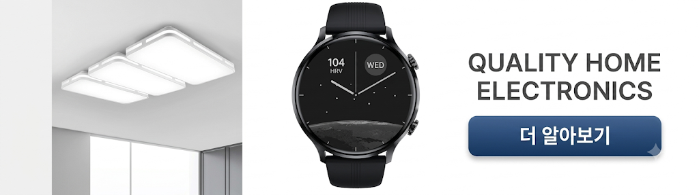

# 02-3. Native-HTML Banner

> [!NOTE]
> **HTML Banner**는 Native 지면에서 제공하는 HTML 형태의 배너 광고 타입입니다. 이미지·동영상 대신 HTML 소재를 정해진 규격(320x100 또는 300x250)의 배너로 노출합니다.<br>이 문서를 따라 하면 HTML Banner 소재를 판별해 표시하고, 소재의 배경색을 추출해 광고 영역 디자인에 적용하는 것까지 완료할 수 있습니다.

## 개요

본 가이드는 Native 지면에서 제공하는 HTML Banner 형태의 지면을 설명합니다. HTML Banner도 [02-1. Native-기본설정](02-1_native-basic.md)과 동일하게 Native 지면 위에서 연동하는 커스텀 배너 타입이며, 광고 소재만 HTML로 전달된다는 점이 다릅니다.

현재 HTML Type은 **320x100** 또는 **300x250** 두 가지 규격을 지원합니다.

| 320x100 | 300x250 |
|---|---|
| <kbd></kbd> | <kbd></kbd> |

> [!IMPORTANT]
> HTML Banner 광고는 다른 광고와 달리 광고 소재를 제외한 다른 정보(예: title, Description)는 표시하지 않습니다.

## 사전 준비

- [ ] [01. 시작하기](01_getting-started.md) 적용 완료 — SDK 설치 및 초기화
- [ ] [02-1. Native-기본설정](02-1_native-basic.md) 연동 흐름 숙지
- [ ] Native 지면용 **Unit ID** 발급 — 이 문서에서는 YOUR_NATIVE_UNIT_ID 로 표기합니다

## 연동 방법

### STEP 1. 광고 레이아웃 구성

Native 지면은 광고 레이아웃을 자유롭게 구성하여 노출하는 지면입니다. Activity 또는 Fragment 레이아웃 내에 아래 구조에 맞게 Native 광고 레이아웃을 구성합니다.

HTML Banner는 소재(MediaView)만 필요합니다.

| 항목 | 설명 | 필수 여부 | 비고 |
|---|---|---|---|
| 광고 소재 | HTML 광고 소재 | Mandatory | com.skplanet.skpad.benefit.presentation.media.MediaView 사용 필수<br>종횡비 유지 필수<br>사이즈: 320 x 100 또는 300 x 250 (px)<br>여백 추가 가능 |
| 광고 알림 문구 | Sponsored image/text view | Optional | 광고임을 나타내는 텍스트 또는 이미지<br>APP 정책에 맞게 필요하다면 추가<br>예시) "광고", "ad", "스폰서", "Sponsored" |

광고 레이아웃의 최상위 컴포넌트는 NativeAdView이며, 위 컴포넌트는 NativeAdView의 하위 컴포넌트로 구현해야 합니다.

다음은 NativeAdView의 레이아웃 예시입니다.

**res/layout/your_native_ad_banner_view.xml**

```xml
<com.skplanet.skpad.benefit.presentation.nativead.NativeAdView
    android:id="@+id/native_ad_view"
    ...생략... >

    // MediaView는 NativeAdView의 하위 컴포넌트로 구현해야합니다.

    <com.skplanet.skpad.benefit.presentation.media.MediaView
        android:id="@+id/mediaView"
        ...생략... />
    ...생략...
</com.skplanet.skpad.benefit.presentation.nativead.NativeAdView>
```

> [!TIP]
> 두 가지 규격(320x100, 300x250)을 모두 지원하려면 크기별로 레이아웃 파일을 각각 준비하세요. 다음 STEP에서 소재 크기에 따라 알맞은 레이아웃을 선택합니다.

### STEP 2. 광고 할당 요청

광고를 표시하기 위해 광고 할당을 요청합니다. 할당된 소재의 Creative Type이 HTML인지 확인해, HTML이면 배너용 처리(populateBannerAd())로 분기합니다.

**광고 할당 요청 및 타입 분기**

```java
final NativeAdLoader loader = new NativeAdLoader("YOUR_NATIVE_UNIT_ID");
loader.loadAd(new NativeAdLoader.OnAdLoadedListener() {
    @Override
    public void onAdLoaded(@NonNull NativeAd nativeAd) {

        final Creative.Type creativeType = ad.getCreative() == null ? null : ad.getCreative().getType();
        if (Creative.Type.HTML.equals(creativeType)) {
            populateBannerAd(nativeAd); // HTML(Banner광고)
        } else {
            populateAd(nativeAd); // NATIVE(이미지), TOPDA(이미지), VAST(동영상), WEBBANNER(쿠팡, 네이버 웹배너)
        }
    }

    @Override
    public void onLoadError(@NonNull AdError adError) {
        // 할당된 광고가 없으면 호출됩니다.
        Log.e(TAG, "Failed to load a native ad.", adError);
    }
});
```

### STEP 3. 광고 표시

할당받은 광고 데이터를 직접 구현한 광고 레이아웃(your_native_ad_banner_view)에 채워 넣습니다. HTML 소재의 너비(320/300)에 따라 알맞은 레이아웃을 선택한 뒤, MediaView에 소재를 설정합니다.

**populateBannerAd() — HTML Banner 표시**

```java
public void populateBannerAd(final NativeAd nativeAd) {

    // HTML Banner Type의 Creative는 HTML타입만 전달됩니다.
    final Creative.Type creativeType = ad.getCreative() == null ? null : ad.getCreative().getType();
    if (!Creative.Type.HTML.equals(creativeType)) {
        return;
    }

    final Ad ad = nativeAd.getAd();
    CreativeHtml creative = ((CreativeHtml) ad.getCreative());

    // Creative의 Size 체크 필요.
    int layoutId = (creative.getWidth() == 320) ? R.layout.your_native_ad_banner_view_320_100 : R.layout.your_native_ad_banner_view_300_250;

    final NativeAdView view = findViewById(layoutId);
    final MediaView mediaView = view.findViewById(R.id.mediaView);

    if (mediaView != null) {
        mediaView.setCreative(ad.getCreative());

        // Html Banner로부터 Background Color를 추출한다.(필요시 설정)
        mediaView.setBackgroundColorListener(new MediaView.BackgroundColorExtractedListener() {
            @Override
            public void onBackgroundColorExtracted(int color) {
                // 전달된 Background 색상으로 광고영역을 처리한다.
                view.setBackgroundColor(color);
            }
        });
    }

    // 광고 콜백 이벤트를 수신할 수 있습니다.
    // view.setNativeAd 이전에 호출해야 합니다.
    // 중복하여 호출하면 2개 이상의 리스너가 등록됩니다.

    NativeAdView.OnNativeAdEventListener nativeAdEventListener = new NativeAdView.OnNativeAdEventListener() {
        @Override
        public void onImpressed(@NonNull NativeAdView view, @NonNull NativeAd nativeAd) {

        }

        @Override
        public void onClicked(@NonNull NativeAdView view, @NonNull NativeAd nativeAd) {
            // 기획에 따른 추가적인 UI 처리
        }

        @Override
        public void onRewardRequested(@NonNull NativeAdView view, @NonNull NativeAd nativeAd) {
            // 기획에 따라 리워드 로딩 이미지를 보여주는 등의 처리
        }

        @Override
        public void onRewarded(@NonNull NativeAdView view, @NonNull NativeAd nativeAd, @Nullable RewardResult rewardResult) {
            // 리워드 적립의 결과 (RewardResult) SUCCESS, ALREADY_PARTICIPATED, MISSING_REWARD 등에 따라서 적절한 유저 커뮤니케이션 처리
        }

        @Override
        public void onParticipated(@NonNull NativeAdView view, @NonNull NativeAd nativeAd) {
            ctaPresenter.bind(nativeAd);
            // 기획에 따른 추가적인 UI 처리
        }
    };
    // 중복하여 addOnNativeAdEventListener를 호출하면 2개 이상의 리스너가 등록됩니다.
    // 하나의 리스너만 등록하기 위해서는 아래와 같이 리스너를 해제하거나, addOnNativeAdEventListener를 한번만 호출하기 위한 로직을 추가해야 합니다.
    view.removeOnNativeAdEventListener(nativeAdEventListener);

    view.addOnNativeAdEventListener(nativeAdEventListener);

    view.setMediaView(mediaView);
    view.setNativeAd(nativeAd);
}
```

## Background Color 추출

Creative Type이 HTML인 경우, SDK는 소재의 배경 색상을 추출하여 앱에 전달할 수 있습니다. 앱은 전달받은 색상으로 배경색을 조정해 전체 광고 영역의 디자인을 자연스럽게 맞출 수 있습니다.

> [!IMPORTANT]
> Background 색상의 전달 여부는 서버의 Unit 설정으로 관리됩니다. 해당 설정이 Disable일 경우 기본 색상(흰색)이 전달됩니다.

**Background Color 추출**

```java
final Creative.Type creativeType = ad.getCreative() == null ? null : ad.getCreative().getType();
final MediaView mediaView = interstitialView.findViewById(R.id.ad_media_view);
if (Creative.Type.HTML.equals(creativeType)) {
    mediaView.setBackgroundColorListener(new MediaView.BackgroundColorExtractedListener() {
        @Override
        public void onBackgroundColorExtracted(int color) {
            // 전달된 Background 색상으로 광고영역을 처리한다.
            nativeAdView.setBackgroundColor(color);
        }
    });
}
```

> [!WARNING]
> **주의 사항** — Background 추출 기능은 HTML Creative에서만 지원됩니다. HTML이 아닌 타입의 광고로 재설정할 때 기존 배경 색상이 남아 있지 않도록 주의해야 합니다.

> **다음 단계**
>
> - [02-1. Native-기본설정](02-1_native-basic.md) — Native 지면 기본 연동
> - [02-2. Native-고급설정](02-2_native-advanced.md) — CTA 커스터마이징, 비디오·체류형 광고 등
> - [02-4. Native-TOP DA](02-4_native-top-da.md) — TOP DA 이미지 타입 연동
> - [02-5. Native-CarouselView](02-5_native-carousel-view.md) — 좌우 스와이프 캐러셀 타입 연동
