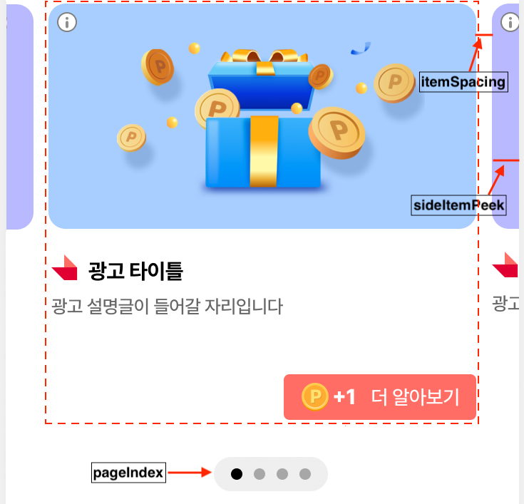

# 02-5. Native-CarouselView

> [!NOTE]
> **CarouselView**는 여러 개의 Native 광고를 좌우로 스와이프하며 볼 수 있는 캐러셀 형태의 지면입니다. SDK가 좌우 이동 UI와 하단 페이지 인디케이터를 기본 제공합니다.<br>이 문서를 따라 하면 캐러셀 지면을 화면에 배치하고, 여러 광고를 할당받아 표시하며, 동작(Config)과 디자인(Adapter)까지 커스터마이징하는 방법을 익힐 수 있습니다.

## 개요

본 가이드는 Planet AD SDK의 Native Carousel 지면을 연동하는 방법을 안내합니다. Native 지면은 광고 지면 레이아웃을 직접 구성한 후, SKP 서버로부터 광고 데이터를 할당받아 광고 지면에 표시하는 커스텀 지면입니다.

Native Carousel은 여러 개의 광고를 좌우로 스와이프하며 볼 수 있는 배너 타입으로, NativeAdCarouselView 하나로 손쉽게 배치할 수 있습니다.

<kbd></kbd>

## 사전 준비

- [ ] [01. 시작하기](01_getting-started.md) 적용 완료 — SDK 설치 및 초기화
- [ ] Native 지면용 **Unit ID** 발급 — 이 문서에서는 YOUR_NATIVE_UNIT_ID 로 표기합니다

## 연동 방법

### STEP 1. 광고 레이아웃 구성

Native 지면은 광고 레이아웃을 자유롭게 구성하여 노출하는 지면입니다. Activity 또는 Fragment 레이아웃 내에 아래 구조에 맞게 Native 광고 레이아웃을 구성합니다.

NativeAdCarouselView는 단독으로 사용되며, 원하는 위치에 해당 View를 배치하면 됩니다.

다음은 NativeAdCarouselView의 레이아웃 예시입니다.

**레이아웃에 CarouselView 배치**

```xml
<com.skplanet.skpad.benefit.presentation.feed.carousel.NativeAdCarouselView
    android:id="@+id/native_ad_carousel"
    android:layout_width="match_parent"
    android:layout_height="wrap_content" />
```

### STEP 2. 광고 할당 요청

광고를 표시하기 위해 광고 할당을 요청합니다. Native Carousel 지면은 복수 개의 광고를 표시할 수 있습니다.

> [!IMPORTANT]
> 하단 페이지 index는 최대 5개까지 표시되며, 광고가 1개인 경우에는 표시되지 않습니다.

다음은 10개의 광고를 할당받는 예시입니다. showCarouselView()는 다음 STEP(광고 표시)에서 구현합니다.

**여러 개 광고 할당 요청**

```java
NativeAdLoader loader = new NativeAdLoader("YOUR_NATIVE_AD_UNIT_ID");
loader.loadAds(new OnAdsLoadedListener() {
    @Override
    public void onLoadError(@NonNull AdError error) {
        // 할당된 광고가 없으면 호출됩니다.
        Log.e(TAG, "Failed to load a native ad. " + error);
    }

    @Override
    public void onAdsLoaded(@NonNull Collection<NativeAd> nativeAds) {
        showCarouselView(new ArrayList<>(nativeAds));
    }
}, 10);
```

### STEP 3. 광고 표시

Native Carousel 지면을 표시합니다. Planet AD SDK의 Native Carousel 지면은 좌우로 이동할 수 있는 UI를 기본 제공합니다.

다음은 할당받은 광고 목록을 캐러셀에 넣어 표시하는 예시입니다.

**showCarouselView() — 캐러셀에 광고 목록 설정**

```java
private void showCarouselView(ArrayList<NativeAd> nativeAds) {
    NativeAdCarouselView carouselView = binding.nativeAdCarousel;
    carouselView.setNativeAdList(nativeAds);
}
```

## 지면 동작 구성

Native Carousel 지면의 동작은 Config 설정으로 변경할 수 있습니다. 단, 일부 설정은 Native Carousel 지면의 종류에 따라 적용되지 않습니다. 아래 표에서 설정 가능한 Config를 확인할 수 있습니다.

<kbd></kbd>

| 항목 | 설명 | Type | Default |
|---|---|---|---|
| Custom View Holder | Customizing을 위한 Holder | Class |  |
| Loop | 마지막 스크롤 시 처음 아이템으로 이동 여부 | Boolean | true |
| PageIndex | 하단 Page Index 정보 표시 여부 | Boolean | true |
| AutoPaging | 자동으로 Page 이동 활성화 여부 | Boolean | false |
| AutoPagingDuration | 자동으로 Page 이동 시 시간 간격 (단위: ms) | int | 2000 |
| SideItemPeek | 좌우 아이템의 보여지는 간격 (단위: dp) | int | 0 |
| ItemSpacing | 아이템 간의 간격 (단위: dp) | int | 0 |

다음은 Config를 만들어 캐러셀에 적용하는 예시입니다.

**Config 적용**

```java
private void showCarouselView(ArrayList<NativeAd> nativeAds) {
    NativeAdCarouselView carouselView = binding.nativeAdCarousel;

    NativeAdCarouselConfig.Builder config = new NativeAdCarouselConfig.Builder();
    config.setLoop(true)
            .setPageIndex(true)
            .setAutoPaging(true)
            .setAutoPagingDuration(2000)
            .setSideItemPeek(0)
            .setItemSpacing(0)
            .setAdsAdapterClass(CustomCarouselAdsAdapter.class);

    NativeAdCarouselConfig carouselConfig = config.build();

    carouselView.setNativeAdList(nativeAds, carouselConfig);
}
```

## 지면 UI의 구성

SKPAdBenefit AOS SDK에서 제공하는 Native Carousel 지면 UI의 구성을 지키며 디자인을 변경하기 위한 방법을 안내합니다.

### 광고 레이아웃 구성

Native 지면은 광고 레이아웃을 자유롭게 구성하여 노출하는 지면입니다. 캐러셀 각 아이템에 사용할 광고 레이아웃은 아래 구성 요소를 갖춰야 합니다.

| 항목 | 설명 | 필수 여부 | 비고 |
|---|---|---|---|
| 광고 제목 | 광고의 제목 | Mandatory | 최대 10자<br>생략 부호로 일정 길이 이상은 생략 가능 |
| 광고 소재 | 이미지, 동영상 등 광고 소재 | Mandatory | com.skplanet.skpad.benefit.presentation.media.MediaView 사용 필수<br>종횡비 유지 필수<br>여백 추가 가능 |
| 광고 설명 | 광고에 대한 상세 설명 | Mandatory | 생략 부호로 일정 길이 이상은 생략 가능<br>최대 40자 |
| 광고주 아이콘 | 광고주 아이콘 이미지 | Mandatory | 종횡비 유지 필수<br>이미지 사이즈 80x80 \[px\] |
| CTA 버튼 | 광고의 참여를 유도하는 버튼 | Mandatory | com.skplanet.skpad.benefit.presentation.media.CtaView 사용 필수<br>최대 7자<br>생략 부호로 일정 길이 이상은 생략 가능 |
| 광고 알림 문구 | Sponsored image/text view | Optional | 광고임을 나타내는 텍스트 또는 이미지<br>APP 정책에 맞게 필요하다면 추가<br>예시) "광고", "ad", "스폰서", "Sponsored" |

Native Carousel용 NativeAdView의 규격에 맞는 레이아웃(your_native_carousel_ad.xml)을 구현합니다.

**res/layout/your_native_carousel_ad.xml**

```xml
<com.skplanet.skpad.benefit.presentation.nativead.NativeAdView
    android:id="@+id/native_ad_view"
    ...... >

    // MediaView와 CtaView는 NativeAdView의 하위 컴포넌트로 구현해야합니다.

    <com.skplanet.skpad.benefit.presentation.media.MediaView
        android:id="@+id/mediaView"
        ...... />
    <TextView
        android:id="@+id/textTitle"
        ...... />
    <TextView
        android:id="@+id/textDescription"
        ...... />
    <ImageView
        android:id="@+id/imageIcon"
        ...... />
    <com.skplanet.skpad.benefit.presentation.media.CtaView
        android:id="@+id/ctaView"
        ...... />
    ......
</com.skplanet.skpad.benefit.presentation.nativead.NativeAdView>
```

### adapter의 예시

AdsAdapter의 상속 클래스를 구현합니다. 구현한 상속 클래스의 onCreateViewHolder에서 your_native_carousel_ad를 사용하여 NativeAdView를 생성하고, onBindViewHolder에서 광고 데이터를 각 뷰에 채웁니다. 그런 다음 NativeAdCarouselConfig에 구현한 YourAdsAdapter를 설정합니다.

<details>
<summary>Adapter 전체 코드 보기</summary>

**YourAdsAdapter.java**

```java
public class YourAdsAdapter extends AdsAdapter<AdsAdapter.NativeAdViewHolder> {
    @Override
    public NativeAdViewHolder onCreateViewHolder(ViewGroup parent, int viewType) {
        final LayoutInflater inflater = LayoutInflater.from(parent.getContext());
        final NativeAdView interstitialNativeAdView = (NativeAdView) inflater.inflate(R.layout.your_native_carousel_ad, parent, false);
        return new NativeAdViewHolder(interstitialNativeAdView);
    }

    @Override
    public void onBindViewHolder(NativeAdViewHolder holder, NativeAd nativeAd) {
        super.onBindViewHolder(holder, nativeAd);

        NativeAdView nativeAdView = holder.itemView.findViewById(R.id.native_ad_view);

        MediaView mediaView = nativeAdView.findViewById(R.id.ad_media_view);
        TextView titleTextView = nativeAdView.findViewById(R.id.ad_title_text);
        ImageView iconImageView = nativeAdView.findViewById(R.id.ad_icon_image);
        TextView descriptionTextView = nativeAdView.findViewById(R.id.ad_description_text);
        CtaView ctaView = nativeAdView.findViewById(R.id.ad_cta_view);
        CtaPresenter ctaPresenter = new CtaPresenter(ctaView);
        ctaPresenter.bind(nativeAd);

        Ad ad = nativeAd.getAd();
        mediaView.setCreative(ad.getCreative());

        if (titleTextView != null) {
            titleTextView.setText(ad.getTitle());
        }
        if (iconView != null) {
            ImageLoader.getInstance().displayImage(ad.getIconUrl(), iconView);
        }
        if (descriptionTextView != null) {
            descriptionTextView.setText(ad.getDescription());
        }

        // clickableViews에 추가된 UI 컴포넌트를 클릭하면 광고 페이지로 이동합니다.
        final List<View> clickableViews = new ArrayList<>();
        clickableViews.add(ctaView);
        clickableViews.add(mediaView);
        clickableViews.add(iconImageView);
        clickableViews.add(titleTextView);
        clickableViews.add(descriptionTextView);

        // 광고 콜백 이벤트를 수신할 수 있습니다.
        // view.setNativeAd 이전에 호출해야 합니다.
        NativeAdView.OnNativeAdEventListener nativeAdEventListener = new NativeAdView.OnNativeAdEventListener() {
            @Override
            public void onImpressed(@NonNull NativeAdView view, @NonNull NativeAd nativeAd) {

            }

            @Override
            public void onClicked(@NonNull NativeAdView view, @NonNull NativeAd nativeAd) {
                ctaPresenter.bind(nativeAd);
                // 기획에 따른 추가적인 UI 처리
            }

            @Override
            public void onRewardRequested(@NonNull NativeAdView view, @NonNull NativeAd nativeAd) {
                // 기획에 따라 리워드 로딩 이미지를 보여주는 등의 처리
            }

            @Override
            public void onRewarded(@NonNull NativeAdView view, @NonNull NativeAd nativeAd, @Nullable RewardResult rewardResult) {
                // 리워드 적립의 결과 (RewardResult) SUCCESS, ALREADY_PARTICIPATED, MISSING_REWARD 등에 따라서 적절한 유저 커뮤니케이션 처리
            }

            @Override
            public void onParticipated(@NonNull NativeAdView view, @NonNull NativeAd nativeAd) {
                ctaPresenter.bind(nativeAd);
                // 기획에 따른 추가적인 UI 처리
            }
        };
        view.addOnNativeAdEventListener(nativeAdEventListener);

        nativeAdView.setMediaView(mediaView);
        nativeAdView.setClickableViews(clickableViews);
        nativeAdView.setNativeAd(nativeAd);
    }
}
```

</details>

### Custom Adapter 호출

구현한 Custom Adapter는 아래와 같이 Config에 설정하여 호출합니다.

**Custom Adapter 호출**

```java
NativeAdCarouselConfig.Builder config = new NativeAdCarouselConfig.Builder();

config.setAdsAdapterClass(CustomCarouselAdsAdapter.class); // Custom View Holder
NativeAdCarouselConfig carouselConfig = config.build();
carouselView.setConfig(carouselConfig);
```

> **다음 단계**
>
> - [02-1. Native-기본설정](02-1_native-basic.md) — Native 지면 기본 연동
> - [02-2. Native-고급설정](02-2_native-advanced.md) — CTA 커스터마이징, 비디오·체류형 광고 등
> - [02-3. Native-HTML Banner](02-3_native-html-banner.md) — HTML 배너 타입 연동
> - [02-4. Native-TOP DA](02-4_native-top-da.md) — TOP DA 이미지 타입 연동
