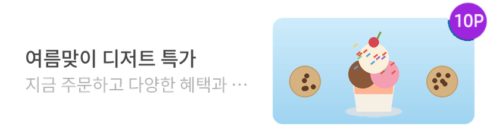

# 02-6. Native-NativeAdBannerView

> [!NOTE]
> **NativeAdBannerView**는 하나의 Native 광고를 배너 형태로 표시하는 사전 제작형(pre-built) 지면입니다.
>
> SDK가 광고 소재 타입(IMAGE·HTML)을 판별해 레이아웃 구성과 렌더링을 모두 기본 제공하므로, 별도의 디자인 작업 없이 뷰 하나만 배치하면 바로 광고를 노출할 수 있습니다.
>
> 이 문서를 따라 하면 배너 지면을 화면에 배치하고, 광고를 할당받아 표시하는 방법을 익힐 수 있습니다.

## 개요

본 가이드는 Banner 구현을 용이하게 하게 위해 SDK에서 제공하는 NativeAdBannerView에 대해서 설명합니다.

|  | 샘플 |
|---|---|
| **Native 소재** | <kbd></kbd> |
| **HTML 소재** | <kbd></kbd> |

## 사전 준비

시작하기 전에 아래 항목이 준비되어 있어야 합니다.

- [ ] [01. 시작하기](01_getting-started.md) 적용 완료 — SDK 설치 및 초기화
- [ ] Native 지면용 **Unit ID** 발급 — 이 문서에서는 YOUR_NATIVE_UNIT_ID 로 표기합니다.

## 연동 방법

### STEP 1. 광고 레이아웃 구성

`NativeAdBannerView`는 Banner형 광고를 쉽게 적용하기 위해 제공됩니다.

Activity 또는 Fragment 레이아웃 내에 아래 구조에 맞게 Native 광고 레이아웃을 구성합니다.

**res/layout/your_native_ad_view.xml**

```xml
<com.skplanet.skpad.benefit.presentation.nativead.NativeAdBannerView
    android:id="@+id/your_native_ad_banner_view"
    ...생략... />
```

### STEP 2. 광고 할당 요청

광고를 표시하기 위해 광고 할당을 요청합니다. 아래 예시의 `populateBannerAd()`는 다음 STEP(광고 표시)에서 구현합니다.

**광고 할당 요청**

```java
final NativeAdLoader loader = new NativeAdLoader("YOUR_NATIVE_UNIT_ID");

loader.loadAd(new NativeAdLoader.OnAdLoadedListener() {
    @Override
    public void onAdLoaded(@NonNull NativeAd nativeAd) {
        populateBannerAd(nativeAd); // 아래 '광고 표시' 참조
    }

    @Override
    public void onLoadError(@NonNull AdError adError) {
        // 광고 로드에 실패하면(노필(no-fill) 포함) 호출됩니다.
        Log.e(TAG, "Failed to load a native ad.", adError);
    }
});
```

### STEP 3. 광고 표시

할당받은 광고 데이터를 STEP 1에서 배치한 `NativeAdBannerView`에 설정합니다.

**populateAd() — 광고 데이터를 레이아웃에 채우기**

```java
// 리스너를 필드로 한 번만 생성해 재사용합니다.
private final NativeAdView.OnNativeAdEventListener nativeAdEventListener =
        new NativeAdView.OnNativeAdEventListener() {
            @Override
            public void onImpressed(@NonNull NativeAdView view, @NonNull NativeAd nativeAd) {

            }

            @Override
            public void onClicked(@NonNull NativeAdView view, @NonNull NativeAd nativeAd) {
                // 기획에 따른 추가적인 UI 처리
            }

            @Override
            public void onRewardRequested(@NonNull NativeAdView view, @NonNull NativeAd nativeAd) {
                // 기획에 따라 리워드 로딩 이미지를 보여주는 등의 처리
            }

            @Override
            public void onRewarded(@NonNull NativeAdView view, @NonNull NativeAd nativeAd,
                                   @Nullable RewardResult rewardResult) {
                // 리워드 적립의 결과(RewardResult) SUCCESS, ALREADY_PARTICIPATED, MISSING_REWARD 등에 따라
                // 적절한 유저 커뮤니케이션 처리
            }

            @Override
            public void onParticipated(@NonNull NativeAdView view, @NonNull NativeAd nativeAd) {
                // 기획에 따른 추가적인 UI 처리
            }
        };

public void populateBannerAd(final NativeAd nativeAd) {
    final NativeAdBannerView view = findViewById(R.id.bannerView);

    // 동일한 리스너 인스턴스를 remove 후 add 하므로 중복 등록이 발생하지 않습니다.
    view.removeOnNativeAdEventListener(nativeAdEventListener);
    view.addOnNativeAdEventListener(nativeAdEventListener);

    view.setNativeAd(nativeAd);
}
```

## UI 커스터마이징

NativeAdView의 경우 소재에 따라 일부 속성을 변경할 수 있습니다.

### 지원 속성

|  |  |  |  |
|---|---|---|---|
| **공통** | Point Bullet 배경 색상 | Point Bullet의 배경 색상을 지정합니다. | `setPointBulletColor(int color)` |
| **공통** | Point Bullet 글자 색상 | Point Bullet의 글자 색상을 지정합니다. | `setPointTextColor(int color)` |
| **이미지형** | MediaView 위치 | MediaView와 Title·Description의 좌우 배치를 지정합니다. | `setMediaPosition(MediaPosition position)` |
| **이미지형** | 배경 색상 | 광고 영역의 배경 색상을 지정합니다. | `setBackgroundColor(@ColorInt int color)` |
| **이미지형** | 글자 색상 | Title 및 Description의 글자 색상을 지정합니다. | `setTextColor(@ColorInt int color)` |

### MediaView 위치 설정

이미지형 소재의 경우 `MediaView`의 위치를 좌측 또는 우측으로 설정할 수 있습니다.

|  |
|---|
| `public` `enum` `MediaPosition {`<br>`LEFT, ` `// MediaView 좌측 / Title·Description 우측`<br>`RIGHT ` `// MediaView 우측 / Title·Description 좌측`<br>`}` |

```
  
다음 API를 사용하여 위치를 설정할 수 있습니다.
```

|  |
|---|
| `NativeAdBannerView.setMediaPosition(MediaPosition position)` |

### 색상 설정

광고의 디자인에 맞춰 Point Bullet, 배경 및 텍스트 색상을 설정할 수 있습니다.

|  |
|---|
| `view.setPointBulletColor(Color.BLACK);`<br>`view.setPointTextColor(Color.WHITE);`<br>`view.setBackgroundColor(Color.WHITE);`<br>`view.setTextColor(Color.BLACK);` |

```
  
```

> `setTextColor()`는 Title과 Description에 동일한 색상을 적용합니다.

**참고**

UI 커스터마이징을 적용하지 않는 경우 SDK에서 제공하는 기본 디자인이 적용됩니다.

> [!TIP]
> 광고의 상태별 콜백을 커스터마이즈하려면 [10. 광고 노출/클릭/참여와 관련한 콜백 변화](10_ad-event-callback-changes.md) 문서를 참고해 콜백의 정의와 동작을 파악할 수 있습니다.

> **다음 단계**
>
> - [02-2. Native-고급설정](02-2_native-advanced.md) — CTA 커스터마이징, 다중 로드, 비디오·체류형 광고 등
> - [02-3. Native-HTML Banner](02-3_native-html-banner.md) — HTML 배너 타입 연동
> - [02-4. Native-TOP DA](02-4_native-top-da.md) — TOP DA 이미지 타입 연동
> - [02-5. Native-CarouselView](02-5_native-carousel-view.md) — 좌우 스와이프 캐러셀 타입 연동
> - [10. 광고 노출/클릭/참여와 관련한 콜백 변화](10_ad-event-callback-changes.md) — 콜백 정의 및 동작
