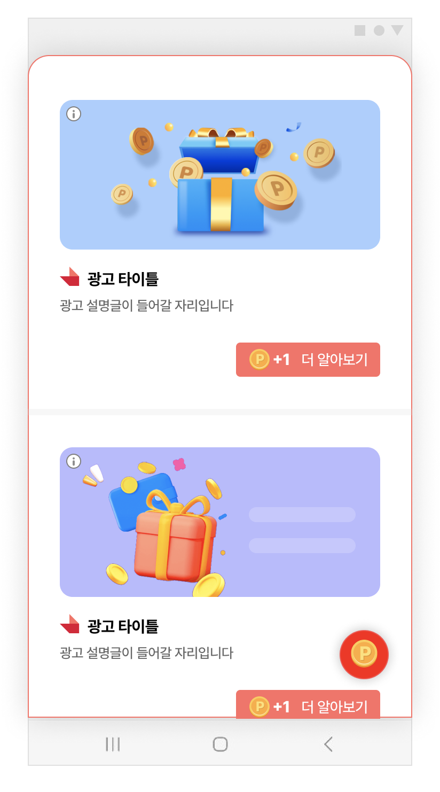

# 03-1. Feed-기본설정

> [!NOTE]
> **Feed**는 광고를 리스트 형태로 보여주는 가장 기본적인 광고 지면입니다.<br>이 문서를 순서대로 따라 하면 앱에 Feed 지면을 띄우고, 광고를 미리 받아오는 것까지 완료할 수 있습니다.

## 개요

Feed 지면은 광고를 리스트 형식으로 제공하는 지면입니다. 아래처럼 여러 개의 광고 카드가 세로로 나열됩니다.



## 사전 준비

시작하기 전에 아래 항목이 준비되어 있어야 합니다.

- [ ] [01. 시작하기](01_getting-started.md) 연동 완료 — SDK 설치 및 초기화
- [ ] Feed 지면용 **Unit ID** 발급 — 이 문서에서는 YOUR_FEED_UNIT_ID 로 표기합니다

## 연동 방법

### STEP 1. Feed 지면 초기화

SKPAdBenefitConfig에 FeedConfig를 추가해 SDK를 초기화합니다.

**Application.onCreate()**

```java
public class App extends Application {
    @Override
    public void onCreate() {
        super.onCreate();
        final FeedConfig feedConfig = new FeedConfig.Builder(getApplicationContext(), "YOUR_FEED_UNIT_ID")
            .feedHeaderViewAdapterClass(DefaultFeedHeaderViewAdapter.class)
            .build();
        final SKPAdBenefitConfig SKPAdBenefitConfig = new SKPAdBenefitConfig.Builder(getApplicationContext())
            .setFeedConfig(feedConfig)
            .build();
        SKPAdBenefit.init(getApplicationContext(), SKPAdBenefitConfig);
        ...
    }
}
```

> [!TIP]
> FeedConfig로 Feed 지면의 기능과 디자인을 바꿀 수 있습니다. 자세한 내용은 [03-2. Feed 고급설정](03-2_feed-advanced.md)을 참고하세요.

### STEP 2. Feed 지면 표시

바텀시트 형태의 Feed 지면을 표시합니다. 광고를 미리 받아두지 않았다면, 지면이 사용자에게 노출된 후 자동으로 광고를 받아옵니다.

```java
final FeedHandler feedHandler = new FeedHandler(context, "YOUR_FEED_UNIT_ID");
feedHandler.startFeedActivity(this);
```

> [!IMPORTANT]
> - 광고를 받아오는 동안에는 "참여할 수 있는 광고가 없습니다." 이미지가 잠깐 보일 수 있습니다.
> - startFeedActivity()를 반복해서 호출해도 광고는 갱신되지 않고 같은 광고가 보입니다. 새 광고를 받으려면 FeedHandler를 다시 만들거나 preload()를 다시 호출하세요.

### STEP 3. 광고 미리 받기 (preload)

preload()로 광고를 미리 받아두면, 사용자가 지면에 들어오기 전에 광고 노출이 보장됩니다. 이렇게 하면 위의 "참여할 수 있는 광고가 없습니다." 이미지가 보이지 않습니다.

**preload 후 지면 표시**

```java
final FeedHandler feedHandler = new FeedHandler(context, "YOUR_FEED_UNIT_ID");
feedHandler.preload(new FeedHandler.FeedPreloadListener() {
    @Override
    public void onPreloaded() {
        int feedAdSize = feedHandler.getSize(); // 광고의 개수
        int feedTotalReward = feedHandler.getTotalReward(); // 적립 가능한 총 포인트 금액
        feedHandler.startFeedActivity(context);
    }

    @Override
    public void onError(AdError error) {
        // 광고가 없을 경우 호출됩니다. error를 통해 원인을 알 수 있습니다
    }
});
```

> [!WARNING]
> 개인 정보 처리 방침에 **동의하지 않은 상태**로 preload()를 호출하면 광고가 할당되지 않습니다. SDK가 제공하는 개인 정보 처리 방침 UI로 먼저 동의를 받으세요.

> **다음 단계**
>
> - [03-2. Feed 고급설정](03-2_feed-advanced.md) — 헤더·필터 등 기능 확장
> - [03-3. Feed-고급설정-Grid 타입](03-3_feed-advanced-grid.md) — 2열 그리드 형태
> - 리스트 화면 대신 내 화면 일부에 넣고 싶다면 → [프래그먼트로 Feed 연동](03-2_feed-advanced.md#프래그먼트로-feed-연동)
