# 03-2. Feed-고급설정

> [!NOTE]
> **Feed 고급설정**은 Feed 지면의 기능을 켜고 끄거나, 각 영역(툴바·헤더·광고 카드 등)의 UI를 직접 구현해 원하는 대로 바꾸는 방법을 다룹니다.<br>이 문서를 참고하면 개인정보 동의 UI 연동, 프래그먼트 연동, 무한 스크롤·탭·필터 제어, 광고 UI 커스터마이징까지 필요한 부분만 골라 적용할 수 있습니다.

## 개요

이 문서는 Planet AD SDK의 Feed 지면이 제공하는 기능과, 각 기능을 변경하는 방법을 설명합니다. Feed 지면은 아래처럼 **툴바·헤더 등의 UI 영역**과 **광고가 나열되는 영역**으로 구성됩니다.

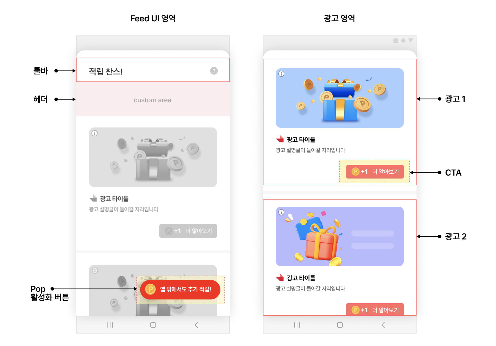

> [!IMPORTANT]
> 이 문서의 커스터마이징 예제는 여러 곳에서 **구현 클래스**를 정의합니다. 구현하는 클래스는 아래 조건을 지켜야 하며, 지키지 않으면 커스터마이징이 적용되지 않습니다.
>
> - 구현 클래스는 내부 클래스(Inner class)가 아니어야 합니다.
> - 내부 클래스로 만들어야 한다면 public static 클래스로 구현해야 합니다.

## 개인정보 수집 동의 UI

개인정보 보호법과 구글 정책에 따라, 개인정보 수집·사용에는 사용자의 동의가 필요합니다. <strong>동의하지 않은 사용자에게는 Feed 지면에 광고가 할당되지 않습니다.</strong>

Planet AD SDK는 동의를 받기 위한 UI를 기본 제공합니다. Feed 지면에 처음 진입하는 사용자에게는 아래 왼쪽과 같은 동의 UI가 표시되고, 동의하지 않으면 오른쪽처럼 "참여할 수 있는 광고가 없습니다." 화면이 보입니다.

SDK가 제공하는 동의 UI를 사용하지 않거나, 동의를 다시 받고 싶을 때는 아래 API를 사용합니다.

| Class | API | 설명 |
|---|---|---|
| **SKPAdBenefit** | getPrivacyPolicyManager() | PrivacyPolicyManager 인스턴스를 반환합니다. |
| **PrivacyPolicyManager** | showConsentUI(context, new PrivacyPolicyEventListener()) | 개인정보 수집 동의 UI를 표시합니다. |
|  | grantConsent() | 개인정보 수집에 동의 처리합니다. 사용자가 처음 Feed 지면에 진입하기 전에 호출하면 해당 사용자에게 동의 UI가 보이지 않습니다. |
|  | revokeConsent() | 개인정보 수집 동의를 철회합니다. 철회하면 사용자가 Feed 지면에 진입할 때 동의 UI가 다시 표시됩니다. |
|  | isConsentGranted() | 개인정보 수집 동의 여부를 확인합니다. |
| **PrivacyPolicyEventListener** | onUpdated(accepted: Boolean) | showConsentUI에서 보여진 UI에서 사용자가 동의하면 accepted = true, 미동의하면 accepted = false로 호출됩니다. |

## 프래그먼트로 Feed 연동

Feed 지면은 기본적으로 **액티비티**로 제공됩니다. 더 다양한 연동 방식을 지원하기 위해, 액티비티가 아닌 **프래그먼트**로 Feed 지면을 연동할 수도 있습니다.

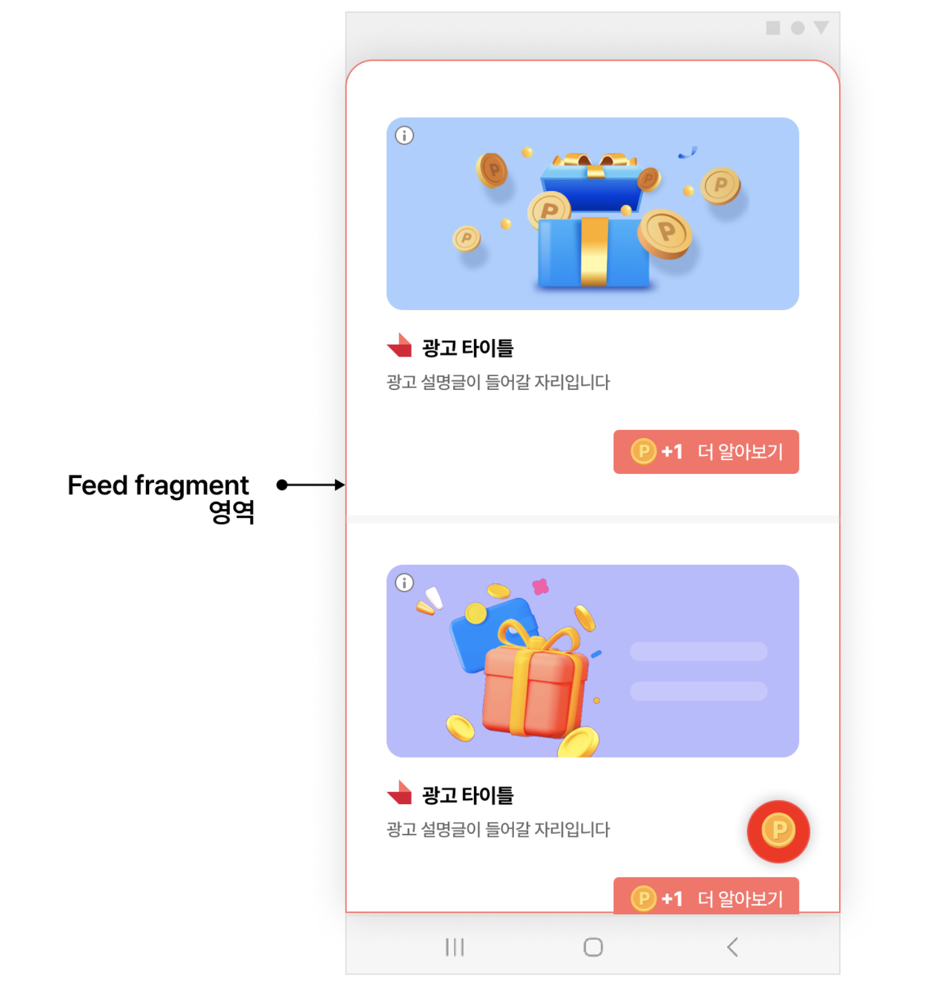

프래그먼트를 넣고 싶은 액티비티에 FeedFragment를 추가하고, 해당 액티비티의 onCreate에서 프래그먼트를 초기화합니다.

### STEP 1. 레이아웃에 FeedFragment 추가

**your_activity_layout.xml**

```xml
<!-- your_activity_layout.xml -->
...생략...
<!-- FeedFragment 추가 -->
<fragment
    android:id="@+id/feed_fragment"
    android:name="com.skplanet.skpad.benefit.presentation.feed.FeedFragment"
    android:layout_width="match_parent"
    android:layout_height="match_parent" />
```

### STEP 2. 액티비티에서 FeedFragment 초기화

**YourActivity.onCreate()**

```java
...생략...
class YourActivity extends Actvity {

    private FeedHandler feedHandler;

    @Override
    public void onCreate() {
        super.onCreate();
        ...생략...

        // 광고를 새로 받기 위해 필요한 부분입니다.
        feedHandler = new FeedHandler(context, "YOUR_FEED_UNIT_ID");

        // FeedFragment 초기화
        final FeedFragment feedFragment = (FeedFragment) getSupportFragmentManager().findFragmentById(R.id.feed_fragment);
        if (feedFragment != null) {
            feedFragment.init(context, "YOUR_FEED_UNIT_ID");
        }
    }
    ...생략...
}
```

> [!TIP]
> FeedFragment에는 <strong>툴바 영역이 없습니다.</strong>

## Feed 무한 스크롤

Feed 무한 스크롤 기능이 켜져 있으면, 사용자가 마지막 광고까지 봤을 때 광고를 추가로 할당받습니다. 추가 요청에서 광고가 할당되지 않으면 더 이상 요청하지 않습니다.

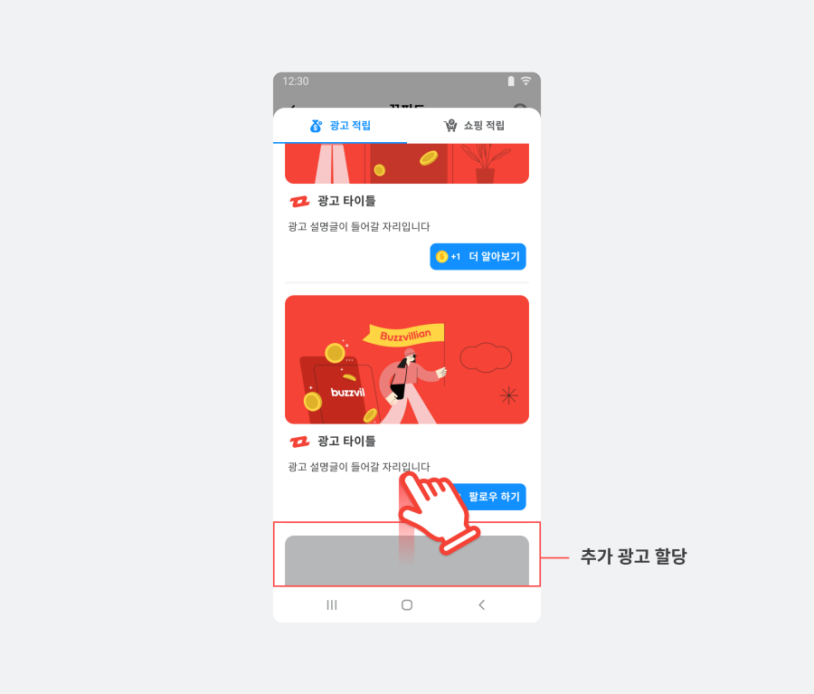

무한 스크롤 기능은 **기본적으로 활성화**되어 있습니다. FeedConfig에서 끌 수 있습니다.

**FeedConfig — 무한 스크롤 끄기**

```java
final FeedConfig feedConfig = new FeedConfig.Builder(context, "YOUR_FEED_UNIT_ID")
    .autoLoadingEnabled(false) // Feed 무한 스크롤 기능
    .build();
```

## 툴바 영역 자체 구현

Feed 툴바 영역의 디자인을 바꿀 수 있습니다. 툴바를 변경하는 방법은 두 가지이며, 아래 중 하나를 선택해 연동합니다.

- SDK에서 기본으로 제공하는 UI를 이용하는 방법
- 직접 구현한 Custom View를 이용하는 방법

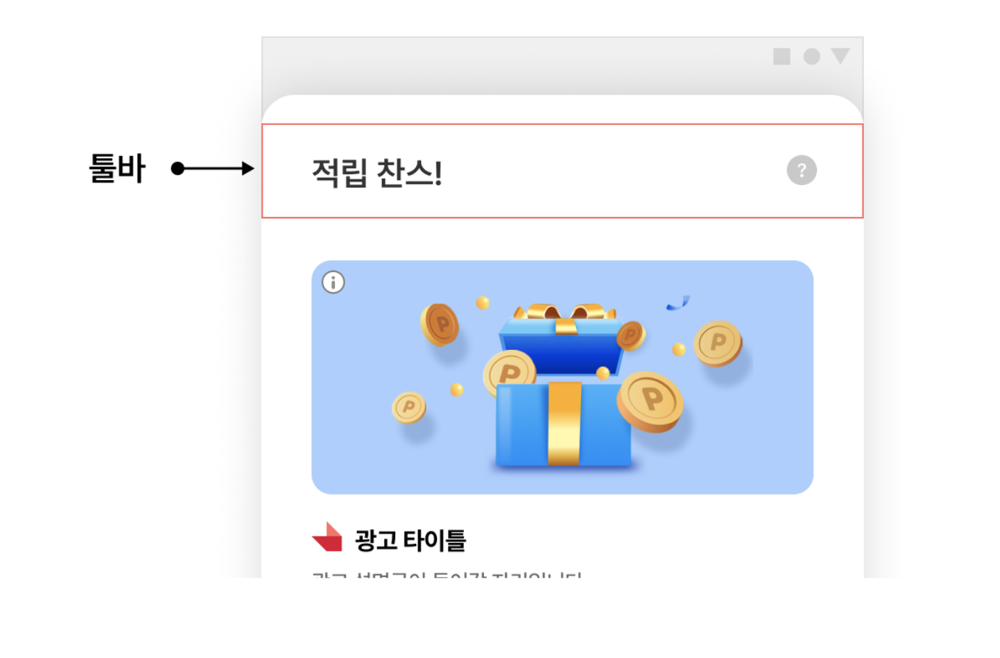

### 방법 1. SDK 기본 UI를 이용하는 방법

기본 UI를 수정해 타이틀이나 배경색을 바꾸는 방법입니다. DefaultFeedToolbarHolder의 상속 클래스를 구현하고, 기본 UI(FeedToolbar)를 사용해 타이틀·배경색을 변경한 뒤, FeedConfig에 구현한 클래스를 추가합니다.

**YourFeedToolbarHolder — 기본 UI 활용**

```java
public class YourFeedToolbarHolder extends DefaultFeedToolbarHolder {
    @Override
    public View getView(Activity activity, @NonNull final String unitId) {
        toolbar = new FeedToolbar(activity); // FeedToolbar 에서 제공하는 기본 Template 사용
        toolbar.setTitle("YourFeedToolbarHolder");
        toolbar.setIconResource(R.drawable.your_icon);
        toolbar.setBackgroundColor(Color.parseColor("#123456"));
        addInquiryMenuItemView(activity); // 문의하기 버튼은 이 함수를 통해 간단하게 추가 가능합니다.
        addSettingsMenuItemView(activity); // 세팅 버튼은 이 함수를 통해 간단하게 추가 가능합니다.
        addRightMenuItemView1(activity); // custom 버튼 추가
        return toolbar;
    }

    // custom 버튼 추가는 DefaultMenuLayout 를 사용하여 View 를 생성하고
    // toolbar.addRightMenuButton 를 사용하여 toolbar 에 추가합니다.
    private void addRightMenuItemView1(@NonNull final Activity activity) {
        MenuLayout menuLayout = new DefaultMenuLayout(activity, R.mipmap.ic_launcher);
        menuLayout.setOnClickListener(new View.OnClickListener() {

            @Override
            public void onClick(View v) {
                showInquiry(); // showInquiry 를 호출하여 문의하기 페이지로 연결합니다.
            }
        });
        toolbar.addRightMenuButton(menuLayout);
    }
}
```

**FeedConfig — 구현한 툴바 홀더 등록**

```java
final FeedConfig feedConfig = new FeedConfig.Builder(context, "YOUR_FEED_UNIT_ID")
    .feedToolbarHolderClass(YourFeedToolbarHolder.class)
    .build();
```

### 방법 2. 직접 구현한 Custom View를 이용하는 방법

SDK 기본 UI를 쓰지 않고, 직접 만든 뷰로 툴바를 구성하는 방법입니다. DefaultFeedToolbarHolder의 상속 클래스를 구현하고, Custom View(your_toolbar_header_layout)를 툴바 영역의 View로 구현한 뒤, FeedConfig에 구현한 클래스를 추가합니다.

**YourFeedToolbarHolder — Custom View 사용**

```java
public class YourFeedToolbarHolder extends DefaultFeedToolbarHolder {
    @Override
    public View getView(final Activity activity, @NonNull final String unitId) {
        final LayoutInflater inflater = (LayoutInflater) activity.getSystemService(Context.LAYOUT_INFLATER_SERVICE);
        return inflater.inflate(R.layout.your_toolbar_header_layout, null);
    }

    @Override
    public void onTotalRewardUpdated(int totalReward) {
    }
}
```

**FeedConfig — 구현한 툴바 홀더 등록**

```java
final FeedConfig feedConfig = new FeedConfig.Builder(context, "YOUR_FEED_UNIT_ID")
    .feedToolbarHolderClass(YourFeedToolbarHolder.class)
    .build();
```

> [!WARNING]
> Custom View의 높이가 안드로이드 액티비티의 기본 액션바 높이와 다르면, 직접 구현한 View가 정상적으로 보이지 않을 수 있습니다. 이 경우에는 액티비티에 Theme을 설정해 액션바 높이를 맞춰야 합니다.

아래는 Theme을 설정해 액션바 높이를 수정하는 예시입니다.

**AndroidManifest.xml**

```xml
// AndroidManifest.xml

...
<activity
    android:name="com.skplanet.skpad.benefit.presentation.feed.FeedBottomSheetActivity"
    android:theme="@style/CustomActivityTheme"
    tools:replace="android:theme"/>
...
```

**styles.xml**

```xml
// styles.xml
<style name="CustomActivityTheme" parent="Theme.SKPAd.RotatableBottomSheet">
    <item name="actionBarSize">DESIRED_ACTION_BAR_HEIGHT</item>
</style>
```

## 헤더 영역에 프로필 입력 배너 표시

사용자가 출생연도·성별 정보를 설정하지 않으면, 헤더 영역에 **프로필 정보 입력 배너**가 표시됩니다. 사용자의 정보 제공 여부와 무관하게 이 배너를 표시하지 않을 수도 있습니다.

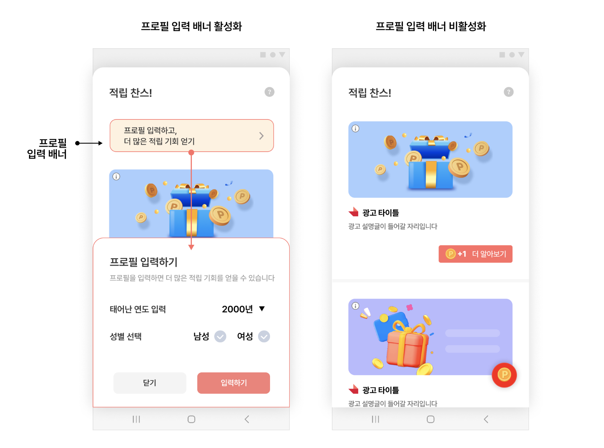

> [!IMPORTANT]
> 이 기능을 사용하려면 FeedConfig.feedHeaderViewAdapterClass를 설정하지 않아야 합니다.

**FeedConfig — 프로필 배너 미노출**

```java
final FeedConfig feedConfig = new FeedConfig.Builder(context, "YOUR_FEED_UNIT_ID")
    .profileBannerEnabled(false) // 프로필 배너 미노출
    .build();
```

## 적립 가능 금액 표시

헤더 영역에 SDK 기본 UI를 사용해 "총 적립 가능 금액"을 사용자에게 보여줄 수 있습니다.

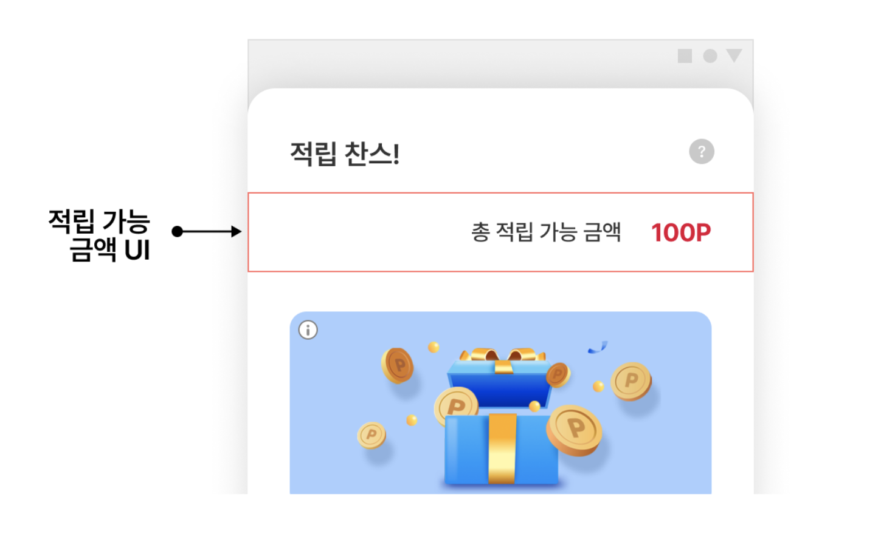

**FeedConfig — 기본 헤더(적립 가능 금액) 사용**

```java
final FeedConfig feedConfig = new FeedConfig.Builder(context, "YOUR_FEED_UNIT_ID")
    .feedHeaderViewAdapterClass(DefaultFeedHeaderViewAdapter.class)
    .build();
```

> [!TIP]
> 이 UI를 바꾸려면 헤더 영역을 자체 구현해야 합니다. 아래 헤더 영역 자체 구현을 참고하세요.

## 헤더 영역 자체 구현

Feed 헤더 영역을 자유롭게 활용할 수 있습니다. 예를 들어 Feed 영역을 설명하는 공간으로 쓸 수 있습니다.

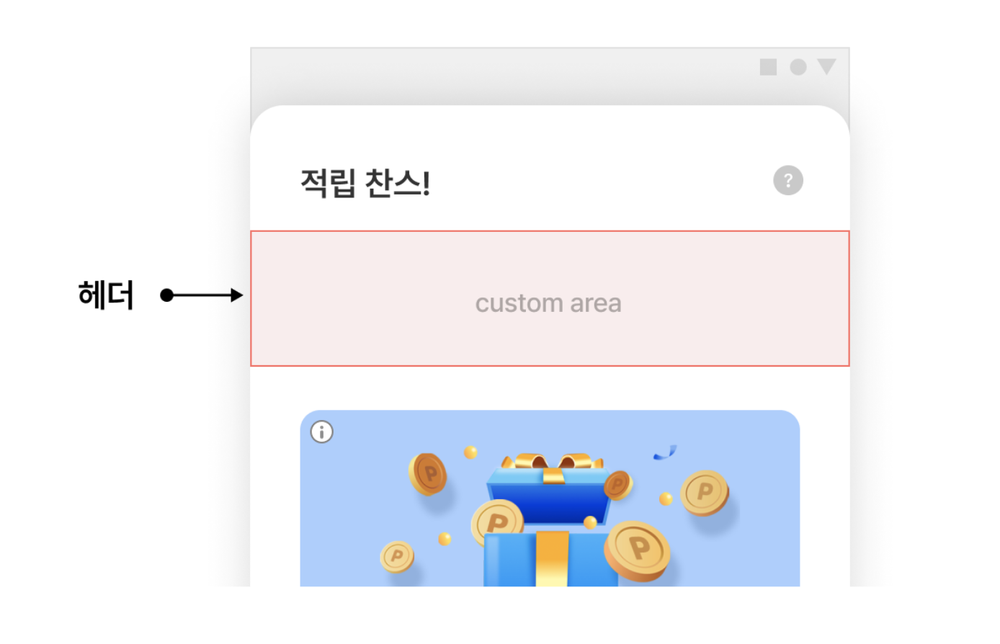

헤더 영역에 직접 구현한 UI에 적립 가능한 금액을 표시할 수도 있습니다. onBindView를 통해 지급 가능한 금액(reward)을 알 수 있습니다.

FeedHeaderViewAdapter의 구현 클래스를 만들고, 구현한 Custom View(your_feed_header_layout)를 헤더 영역에 구현합니다. 그리고 FeedConfig에 구현한 클래스를 추가합니다.

**CustomFeedHeaderViewAdapter**

```java
public class CustomFeedHeaderViewAdapter implements FeedHeaderViewAdapter {
    @Override
    public View onCreateView(final Context context, final ViewGroup parent) {
        final LayoutInflater inflater = (LayoutInflater) context.getSystemService(Context.LAYOUT_INFLATER_SERVICE);
        return inflater.inflate(R.layout.your_feed_header_layout, parent, false);
    }

    @Override
    public void onBindView(final View view, final int reward) {
        // Display total reward on the header if needed.
        val textView: TextView = view.findViewById(R.id.your_textview)
        textView.text = String.format("리워드 %d원", reward)
    }

    @Override
    public void onDestroyView() {
        // Use this this callback for clearing memory
    }
}
```

**FeedConfig — 구현한 헤더 어댑터 등록**

```java
final FeedConfig feedConfig = new FeedConfig.Builder(context, "YOUR_FEED_UNIT_ID")
    .feedHeaderViewAdapterClass(CustomFeedHeaderViewAdapter.class)
    .build();
```

## 광고 분류 기능 (탭·필터)

Feed 지면은 사용자가 광고를 선택적으로 참여할 수 있도록 **탭**과 **필터** 기능을 지원합니다.

### 탭 기능

탭은 <strong>일반 광고(노출형·참여형)</strong>와 **쇼핑 적립형 광고**를 구분하는 역할을 합니다. 탭·필터 기능은 기본 제공되며, 기본값은 false(비활성화)입니다.

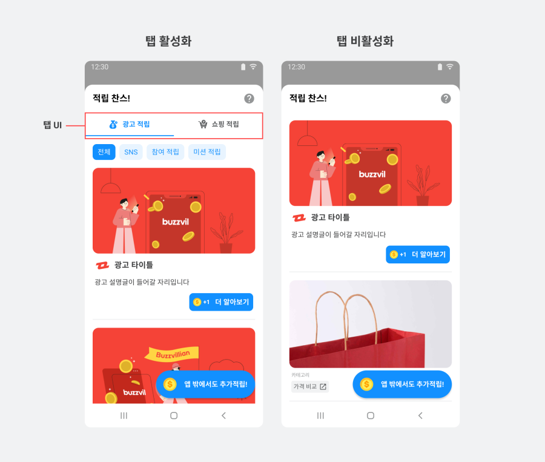

**FeedConfig — 탭 비활성화**

```java
final FeedConfig feedConfig = new FeedConfig.Builder(context, "YOUR_FEED_UNIT_ID")
    .tabUiEnabled(false) // 탭 비활성화
    .build();
```

### 필터 기능

필터는 광고를 카테고리별로 더 세분화합니다. **필터는 탭에 종속**되어 있으므로, 탭이 비활성화되면 필터도 함께 비활성화됩니다.

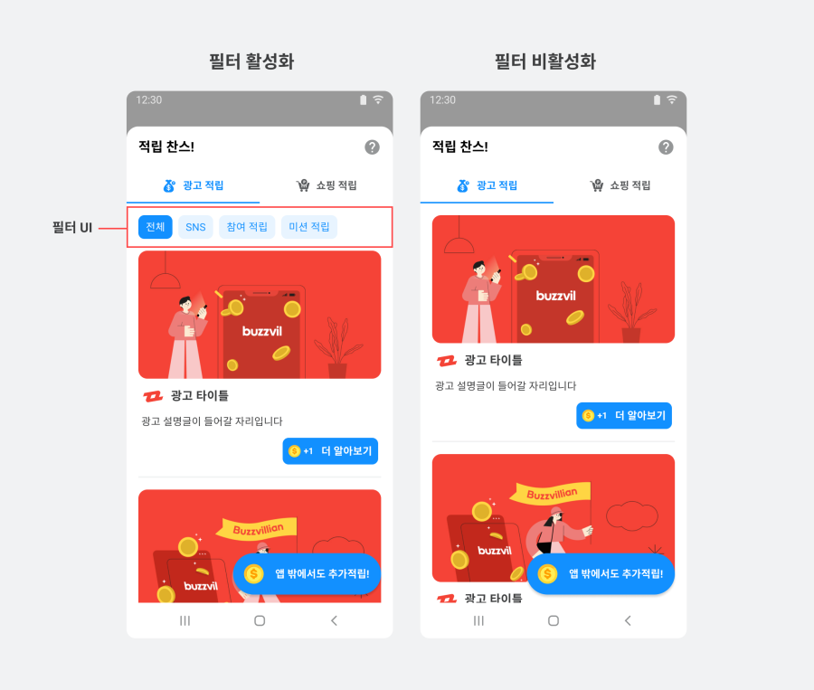

**FeedConfig — 필터 비활성화**

```java
final FeedConfig feedConfig = new FeedConfig.Builder(context, "YOUR_FEED_UNIT_ID")
    .tabUiEnabled(true) // 탭이 비활성화되면 필터도 비활성화 됩니다.
    .filterUiEnabled(false) // 필터 비활성화
    .build();
```

## 광고 UI 자체 구현

Planet AD SDK가 제공하는 광고에는 **일반 광고**와 **쇼핑 적립 광고**가 있습니다. 각 광고에 따라 UI를 변경하는 방법이 다르므로, 광고 UI를 모두 바꾸려면 아래 두 가지 가이드를 모두 적용해야 합니다.

- 일반 광고 UI 자체 구현
- 쇼핑 적립 광고 UI 자체 구현

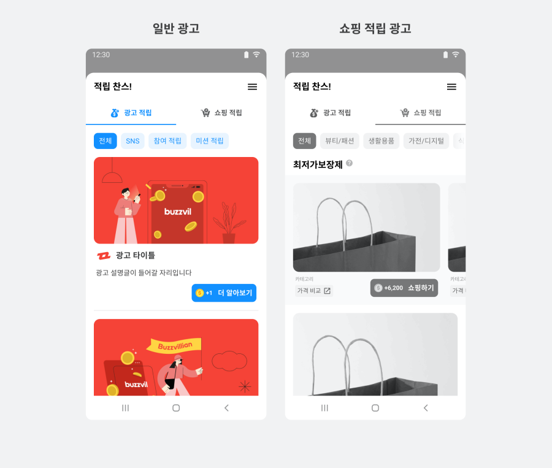

### 일반 광고 UI 자체 구현

일반 광고 UI를 구성하는 항목은 다음과 같습니다.

| 항목 | 설명 | 필수여부 | 비고 |
|---|---|---|---|
| 광고 제목 | 광고의 제목 | Mandatory | 최대 10자<br>생략 부호로 일정 길이 이상은 생략 가능 |
| 광고 소재 | 이미지, 동영상 등 광고 소재 | Mandatory | com.skplanet.skpad.benefit.presentation.media.MediaView 사용 필수<br>종횡비 유지 필수<br>여백 추가 가능<br>이미지 사이즈 1200x627 \[px\] |
| 광고 설명 | 광고에 대한 상세 설명 | Mandatory | 생략 부호로 일정 길이 이상은 생략 가능<br>최대 40자 |
| 광고주 아이콘 | 광고주 아이콘 이미지 | Mandatory | 종횡비 유지 필수<br>이미지 사이즈 80x80 \[px\] |
| CTA 버튼 | 광고의 참여를 유도하는 버튼 | Mandatory | com.skplanet.skpad.benefit.presentation.media.CtaView 사용 필수<br>최대 7자<br>생략 부호로 일정 길이 이상은 생략 가능 |
| 광고 알림 문구 | Sponsored image/ text view | Optional | 광고임을 나타내는 텍스트 또는 이미지<br>APP 정책에 맞게 필요하다면 추가.<br>예시) "광고", "ad", "스폰서", "Sponsored" |

#### STEP 1. 광고 레이아웃 구현

일반 광고용 NativeAdView의 규격에 맞는 레이아웃(your_feed_ad.xml)을 구현합니다.

**your_feed_ad.xml**

```xml
// your_feed_ad.xml
<com.skplanet.skpad.benefit.presentation.nativead.NativeAdView
    android:id="@+id/native_ad_view" ...>

    // MediaView와 CtaView는 NativeAdView의 하위 컴포넌트로 구현해야합니다.

    <LinearLayout ... >
        <com.skplanet.skpad.benefit.presentation.media.MediaView
            android:id="@+id/mediaView" ... />
        <TextView
            android:id="@+id/textTitle" ... />
        <TextView
            android:id="@+id/textDescription" ... />
        <ImageView
            android:id="@+id/imageIcon" ... />
        <com.skplanet.skpad.benefit.presentation.media.CtaView
            android:id="@+id/ctaView" ... />
    </LinearLayout>

</com.skplanet.skpad.benefit.presentation.nativead.NativeAdView>
```

#### STEP 2. AdsAdapter 상속 클래스 구현

AdsAdapter의 상속 클래스를 구현합니다. onCreateViewHolder에서 your_feed_ad.xml을 사용해 NativeAdView를 생성하고, FeedConfig에 구현한 YourAdsAdapter를 설정합니다.

**YourAdsAdapter**

```java
public class YourAdsAdapter extends AdsAdapter<AdsAdapter.NativeAdViewHolder> {

    @Override
    public NativeAdViewHolder onCreateViewHolder(ViewGroup parent, int viewType) {
        final LayoutInflater inflater = LayoutInflater.from(parent.getContext());
        final NativeAdView feedNativeAdView = (NativeAdView) inflater.inflate(R.layout.your_feed_ad, parent, false);
        return new NativeAdViewHolder(feedNativeAdView);
    }

    @Override
    public void onBindViewHolder(NativeAdViewHolder holder, NativeAd nativeAd) {
        super.onBindViewHolder(holder, nativeAd);
        final NativeAdView view = (NativeAdView) holder.itemView;

        final Ad ad = nativeAd.getAd();

        // create ad component
        final MediaView mediaView = view.findViewById(R.id.mediaView);
        final TextView titleView = view.findViewById(R.id.textTitle);
        final ImageView iconView = view.findViewById(R.id.imageIcon);
        final TextView descriptionView = view.findViewById(R.id.textDescription);
        final CtaView ctaView = view.findViewById(R.id.ctaView);
        final CtaPresenter ctaPresenter = new CtaPresenter(ctaView); // CtaView should not be null

        // data binding
        ctaPresenter.bind(nativeAd);

        if (mediaView != null) {
            mediaView.setCreative(ad.getCreative());
            mediaView.setVideoEventListener(new VideoEventListener() {
                // Override and implement methods
            });
        }

        if (titleView != null) {
            titleView.setText(ad.getTitle());
        }

        if (iconView != null) {
            ImageLoader.getInstance().displayImage(ad.getIconUrl(), iconView);
        }

        if (descriptionView != null) {
            descriptionView.setText(ad.getDescription());
        }

        // clickableViews에 추가된 UI 컴포넌트를 클릭하면 광고 페이지로 이동합니다.
        final Collection<View> clickableViews = new ArrayList<>();
        clickableViews.add(ctaView);
        clickableViews.add(mediaView);
        clickableViews.add(titleView);
        clickableViews.add(descriptionView);

        // 광고 콜백 이벤트를 수신할 수 있습니다.
        // view.setNativeAd 보다 전에 호출해야 합니다.
        view.addOnNativeAdEventListener(new NativeAdView.OnNativeAdEventListener() {

            @Override
            public void onImpressed(final @NonNull NativeAdView view, final @NonNull NativeAd nativeAd) {

            }

            @Override
            public void onClicked(@NonNull NativeAdView view, @NonNull NativeAd nativeAd) {
                ctaPresenter.bind(nativeAd);
            }

            @Override
            public void onRewardRequested(@NonNull NativeAdView view, @NonNull NativeAd nativeAd) {

            }

            @Override
            public void onRewarded(@NonNull NativeAdView nativeAdView, @NonNull NativeAd nativeAd, @Nullable RewardResult rewardResult) {

            }

            @Override
            public void onParticipated(final @NonNull NativeAdView view, final @NonNull NativeAd nativeAd) {
                ctaPresenter.bind(nativeAd);
            }
        });
        view.setMediaView(mediaView);
        view.setClickableViews(clickableViews);
        view.setNativeAd(nativeAd);
    }
}
```

**FeedConfig — 구현한 어댑터 등록**

```java
final FeedConfig feedConfig = new FeedConfig.Builder(context, "YOUR_FEED_UNIT_ID")
    .adsAdapterClass(YourAdsAdapter.class)
    .build();
```

### 쇼핑 적립 광고 UI 자체 구현

쇼핑 적립 광고는 일반 광고에 비해 더 많은 정보(가격·할인율·카테고리 등)를 제공합니다. 먼저 위의 일반 광고 UI 자체 구현을 참고한 뒤, 아래 추가 항목을 적용하세요.

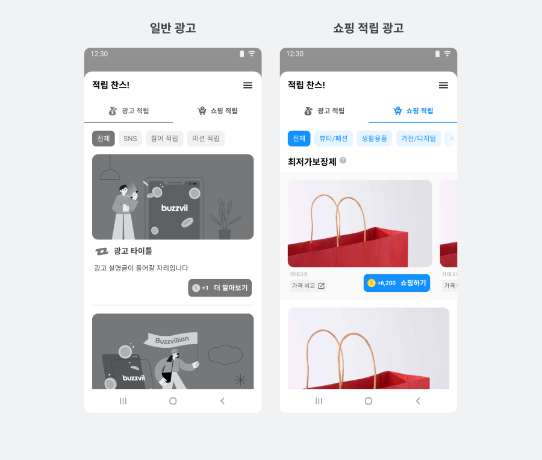

쇼핑 적립 광고용 NativeAdView의 규격에 맞는 레이아웃(your_feed_ad_cps.xml)을 구현합니다. 일반 광고용 레이아웃에 없는 priceText, originalPriceText, discountPercentageText, categoryText가 있습니다.

|  | 설명 | 비고 |
|---|---|---|
| 필수 일반 광고의 필수 컴포넌트 | 일반 광고에서 정의하는 컴포넌트 | Sponsored view는 권장 |
| 필수 Category View | 상품의 카테고리를 표시합니다. |  |
| 권장 OriginalPrice View | 상품의 원가를 표시합니다. |  |
| 권장 Price View | 상품의 할인된 가격을 표시합니다. |  |
| 권장 DiscountRate View | 상품 가격의 할인율을 표시합니다. | 할인율은 원가와 할인가를 비교하여 산출해야 합니다. |

#### STEP 1. 쇼핑 광고 레이아웃 구현

**your_feed_ad_cps.xml**

```xml
// your_feed_ad_cps.xml

<?xml version="1.0" encoding="utf-8"?>
<com.skplanet.skpad.benefit.presentation.nativead.NativeAdView
    android:id="@+id/native_ad_view"
    ...생략... >
    <LinearLayout
        ...생략... >

        // MediaView와 CtaView는 NativeAdView의 하위 컴포넌트로 구현해야합니다.

        <com.skplanet.skpad.benefit.presentation.media.MediaView
            android:id="@+id/mediaView"
            ...생략... />

        ...생략...

        <TextView
            android:id="@+id/priceText"
            ...생략... />
        <TextView
            android:id="@+id/originalPriceText"
            ...생략... />
        <TextView
            android:id="@+id/discountPercentageText"
            ...생략... />
        <TextView
            android:id="@+id/categoryText"
            ...생략... />

        ...생략...

    </LinearLayout>
    ...생략...
</com.skplanet.skpad.benefit.presentation.nativead.NativeAdView>
```

#### STEP 2. AdsAdapter 상속 클래스 구현

AdsAdapter의 상속 클래스를 구현합니다. onCreateViewHolder에서 your_feed_ad_cps.xml을 사용해 NativeAdView를 생성하고, FeedConfig에 구현한 YourCPSAdsAdapter를 설정합니다.

**YourCPSAdsAdapter**

```java
public class YourCPSAdsAdapter extends AdsAdapter<AdsAdapter.NativeAdViewHolder> {

    @Override
    public NativeAdViewHolder onCreateViewHolder(ViewGroup parent, int viewType) {
        final LayoutInflater inflater = LayoutInflater.from(parent.getContext());
        final NativeAdView feedNativeAdView = (NativeAdView) inflater.inflate(R.layout.your_feed_ad_cps, parent, false);
        return new NativeAdViewHolder(feedNativeAdView);
    }

    @Override
    public void onBindViewHolder(NativeAdViewHolder holder, NativeAd nativeAd) {
        super.onBindViewHolder(holder, nativeAd);

        final NativeAdView view = (NativeAdView) holder.itemView;
        final Ad ad = nativeAd.getAd();

        // create ad component
        // ...생략...
        final TextView priceText = view.findViewById(R.id.discountedPriceText);
        final TextView originalPriceText = view.findViewById(R.id.originalPriceText);
        final TextView discountPercentageText = view.findViewById(R.id.discountPercentageText);
        final TextView categoryText = view.findViewById(R.id.categoryText);

        // data binding
        // ...생략...
        final Product product = ad.getProduct();
        if (product != null) {
            if (product.getDiscountedPrice() != null) {
                // 할인이 있는 쇼핑 광고
                originalPriceText.setPaintFlags(originalPriceText.getPaintFlags() | Paint.STRIKE_THRU_TEXT_FLAG);
                int percentage = 0;
                if (product.getPrice() > product.getDiscountedPrice()) {
                    percentage = Math.round((((product.getPrice() - product.getDiscountedPrice()) / product.getPrice() * 100));
                }
                if (percentage > 0) {
                    priceText.setText(getCommaSeparatedPrice(product.getDiscountedPrice().longValue()));
                    originalPriceText.setText(getCommaSeparatedPrice((long) product.getPrice()));
                    discountPercentageText.setText(String.format(Locale.ROOT, "%d%%", percentage));
                    discountPercentageText.setVisibility(View.VISIBLE);
                } else {
                    priceText.setText(getCommaSeparatedPrice((long) product.getPrice()));
                    originalPriceText.setText("");
                    discountPercentageText.setVisibility(View.GONE);
                }
            } else {
                // 할인이 없는 쇼핑 광고
                priceText.setText(getCommaSeparatedPrice((long) product.getPrice()));
                originalPriceText.setText("");
                discountPercentageText.setVisibility(View.GONE);
            }
            categoryText.setText(product.getCategory());
            if (!TextUtils.isEmpty(product.getCategory())) {
                categoryText.setVisibility(View.VISIBLE);
            }
        }

        final Collection<View> clickableViews = new ArrayList<>();
        clickableViews.add(ctaView);
        clickableViews.add(mediaView);
        clickableViews.add(descriptionView);

        // ...생략...

        view.setMediaView(mediaView);
        view.setClickableViews(clickableViews);
        view.setNativeAd(nativeAd);
    }

    private String getCommaSeparatedPrice (long price){
        return String.format(Locale.getDefault(), "₩%,d", price);
    }
}
```

**FeedConfig — 구현한 CPS 어댑터 등록**

```java
final FeedConfig feedConfig = new FeedConfig.Builder(context, "YOUR_FEED_UNIT_ID")
    .cpsAdsAdapterClass(YourCPSAdsAdapter.class)
    .build();
```

## 기본 포인트 지급 안내 UI 자체 구현

사용자가 Feed 지면에 접근하면 일정 주기로 기본 포인트를 지급합니다. 기본 포인트 지급 알림 UI는 아래 이미지와 같습니다. 이 UI를 수정해 사용자 경험을 개선할 수 있습니다.

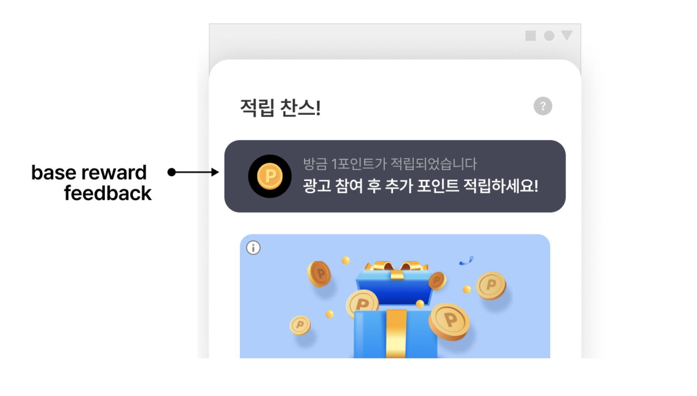

DefaultFeedFeedbackHandler의 상속 클래스를 구현하고, FeedConfig에 등록합니다.

**YourFeedFeedbackHandler**

```java
public class YourFeedFeedbackHandler extends DefaultFeedFeedbackHandler {

    @Override
    @NotNull
    public View getBaseRewardNotificationView(@NotNull Context context, int reward) {
        View view = LayoutInflater.from(context).inflate(R.layout.your_layout, null);
        return view
    }
}
```

**FeedConfig — 구현한 피드백 핸들러 등록**

```java
final FeedConfig feedConfig = new FeedConfig.Builder(context, "YOUR_FEED_UNIT_ID")
    .feedFeedbackHandler(YourFeedFeedbackHandler.class)
    .build();
```

## 광고 미할당 안내 디자인 자체 구현

Feed 지면에 진입한 시점에 노출할 광고가 없으면 **광고 미할당 안내 UI**가 표시됩니다. 이 안내 디자인은 자체 구현해 변경할 수 있습니다.

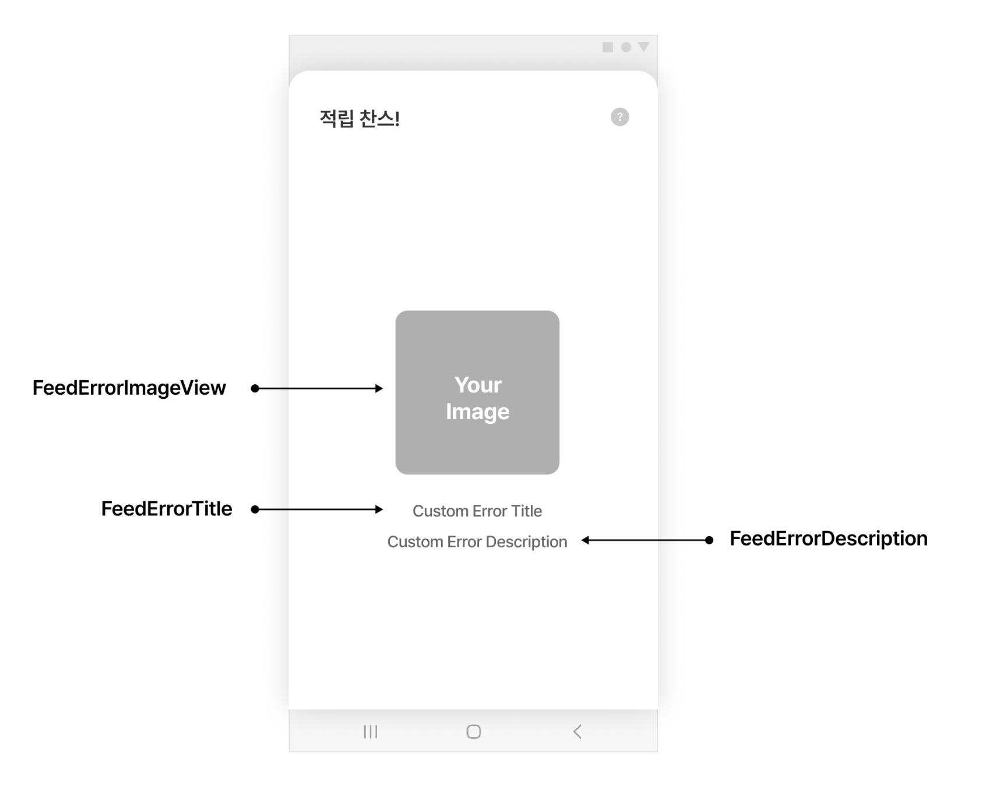

광고 미할당 안내 디자인을 직접 구현하려면 다음 절차를 따르세요.

### STEP 1. 에러 레이아웃 작성

Feed 지면에 광고가 할당되지 않았을 때의 화면에 추가할 에러 이미지(feedErrorImageView), 타이틀(feedErrorTitle), 상세 설명(feedErrorDescription) 레이아웃을 작성합니다.

**custom_feed_error_view.xml**

```xml
<!-- custom_feed_error_view.xml -->

<LinearLayout xmlns:android="http://schemas.android.com/apk/res/android"
    android:layout_width="match_parent"
    android:layout_height="wrap_content"
    android:gravity="center_vertical"
    android:orientation="vertical"
    android:padding="40dp">

    <ImageView
        android:id="@+id/feedErrorImageView"
        android:layout_width="match_parent"
        android:layout_height="wrap_content"/>

    <TextView
        android:id="@+id/feedErrorTitle"
        android:layout_width="wrap_content"
        android:layout_height="wrap_content"
        android:layout_gravity="center_horizontal"
        android:layout_marginTop="32dp"
        android:textColor="@color/bz_text_emphasis"
        android:textSize="16sp" />

    <TextView
        android:id="@+id/feedErrorDescription"
        android:layout_width="wrap_content"
        android:layout_height="wrap_content"
        android:layout_gravity="center_horizontal"
        android:layout_marginTop="8dp"
        android:textAlignment="center"
        android:textColor="@color/bz_text_description"
        android:textSize="14sp" />

</LinearLayout>
```

### STEP 2. FeedErrorViewHolder 구현 클래스 작성

FeedErrorViewHolder를 구현하는 커스텀 클래스 CustomErrorView를 새로 만들고, 자동 완성되는 getErrorView() 메소드를 아래와 같이 구현합니다.

**CustomErrorView**

```java
public class CustomErrorView extends FeedErrorViewHolder {
    @NonNull
    @Override
    public View getErrorView(@NonNull Activity activity) {
        // TODO: 1번에서 생성한 custom_feed_error_view 레이아웃을 inflate
        View errorView = activity.getLayoutInflater().inflate(R.layout.custom_feed_error_view, null, false);
        final ImageView errorImageView = errorView.findViewById(R.id.feedErrorImageView);
        final TextView errorTitle = errorView.findViewById(R.id.feedErrorTitle);
        final TextView errorDescription = errorView.findViewById(R.id.feedErrorDescription);

        errorImageView.setImageResource(R.drawable.bz_ic_feed_profile_coin); // 에러 이미지 설정
        errorTitle.setText("타이틀: 광고가 없습니다. "); // 에러 타이틀 텍스트 설정
        errorDescription.setText("디스크립션: 할당된 광고가 없습니다!"); // 에러 상세 텍스트 설정

        return errorView;
    }
}
```

### STEP 3. FeedConfig에 등록

FeedConfig의 feedErrorViewHolderClass 속성에 2번에서 만든 CustomErrorView 클래스를 추가합니다.

**FeedConfig — 구현한 에러 뷰 홀더 등록**

```java
// Feed 지면 초기화
// TODO: feedErrorViewHolderClass 속성에 2번에서 생성한 CustomErrorView 클래스를 설정합니다.
final FeedConfig feedConfig = new FeedConfig.Builder(YOUR_FEED_UNIT_ID)
        .feedErrorViewHolderClass(CustomErrorView.class)
        .build();
```

> **다음 단계**
>
> - [03-1. Feed-기본설정](03-1_feed-basic.md) — Feed 지면 초기화·표시·preload 기본기
> - [03-3. Feed-고급설정-Grid 타입](03-3_feed-advanced-grid.md) — 2열 그리드 형태 연동
