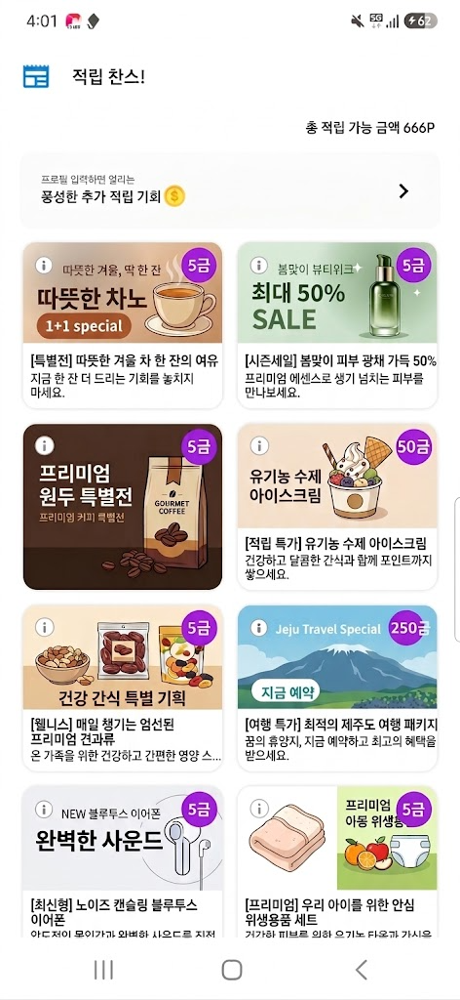
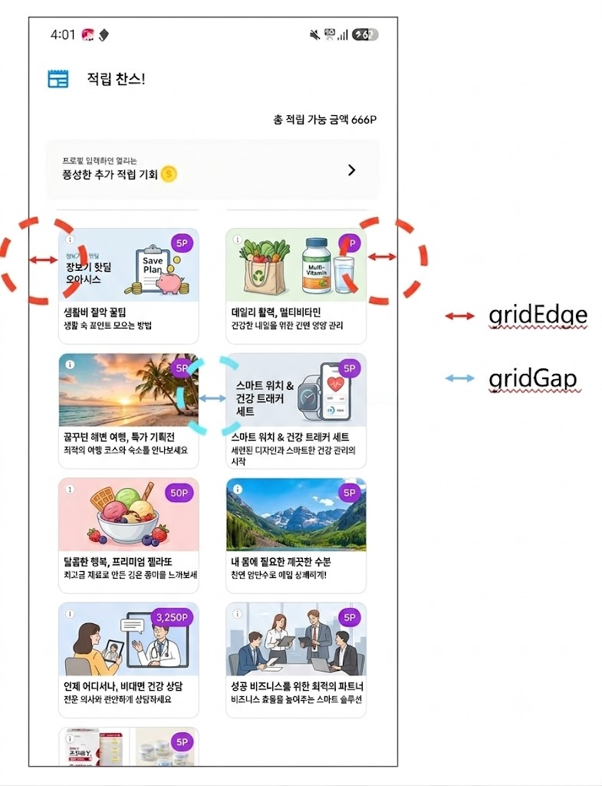
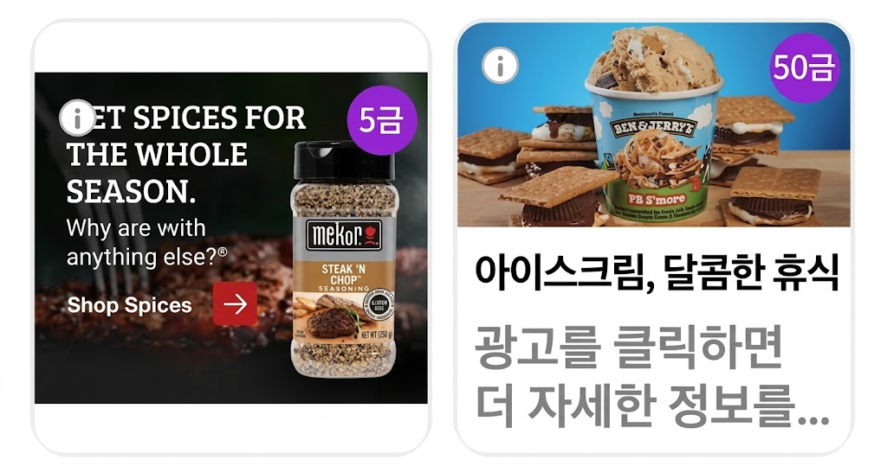

# 03-3. Feed-고급설정-Grid 타입

> [!NOTE]
> **Grid 타입**은 Feed 지면을 2열 그리드 형태로 보여주는 UI입니다. `v1.17.0+`<br>이 문서를 따라 하면 Grid 모드를 켜서 지면을 표시하고, 필요하면 광고 UI를 직접 커스터마이징할 수 있습니다.

## 개요

이 문서는 Planet AD SDK의 Feed 지면 중 **Grid 형태 UI**를 설명합니다. 광고가 세로 리스트가 아니라 **2열 그리드**로 나열되는 형태입니다.

<kbd></kbd>

## 사전 준비

시작하기 전에 아래 항목이 준비되어 있어야 합니다.

- [ ] [01. 시작하기](01_getting-started.md) 적용 완료
- [ ] Feed 지면에 사용할 **Unit ID** 발급 — 이 문서에서는 YOUR_FEED_UNIT_ID 로 표기합니다

## Feed Grid 지면 표시

Grid 모양의 2열 형태로 Feed 지면을 표시합니다.

> [!IMPORTANT]
> Feed 타입의 Grid UI 기능은 `v1.17.0+` 부터 제공됩니다.

다음은 Feed 지면의 Grid Mode를 활성화하는 예시입니다.

**Feed Grid 지면 표시**

```java
FeedConfig.Builder builder = new FeedConfig.Builder(getContext(), "YOUR_FEED_UNIT_ID");

builder.setGridMode(true);   // Feed Grid Mode 활성화

FeedConfig feedConfig = builder.build();
FeedHandler feedHandler = new FeedHandler(feedConfig);
feedHandler.startFeedActivity(getContext());
```

## 광고 UI 자체 구현

Feed 광고 UI 자체 구현의 기본 가이드는 [03-2. Feed-고급설정](03-2_feed-advanced.md)과 같습니다. 이 문서에서는 기존 List형 UI와 **다른, Grid형 UI 관련 추가 사항만** 설명합니다.

### 화면 영역 설정

Feed Grid 화면의 좌우 끝 여백, 좌우 아이템간의 간격에 대해서 설정이 가능합니다.

<kbd></kbd>

Feed Grid 화면의 좌우 끝 여백, 좌우 아이템간의 간격에 대해서 설정이 가능합니다.

아래 내용에서 종류에 따른 설정 가능한 Config를 확인할 수 있습니다.

<table>
<tr>
<th>Config</th>
<th>Description</th>
<th>비고</th>
</tr>
<tr>
<th>Grid Edge</th>
<td><p>좌우 끝 여백 dp</p><p><strong>Feed Grid Sample</strong></p><pre><code>    FeedConfig.Builder builder = new FeedConfig.Builder(getContext(), "YOUR_FEED_UNIT_ID");
    builder..setGridEdge(10)

    FeedConfig feedConfig = builder.build();</code></pre></td>
<td></td>
</tr>
<tr>
<th>Grid Gap</th>
<td><p>아이템 간 간격 dp</p><p><strong>Feed Grid Sample</strong></p><pre><code>    FeedConfig.Builder builder = new FeedConfig.Builder(getContext(), "YOUR_FEED_UNIT_ID");
    builder..setGridGap(10)

    FeedConfig feedConfig = builder.build();</code></pre></td>
<td></td>
</tr>
</table>

### 광고 UI 구성

본 지면에서 2가지 다른 비율의 광고 소재가 표시되며, 소재 크기에 따라 화면 구성에 차이가 있습니다.

| 소재 비율 | 광고 소재 타입 | 광고 영역 구성 | 비고 |
|---|---|---|---|
| **1200x627<br>** | 이미지(Native),<br>동영상(VAST, VIDEO),<br>WEBBanner | 광고 소재(AD Creative),<br>Title(광고 제목),<br>광고 설명(Description),<br>포인트 (Point Bullet) | • 기존 CTA 버튼을 Point 정보로 간략화 |
| **300x250<br>** | HTML Banner(HTML) | 광고 소재(AD Creative),<br>포인트 (Point Bullet) | • 기존 CTA 버튼을 Point 정보로 간략화<br>• Title, Description은 표시하지 않음. |

아이템의 비율이 다르기 때문에, Customizing 시에 MediaView의 비율과 표시 항목에 대한 고려가 필요합니다.

따라서, 하나의 Layout으로 운영할수도 있고, 필요할 경우 각각 다른 Layout으로 구현할 수고 있습비낟.

- <u> <em><strong>앱의 디자인 컨셉과 구현방법에 따라 상황에 맞는 고려가 필요합니다.</strong></em> </u>

본 지면에서는 2개의 Layout을 이용한 커스터마이징의 Sample을 제공하며, 해당 방식은 아래와 같습니다.

#### STEP 1. 광고 레이아웃 구현 (일반 광고 / HTML Banner)

일반 광고와 HTML Banner 광고 각각에 맞는 레이아웃을 구현합니다.

**your_feed_normal_ad.xml — 일반 광고용 Layout**

```xml
// your_feed_normal_ad.xml
<com.skplanet.skpad.benefit.presentation.nativead.NativeAdView
    android:id="@+id/native_ad_view" ...>
 
    // MediaView는 NativeAdView의 하위 컴포넌트로 구현해야합니다.
    <LinearLayout ... >
        <com.skplanet.skpad.benefit.presentation.media.MediaView
            android:id="@+id/mediaView" ... />

        <com.skplanet.skpad.benefit.presentation.media.SimplePointBulletView
            android:id="@+id/pointBulletView" ... />
 
        <TextView
            android:id="@+id/textTitle" ... />
        <TextView
            android:id="@+id/textDescription" ... />

    </LinearLayout>
 
</com.skplanet.skpad.benefit.presentation.nativead.NativeAdView>
```

HTML Banner 광고용 Layout Sample

**your_feed_html_ad.xml — HTML Banner 광고용 Layout**

```xml
// your_feed_html_ad.xml
<com.skplanet.skpad.benefit.presentation.nativead.NativeAdView
    android:id="@+id/native_ad_view" ...>
 
    // MediaView는 NativeAdView의 하위 컴포넌트로 구현해야합니다.
    <LinearLayout ... >
        <com.skplanet.skpad.benefit.presentation.media.MediaView
            android:id="@+id/mediaView" ... />

        <com.skplanet.skpad.benefit.presentation.media.SimplePointBulletView
            android:id="@+id/pointBulletView" ... />
 
    </LinearLayout>
 
</com.skplanet.skpad.benefit.presentation.nativead.NativeAdView>
```

#### STEP 2. AdsAdapter 상속 클래스 구현

AdsAdapter의 상속 클래스를 구현합니다. onCreateViewHolder에서 소재 타입에 따라 Layout을 다르게 생성할 수 있습니다.

- 단, 이때 소재 타입에 따라 Layout을 다르게 생성할 수 있습니다.

그리고 FeedConfig에 구현한 YourAdsAdapter를 설정합니다.

**YourAdsAdapter**

```java
public class YourAdsAdapter extends AdsAdapter<AdsAdapter.NativeAdViewHolder> {

    @Override
    public NativeAdViewHolder onCreateViewHolder(final ViewGroup parent, final int viewType) {
         final Context context = parent.getContext();
         final LayoutInflater layoutInflater = LayoutInflater.from(context);

         // 광고 타입에 따라 Layout 분리(
         final boolean isHtmlType = isCheckHtmlItemType(viewType);
         final int layoutResId = isHtmlType
                 ? R.layout.skpad_view_feed_ad_grid_html   // HTML Banner Layout
                 : R.layout.skpad_view_feed_ad_grid_ad;    // 일반 광고 Layout

         final NativeAdView nativeAdView =
                 (NativeAdView) layoutInflater.inflate(layoutResId, parent, false);

         return new NativeAdViewHolder(nativeAdView);
    }

    @Override
    @SuppressLint("RecyclerView")
    public void onBindViewHolder(final NativeAdViewHolder holder,  final NativeAd nativeAd) {
        super.onBindViewHolder(holder, nativeAd);
        final NativeAdView view = (NativeAdView) holder.itemView;

        // create ad component
        final CardView rootCard = view.findViewById(R.id.rootCard);
        final ConstraintLayout contentLayout = view.findViewById(R.id.contentLayout);
        final MediaView mediaView = view.findViewById(R.id.mediaView);
        final SimplePointBulletView pointBulletView = view.findViewById(R.id.pointBulletView);

        final LinearLayout titleLayout = view.findViewById(R.id.titleLayout);
        final TextView titleView = view.findViewById(R.id.textTitle);
        final TextView descriptionView = view.findViewById(R.id.textDescription);

        final Ad ad = nativeAd.getAd();

        if (mediaView != null) {

            // HTML 소재 타입을 위한 Background Color처리 추가(필수)
            rootCard.setCardBackgroundColor(Color.TRANSPARENT);
            mediaView.setBackgroundColorListener(color -> {
                rootCard.setCardBackgroundColor(color);
            });

            // HTML 소재의 자동 확대 축소를 위한 ScaleType 지정(필수)
            mediaView.setHTMLScaleType(MediaView.MediaScaleType.FILL);

            mediaView.setCreative(ad.getCreative());

            mediaView.setVideoEventListener(new VideoEventListener() {
                // Override and implement methods         
            });
        }

        // data binding
        pointBulletView.bind(nativeAd); 

        // clickableViews에 추가된 UI 컴포넌트를 클릭하면 광고 페이지로 이동합니다.
        final Collection<View> clickableViews = new ArrayList<>();
        if (titleLayout != null) {
            if (titleView != null) {
                titleView.setText(ad.getTitle());
                clickableViews.add(titleView);
            }

            if (descriptionView != null) {
                descriptionView.setText(ad.getDescription());
                clickableViews.add(descriptionView);
            }

            clickableViews.add(titleLayout);
        }

        clickableViews.add(mediaView);
        clickableViews.add(contentLayout);
        clickableViews.add(pointBulletView);

        // 광고 콜백 이벤트를 수신할 수 있습니다.
        // view.setNativeAd 보다 전에 호출해야 합니다.
        view.clearOnNativeAdEventListeners();
        view.addOnNativeAdEventListener(new NativeAdView.OnNativeAdEventListener() {
            @Override
            public void onImpressed(@NonNull NativeAdView view, @NonNull NativeAd nativeAd) {
            }

            @Override
            public void onClicked(@NonNull NativeAdView view, @NonNull NativeAd nativeAd) {
                pointBulletView.bind(nativeAd);
            }

            @Override
            public void onRewardRequested(@NonNull NativeAdView view, @NonNull NativeAd nativeAd) {
            }

            @Override
            public void onRewarded(@NonNull NativeAdView view, @NonNull NativeAd nativeAd, @Nullable RewardResult nativeAdRewardResult) {
            }

            @Override
            public void onParticipated(@NonNull NativeAdView view, @NonNull NativeAd nativeAd) {
                pointBulletView.bind(nativeAd);
            }
        });
        view.setClickableViews(clickableViews);
        view.setMediaView(mediaView);
        view.setNativeAd(nativeAd);
    }
}
```

**FeedConfig — 구현한 어댑터 등록**

```java
final FeedConfig feedConfig = new FeedConfig.Builder(context, "YOUR_FEED_UNIT_ID")
    .adsAdapterClass(YourAdsAdapter.class)
    .build(); 
```

### UI 커스터마이징 시 필수 적용 사항

<table>
<tr>
<th>항목</th>
<th>내용</th>
<th>비고</th>
</tr>
<tr>
<th>Media View 설정</th>
<td><p>실제 HTML 소재보다, MediaView의 크기가 작은 경우, WebView scale의 조정이 필요합니다.</p><p><u><em><strong>이 경우 Webview의 Scale 조정을 위해 MediaView에 아래와 같이 scaleType 설정이 필요합니다.</strong></em></u></p><pre><code>    // HTML 소재의 자동 확대 축소를 위한 ScaleType 지정(필수)
    mediaView.setHTMLScaleType(MediaView.MediaScaleType.FILL);</code></pre></td>
<td></td>
</tr>
<tr>
<th>HTML Background 색상</th>
<td><ul><li><code>HTML의 경우 컨텐츠에 맞춰 화면 구성</code></li><li>Background 색상의 전달여부는 서버의 Unit설정으로 관리되며, 해당 설정이 Disable일 경우 기본 색상(흰색)이 전달됩니다.</li></ul><pre><code>    // HTML 소재 타입을 위한 Background Color처리 추가(필수)
    rootCard.setCardBackgroundColor(Color.TRANSPARENT);
    mediaView.setBackgroundColorListener(color -&gt; {
        rootCard.setCardBackgroundColor(color);
    }); </code></pre></td>
<td><ul><li>주의<ul><li>해당 Callback은 소재가 HTML인 경우에만 호출됩니다.</li><li>RecycleView의 Item이 재사용되는 과정에서 HTML소재가 보여진 View가 동영상이나 이미지 소재를 위해 재사용되는 경우가 있습니다.</li><li>이 경우 HTML 소재에서 지정한 Background Color가 남아 있을 수 있으니 해당 부분에 대해서 고려가 필요합니다.</li></ul></li></ul></td>
</tr>
</table>

## FAQ

---

- 좌우 소재 사이즈가 다를 경우 높이 차이가 발생할 수 있습니다.
  - Title, Description등 글짜가 표시되는, 일반 소재인 경우 단말 글자 크기 설정에 영역을 받기 때문에 전체 영역의 크기가 변경됩니다.
  - 반면, HTML 소재의 경우 Title, Descriptio을 표시하지 않기 때문에, 소재의 크기가 변경되지 않아, 고정되어 있습니다.
  - 이 경우, 아래와 같이 좌우 아이템의 크기에 차이가 발생할 수 있습니다.
  - 따라서, 해당 경우를 고려한 UI작업이 필요합니다.

    | 단말 글자크기 | 좌 HTML, 우 일반 이미지형일경우 | 비고 |
    |---|---|---|
    | **가장 작은 경우** |  |  |
    | **가장 큰 경우** |  |  |

> **다음 단계**
>
> - [03-1. Feed-기본설정](03-1_feed-basic.md) — Feed 지면 초기화·표시·preload 기본기
> - [03-2. Feed-고급설정](03-2_feed-advanced.md) — 광고 UI 자체 구현 기본 가이드
