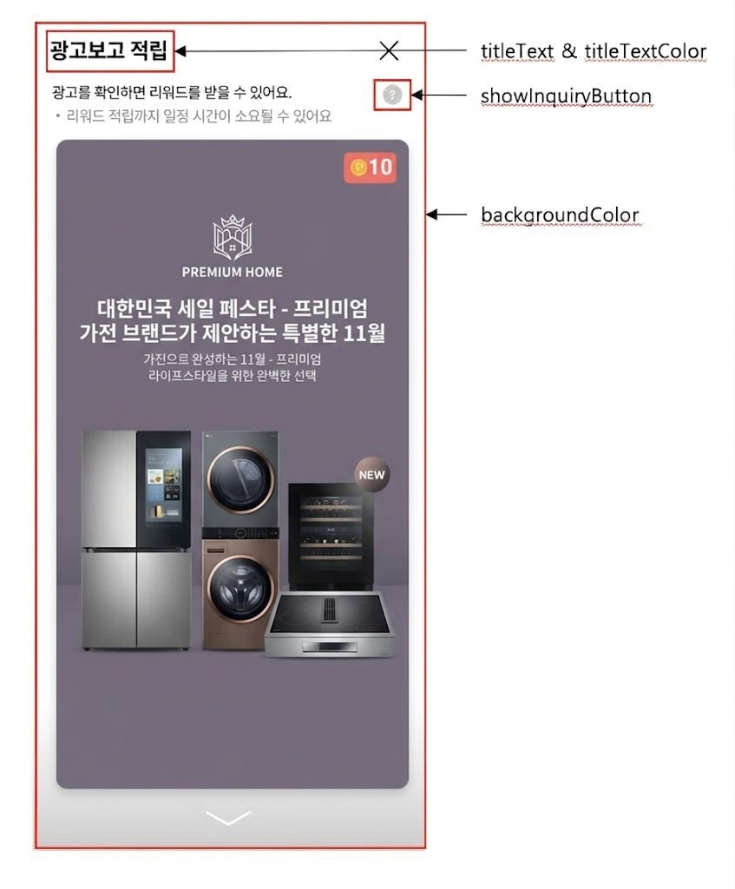
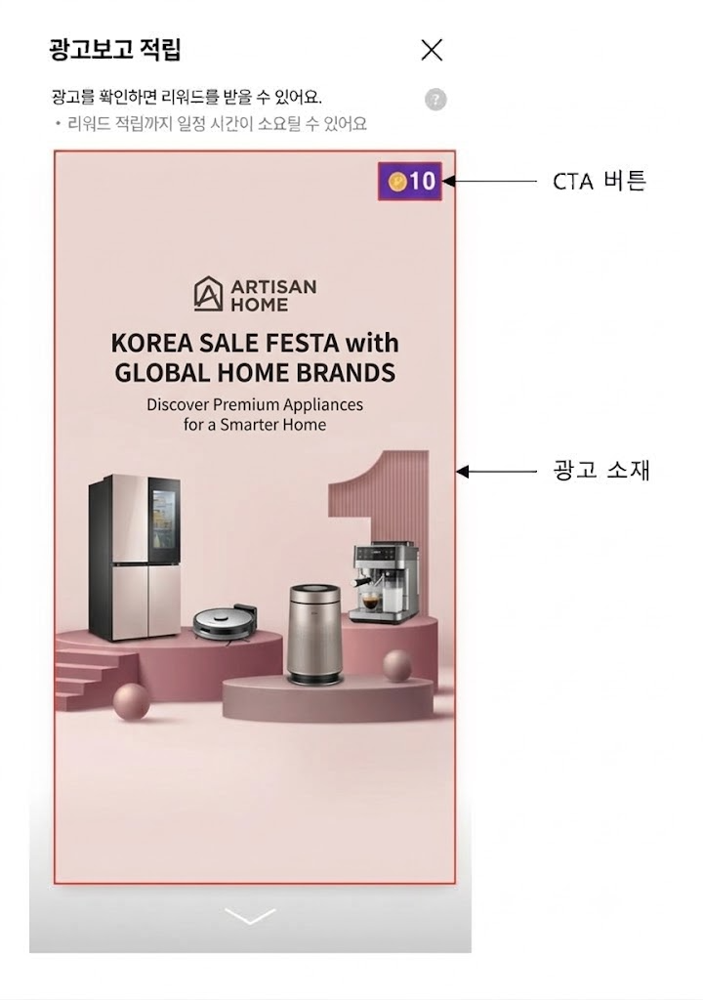
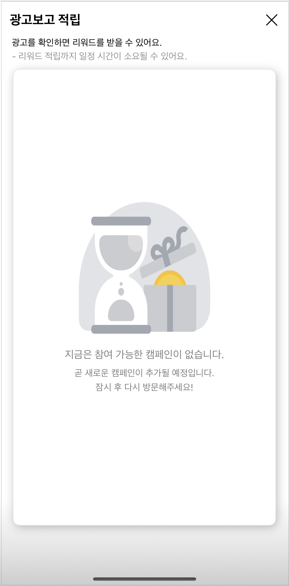

# 04-3. Interstitial 고급설정 - Full Screen Default 타입

> [!NOTE]
> **FullScreen Default 타입**은 화면 전체를 사용하는 전면 Interstitial 지면입니다. `v1.12.0+`<br>이 문서를 따라 하면 FullScreen 지면을 표시하고, 콜백 처리·사전 로드·광고 UI 자체 구현·에러 화면·진입/종료 애니메이션까지 다룰 수 있습니다.

## 개요

이 문서는 Planet AD SDK의 Interstitial FullScreen 지면 연동에서 사용할 수 있는 기능과 각 기능의 사용 방법을 안내합니다.

## 사전 준비

- [ ] [01. 시작하기](01_getting-started.md) 적용 완료
- [ ] Interstitial 지면용 **Unit ID** 발급 — YOUR_INTERSTITIAL_UNIT_ID

## 연동 방법

### STEP 1. FullScreen 지면 표시

Interstitial FullScreen 지면을 표시합니다. FullScreen 지면은 `v1.12.0+`부터 UI를 제공합니다.<br>InterstitialAdHandler.Type.FullScreen으로 설정합니다.

**FullScreen 지면 표시**

```java
InterstitialAdHandler interstitialAdHandler = new InterstitialAdHandlerFactory().create("YOUR_INTERSTITIAL_UNIT_ID", InterstitialAdHandler.Type.FullScreen);

interstitialAdHandler.show(context);
```

### STEP 2. 호출 결과에 대한 콜백

Interstitial 지면이 호출된 후 정상, 실패, 종료 시에 대한 Event Callback을 받을 수 있습니다.

**호출 결과 콜백 수신**

```java
interstitialAdHandler.show(MainActivity.this, interstitialAdConfig, new InterstitialAdHandler.OnInterstitialAdEventListener() {

    // ...

    @Override
    public void onAdLoaded() {
        // 로드 성공시
        // 별도의 처리 특별히 할 것이 없음
    }

    @Override
    public void onAdLoadFailed(AdError error) {
        // 로드 실패시. error를 통해 로드 실패 이유를 알 수 있음
        //
    }

    @Override
    public void onFinish() {
        // 인터스티셜 종료 시
    }
});
```

## AdError Type 별 처리

onAdLoadFailed에서 Error Type에 대한 상황별 동작을 제안할 수 있습니다.<br>네트워크나 서버 오류의 경우는 Toast로 문구 출력을 하면 될 것으로 보입니다. (예: "통신이 원활하지 않습니다.")

**Error Type 분기 처리**

```java
@Override
public void onAdLoadFailed(AdError error) {
    if(ErrorType.SERVER_ERROR.equals(error.getErrorType())) {
        ...
    } else if(ErrorType.WAITING_FOR_RESPONSE.equals(error.getErrorType())) {
        ...
    } ...
}

enum class ErrorType {
    /**
     * 네트워크 or 서버 오류
     */
    SERVER_ERROR, // statusCode 500
    INVALID_PARAMETERS, // statusCode 400
    CONNECTION_TIMEOUT,

    /**
     * Interstitial FullScreen 오류
     */
    EMPTY_RESPONSE, // For campaigns
    WAITING_FOR_RESPONSE,   // interstitialAdHandler.show가 연속적으로 호출되는 경우 전달

    /**
     * 알수 없음
     */
    UNKNOWN
}
```

## 광고 사전 할당 받기

preloadFullScreen()을 호출하여 FullScreen 지면을 표시하기 전에 광고를 미리 할당받을 수 있습니다. 광고가 존재할 경우에만 FullScreen 지면을 표시하여 사용자 경험을 높일 수 있습니다.

**preloadFullScreen으로 사전 할당**

```java
InterstitialAdFullScreenHandler interstitialHandler = new InterstitialAdHandlerFactory().create("YOUR_INTERSTITIAL_UNIT_ID", InterstitialAdHandler.Type.FullScreen);
interstitialHandler.preloadFullScreen(new InterstitialAdFullScreenHandler.FullScreenPreloadListener() {
    @Override
    public void onPreloaded(int adsCount, int totalReward) {
        // adsCount: 광고의 개수, totalReward: 적립 가능한 총 포인트 금액
    }

    @Override
    public void onError(AdError error) {

    }
});
```

## 지면 UI의 구성

SKPAdBenefit AOS SDK에서 제공하는 Interstitial FullScreen 지면 UI의 구성을 지키며 디자인을 변경하는 방법을 안내합니다. 아래는 각 설정 요소가 화면에서 어디에 해당하는지를 보여줍니다.

<kbd></kbd>

Interstitial 지면 UI는 Config 설정으로 변경할 수 있으며, 일부 설정은 지면 종류에 따라 적용되지 않습니다.

| Config | 설명 | FullScreen |
|---|---|---|
| titleText | Interstitial 광고 상단에 있는 Text | O |
| titleTextColor | titleText의 색상 | O |
| backgroundColor | Interstitial 광고 전체의 배경 색상 | O |
| showInquiryButton | 문의하기 버튼 노출 여부 (아래 주의 참고) | O |
| adsAdapterClass | 커스텀 광고 뷰 — 광고 UI 자체 구현 시 설정 (Feed의 광고 UI 자체 구현과 유사) | O |
| errorViewHolderClass | 커스텀 에러 뷰 — 보여줄 광고 없을 경우 표시되는 화면 | O |
| setEnterAnimation | 화면 진입 시 사용되는 Animation 효과 (미지정 시 없음) | O |
| setExitAnimation | 화면 종료 시 사용되는 Animation 효과 (미지정 시 없음) | O |

> [!WARNING]
> **showInquiryButton(문의하기 버튼) — 만 14세 미만 처리 주의**
>
> - Planet AD는 만 14세 미만 아동에게 (맞춤형) 리워드 광고를 송출하지 않습니다.
> - 따라서 만 14세 미만 고객에게는 Planet AD SDK가 제공하는 VOC(문의하기) 기능을 제공해서는 안 됩니다.
> - APP에서는 고객이 만 14세 미만일 경우 VOC(문의하기)로 진입할 수 있는 기능을 **비활성화 혹은 숨김 처리**해야 합니다.
> - 제공 여부는 APP 정책에 따릅니다.

다음은 Interstitial 지면 UI를 변경하는 예시입니다.

<details>
<summary>지면 UI 변경 전체 코드 보기</summary>

**InterstitialAdConfig로 FullScreen UI 변경**

```java
InterstitialAdConfig interstitialAdConfig = new InterstitialAdConfig.Builder()
    .titleText("YOUR_TITLE_TEXT")                                        // Interstitial 지면 상단에 있는 Text
    .textColor("YOUR_TITLE_COLOR")                                       // Interstitial 지면 상단에 있는 Text 색상
    .layoutBackgroundColor("YOUR_BACKGROUND_COLOR")                     // Interstitial 지면 배경색
    .showInquiryButton(true)                                             // 문의하기 버튼 노출 여부
    .adsAdapterClass(YourAdsAdapter.class)                               // 커스텀 광고 뷰
    .errorViewHolderClass(YourErrorViewHolder.class)                    // 커스텀 에러 뷰
    .setEnterAnimation(YourEnterAnimation, YourExitAnimation)            // 화면 진입 Animation 효과
    .setExitAnimation(YourEnterAnimation, YourExitAnimation)             // 화면 종료 Animation 효과
    .build();
```

</details>

## 광고 UI 자체 구현

Planet AD SDK에서 제공하는 FullScreen의 광고에는 **중앙 컨텐츠 영역**을 구성할 수 있습니다.<br>AdsAdapter의 구현 클래스를 만들어 FullScreen의 컨텐츠 영역을 구현하고, InterstitialAdConfig에 구현한 클래스를 adsAdapterClass로 추가합니다.

아래는 FullScreen Default 타입의 구성 요소(CTA 버튼, 광고 소재)입니다.

<kbd></kbd>

다음은 FullScreen의 디자인을 변경하는 방법을 설명하는 예시입니다.

| 항목 | 설명 | 필수 여부 | 비고 |
|---|---|---|---|
| 광고 소재 | 이미지, 동영상 등 광고 소재 | Mandatory | com.skplanet.skpad.benefit.presentation.media.MediaView 사용 필수<br>중횡비 유지 필수 / 여백 추가 가능<br>Adapter의 Item이기에 match_parent로 지정이 기본 |
| CTA 버튼 | 광고의 참여를 유도하는 버튼 | Optional | com.skplanet.skpad.benefit.presentation.interstitial.fullscreen.InterstitialAdFullScreenCtaView 기본 제공<br>필요 시, InterstitialAdFullScreenCtaView를 사용하지 않고 APP에서 구현해서 사용 가능 |

### STEP 1. Item xml 예시

FullScreen용 NativeAdView의 규격에 맞는 레이아웃(your_interstitial_fullscreen_ad.xml)을 구현합니다.

**your_interstitial_fullscreen_ad.xml**

```xml
// your_interstitial_fullscreen_ad.xml
<com.skplanet.skpad.benefit.presentation.nativead.NativeAdView
    android:id="@+id/native_ad_view" ...>

    // MediaView와 CtaView는 NativeAdView의 하위 컴포넌트로 구현해야합니다.
    <LinearLayout ... >
        <com.skplanet.skpad.benefit.presentation.media.MediaView
            android:id="@+id/mediaView" ... />
        <com.skplanet.skpad.benefit.presentation.interstitial.fullscreen.InterstitialAdFullScreenCtaView
            android:id="@+id/ctaView" ... />
    </LinearLayout>

</com.skplanet.skpad.benefit.presentation.nativead.NativeAdView>
```

### STEP 2. adapter의 예시

AdsAdapter의 상속 클래스를 구현합니다.<br>구현한 상속 클래스의 onCreateViewHolder에서 your_interstitial_fullscreen_ad.xml을 사용하여 NativeAdView를 생성합니다.<br>그리고 InterstitialConfig에 구현한 YourAdsAdapter를 설정합니다.

<details>
<summary>Adapter 전체 코드 보기</summary>

**YourAdsAdapter.java**

```java
public class YourAdsAdapter extends AdsAdapter<AdsAdapter.NativeAdViewHolder> {

    @Override
    public NativeAdViewHolder onCreateViewHolder(ViewGroup parent, int viewType) {
        final LayoutInflater inflater = LayoutInflater.from(parent.getContext());
        final NativeAdView interstitialNativeAdView = (NativeAdView) inflater.inflate(R.layout.your_interstitial_fullscreen_ad, parent, false);
        return new NativeAdViewHolder(interstitialNativeAdView);
    }

    @Override
    public void onBindViewHolder(NativeAdViewHolder holder, NativeAd nativeAd) {
        super.onBindViewHolder(holder, nativeAd);
        final NativeAdView view = (NativeAdView) holder.itemView;

        final Ad ad = nativeAd.getAd();

        // create ad component
        final MediaView mediaView = view.findViewById(R.id.mediaView);
        final InterstitialAdFullScreenCtaView ctaView = view.findViewById(R.id.ctaView);
        final InterstitialAdFullScreenCtaPresenter ctaPresenter = new InterstitialAdFullScreenCtaPresenter(ctaView); // CtaView should not be null

        // data binding
        ctaPresenter.bind(nativeAd);

        // mediaView.setCreative 보다 우선적으로 설정하여야 한다.
        mediaView.setVertical(true);                                          // 필수 셋팅
        // mediaView.setImageScaleType(ImageView.ScaleType.FIT_CENTER);       // Image의 경우 화면에 표현되는 Scale 정의(v1.15.0 미만에서 사용)
        mediaView.setImageScaleType(MediaView.MediaScaleType.FIT);            // Image의 경우 화면에 표현되는 Scale 정의(v1.15.0 이상에서 사용)

        if (mediaView != null) {
            mediaView.setCreative(ad.getCreative());
            mediaView.setVideoEventListener(new VideoEventListener() {
                // Override and implement methods
            });
        }

        // clickableViews에 추가된 UI 컴포넌트를 클릭하면 광고 페이지로 이동합니다.
        final Collection<View> clickableViews = new ArrayList<>();
        clickableViews.add(mediaView);

        // 광고 콜백 이벤트를 수신할 수 있습니다.
        // view.setNativeAd 보다 전에 호출해야 합니다.
        view.addOnNativeAdEventListener(new NativeAdView.OnNativeAdEventListener() {

            @Override
            public void onImpressed(final @NonNull NativeAdView view, final @NonNull NativeAd nativeAd) {

            }

            @Override
            public void onClicked(@NonNull NativeAdView view, @NonNull NativeAd nativeAd) {
                ctaPresenter.bind(nativeAd);
            }

            @Override
            public void onRewardRequested(@NonNull NativeAdView view, @NonNull NativeAd nativeAd) {

            }

            @Override
            public void onRewarded(@NonNull NativeAdView nativeAdView, @NonNull NativeAd nativeAd, @Nullable RewardResult rewardResult) {

            }

            @Override
            public void onParticipated(final @NonNull NativeAdView view, final @NonNull NativeAd nativeAd) {
                ctaPresenter.bind(nativeAd);
            }
        });

        view.setMediaView(mediaView);
        view.setClickableViews(clickableViews);
        view.setNativeAd(nativeAd);

        // HTML의 경우 컨텐츠에 맞춰 화면 구성
        // Background 색상의 전달여부는 서버의 Unit설정으로 관리되며, 해당 설정이 Disable일 경우 기본 색상(흰색)이 전달됩니다.
        if (Creative.Type.HTML.equals(ad.getCreative().type)) {
            mediaView.setBackgroundColorListener(new MediaView.BackgroundColorExtractedListener() {
                @Override
                public void onBackgroundColorExtracted(int color) {
                    // 전달된 Background 색상으로 광고영역을 처리한다.
                    view.setBackgroundColor(color);
                }
            });
        }
    }
}
```

</details>

### STEP 3. Custom Adapter 호출

구현한 Custom Adapter를 adsAdapterClass로 지정하여 호출합니다.

**Custom Adapter 호출**

```java
interstitialAdHandler.show(this,
    new InterstitialAdConfig.Builder()
        .adsAdapterClass(YourAdsAdapter.class)
        .build(),
    eventListener);
```

### Full Screen Type의 UI 커스터마이징 시 필수 적용 사항

FullScreen 타입에서 광고 UI를 직접 구현할 때는 아래 항목을 **반드시** 적용해야 합니다.

<details>
<summary>필수 적용 사항 표 보기</summary>

| 항목 | 내용 | 비고 |
|---|---|---|
| **Media View 설정** | MediaView를 Vertical Style로 설정해야 합니다.<br>mediaView.setVertical(true);<br><br>Vertical Style로 설정 시 아래와 같이 적용됩니다.<br>- Full Screen의 경우 Video 전체화면 이용에 제한이 필요 (해당 설정으로 전체화면 버튼 제거)<br>- 세로로 화면이 제공되어 광고를 노출해야 하기에 내부 속성을 변경 |  |
| **Image Type 설정** | Image Type의 경우 ScaleType을 지정할 수 있습니다.<br>- 컨텐츠를 세로로 제공하고, 단말기마다 화면의 비율이 일정하지 않기 때문에, Image 제공 시 ScaleType을 변경하여 처리하기 위해 제공<br>- 기본적으로 FIT_XY로 지정되어 있으나, FullScreen에는 FIT_CENTER가 권장<br>mediaView.setImageScaleType(ImageView.ScaleType.FIT_CENTER); |  |
| **광고 ClickableViews를 위한 처리** | Interstitial FullScreen Type에서는 clickableViews에 MediaView를 제외한 다른 뷰는 추가되어서는 안 됩니다.<br>Collection&lt;View&gt; clickableViews = new ArrayList&lt;&gt;();<br>clickableViews.add(mediaView);<br>view.setClickableViews(clickableViews); |  |
| **CTA 화면 구성** | Interstitial FullScreen에서는 Feed와 다르게 CTAView가 아닌 InterstitialAdFullScreenCtaView가 제공됩니다.<br>- Feed에서 제공하는 CTAView와는 다르게 Custom이 불가능<br>- InterstitialAdFullScreenCtaView, InterstitialAdFullScreenCtaPresenter로 작성 필요<br>InterstitialAdFullScreenCtaPresenter ctaPresenter = new InterstitialAdFullScreenCtaPresenter(ctaView);<br>ctaPresenter.bind(nativeAd) | 앱에서 CTA 기능을 직접 구현하는 경우, InterstitialAdFullScreenCtaView와 InterstitialAdFullScreenCtaPresenter의 역할을 직접 구현하셔야 합니다. |
| **HTML Background 색상** | Background 색상의 전달여부는 서버의 Unit설정으로 관리되며, 해당 설정이 Disable일 경우 기본 색상(흰색)이 전달됩니다.<br>아래 코드 참고 | Interstitial Full Screen Type은 HTML Banner 타입을 지원합니다. |
| **xml 작성 CTA** | Feed에서 제공하는 CTA와 달라 별도 처리 필요.<br>Full Screen의 xml에 CTA 추가 시 아래와 같은 Package Name으로 사용을 해야합니다.<br>&lt;com.skplanet.skpad.benefit.presentation.interstitial.fullscreen.InterstitialAdFullScreenCtaView .../&gt; |  |

HTML Background 색상 처리 코드:

**HTML Background 색상 처리**

```java
if (Creative.Type.HTML.equals(ad.getCreative().type)) {
    mediaView.setBackgroundColorListener(new MediaView.BackgroundColorExtractedListener() {
        @Override
        public void onBackgroundColorExtracted(int color) {
            // 전달된 Background 색상으로 광고영역을 처리한다.
            view.setBackgroundColor(color);
        }
    });
}
```

</details>

## 지면 광고 미할당 안내

사용자가 FullScreen 지면에 진입한 시점에 노출할 광고가 없다면 미할당 안내 UI가 노출됩니다. SKPAdBenefit AOS SDK에서 제공하는 UI의 이미지 혹은 문구만을 변경하여 사용자 경험을 높일 수 있습니다.

<kbd></kbd>

InterstitialAdDefaultErrorViewHolder의 구현 클래스를 만들어 이미지 및 문구를 변경할 수 있습니다.

### STEP 1. Error xml 코드 예시

광고가 할당되지 않았을 때 화면에 추가할 에러 이미지(interstitialErrorImageView), 타이틀(interstitialErrorTitle), 상세 설명(interstitialErrorDescription) 레이아웃을 작성하세요.

<details>
<summary>Error xml 코드 보기</summary>

**custom_interstitial_fullscreen_error_view.xml**

```xml
<!-- custom_interstitial_fullscreen_error_view.xml -->
<LinearLayout xmlns:android="http://schemas.android.com/apk/res/android"
    android:layout_width="match_parent"
    android:layout_height="wrap_content"
    android:gravity="center_vertical"
    android:orientation="vertical"
    android:padding="40dp">

    <ImageView
        android:id="@+id/interstitialErrorImageView"
        android:layout_width="match_parent"
        android:layout_height="wrap_content"/>

    <TextView
        android:id="@+id/interstitialErrorTitle"
        android:layout_width="wrap_content"
        android:layout_height="wrap_content"
        android:layout_gravity="center_horizontal"
        android:layout_marginTop="32dp"
        android:textColor="@color/bz_text_emphasis"
        android:textSize="16sp" />

    <TextView
        android:id="@+id/interstitialErrorDescription"
        android:layout_width="wrap_content"
        android:layout_height="wrap_content"
        android:layout_gravity="center_horizontal"
        android:layout_marginTop="8dp"
        android:textAlignment="center"
        android:textColor="@color/bz_text_description"
        android:textSize="14sp" />

</LinearLayout>
```

</details>

### STEP 2. Error View 예시

interstitialErrorViewHolder를 구현하는 커스텀 클래스 CustomErrorView를 새로 생성하고, 자동 완성되는 getError() 메소드를 다음과 같이 구현하세요.

**CustomErrorView.java**

```java
public class CustomErrorView extends InterstitialErrorViewHolder {
    @NonNull
    @Override
    public View getError(@NonNull Activity activity) {
        // TODO: 1번에서 생성한 custom_interstitial_error_view 레이아웃을 inflate
        View errorView = activity.getLayoutInflater().inflate(R.layout.custom_view_interstitial_fullscreen_error, null, false);
        final ImageView errorImageView = errorView.findViewById(R.id.interstitialErrorImageView);
        final TextView errorTitle = errorView.findViewById(R.id.interstitialErrorTitle);
        final TextView errorDescription = errorView.findViewById(R.id.interstitialErrorDescription);

        errorImageView.setImageResource(R.drawable.bz_ic_feed_profile_coin); // 에러 이미지 설정
        errorTitle.setText("타이틀: 광고가 없습니다. "); // 에러 타이틀 텍스트 설정
        errorDescription.setText("디스크립션: 할당된 광고가 없습니다!"); // 에러 상세 텍스트 설정

        return errorView;
    }
}
```

### STEP 3. Custom Error View 호출

구현한 커스텀 에러 뷰를 errorViewHolderClass로 지정하여 호출합니다.

**Custom Error View 호출**

```java
interstitialAdHandler.show(this,
    new InterstitialAdConfig.Builder()
        .errorViewHolderClass(YourErrorViewHolder.class)
        .build(),
    eventListener);
```

## 화면 진입/종료 Animation 효과

화면 진입/종료에 따른 Animation의 효과를 제공합니다.

**진입/종료 애니메이션 설정**

```java
InterstitialAdConfig interstitialAdConfig = new InterstitialAdConfig.Builder()
    .setEnterAnimation(YourEnterAnimation, YourExitAnimation)   // Interstitial 진입 Animation 효과
    .setExitAnimation(YourEnterAnimation, YourExitAnimation)    // Interstitial 종료 Animation 효과
    .build();
```

> **다음 단계**
>
> - [04-4. Interstitial 고급설정 - Fullscreen No Edge 타입](04-4_interstitial-advanced-fullscreen-no-edge.md) — No Edge 타입 연동
> - [04-2. Interstitial 고급설정 - Dialog, BottomSheet](04-2_interstitial-advanced-dialog-bottomsheet.md) — Dialog/BottomSheet 고급설정
> - [04-5. Interstitial 디자인 커스터마이징](04-5_interstitial-customizing.md)— 타이틀·색상·아이콘 변경
