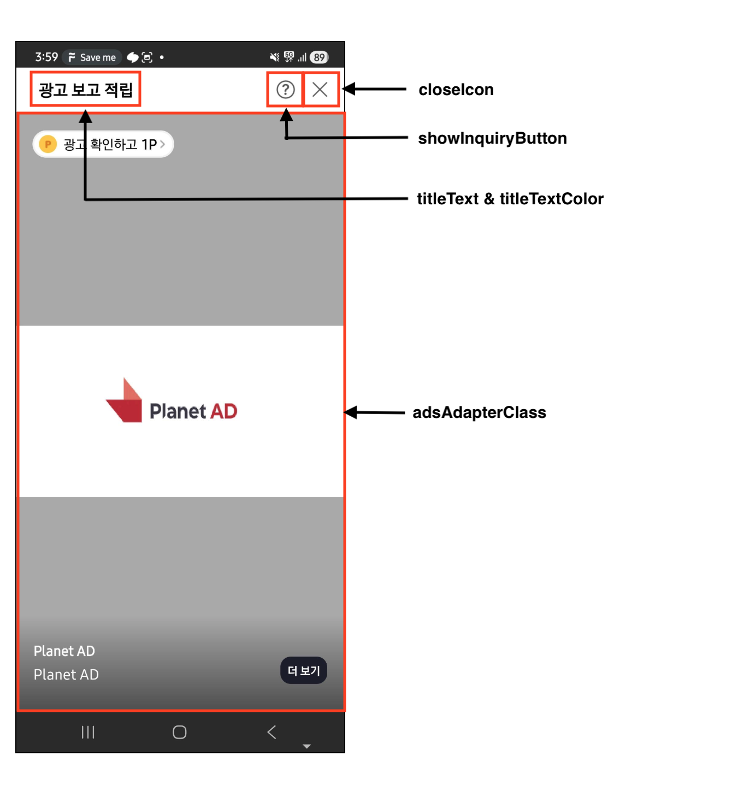
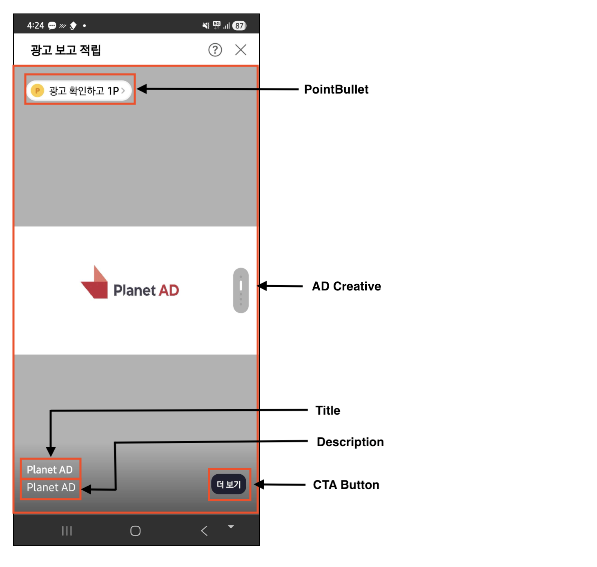
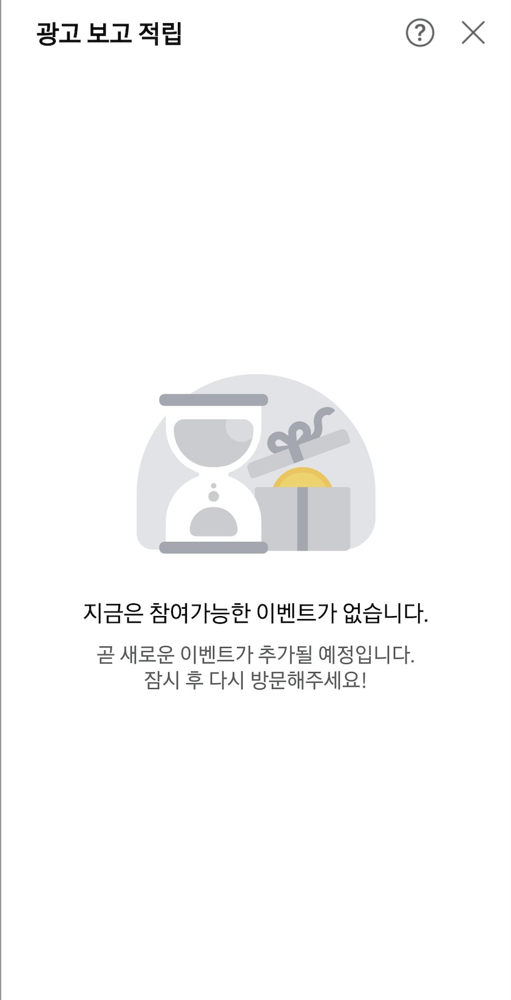

# 04-4. Interstitial 고급설정 - Fullscreen No Edge 타입

> [!NOTE]
> **Fullscreen No Edge 타입**은 소재가 화면 가장자리까지 꽉 차지 않고, 타이틀·설명·PointBullet·CTA 버튼 등 부가 영역과 함께 구성되는 전면 Interstitial 지면입니다. `v1.15.0+`<br>이 문서를 따라 하면 No Edge 지면을 표시하고, 콜백·사전 로드·광고 UI 자체 구현·에러 화면·애니메이션·CTA 커스터마이징까지 다룰 수 있습니다.

## 개요

이 문서는 Planet AD SDK의 Interstitial FullScreen 지면 중 **No Edge 타입**의 연동에서 사용할 수 있는 기능과 각 기능의 사용 방법을 안내합니다.

## 사전 준비

- [ ] [01. 시작하기](01_getting-started.md) 적용 완료
- [ ] Interstitial 지면용 **Unit ID** 발급 — YOUR_INTERSTITIAL_UNIT_ID

## 연동 방법

### STEP 1. No Edge 지면 표시

Interstitial FullScreen 지면을 표시합니다. No Edge 타입 지면은 `v1.15.0+`부터 제공됩니다.<br>InterstitialAdConfig에서 setUiType(InterstitialAdConfig.UiType.NoEdge)로 UI 타입을 No-Edge로 설정합니다.

**No Edge 지면 표시**

```java
InterstitialAdHandler interstitialAdHandler = new InterstitialAdHandlerFactory().create("YOUR_INTERSTITIAL_UNIT_ID", InterstitialAdHandler.Type.FullScreen);

InterstitialAdConfig config = new InterstitialAdConfig.Builder()
    .setUiType(InterstitialAdConfig.UiType.NoEdge) // UI Type을 No-Edge로 설정
    .build();

interstitialAdHandler.show(context, config);
```

### STEP 2. 호출 결과에 대한 콜백

Interstitial 지면이 호출된 후 정상, 실패, 종료 시에 대한 Event Callback을 받을 수 있습니다.

**호출 결과 콜백 수신**

```java
interstitialAdHandler.show(MainActivity.this, interstitialAdConfig, new InterstitialAdHandler.OnInterstitialAdEventListener() {

    // ...

    @Override
    public void onAdLoaded() {
        // 로드 성공시
        // 별도의 처리 특별히 할 것이 없음
    }

    @Override
    public void onAdLoadFailed(AdError error) {
        // 로드 실패시. error를 통해 로드 실패 이유를 알 수 있음
        //
    }

    @Override
    public void onFinish() {
        // 인터스티셜 종료 시
    }
});
```

## AdError Type 별 처리

onAdLoadFailed에서 Error Type에 대한 상황별 동작을 제안할 수 있습니다.<br>네트워크나 서버 오류의 경우는 Toast로 문구 출력을 하면 될 것으로 보입니다. (예: "통신이 원활하지 않습니다.")

**Error Type 분기 처리**

```java
@Override
public void onAdLoadFailed(AdError error) {
    if(ErrorType.SERVER_ERROR.equals(error.getErrorType())) {
        ...
    } else if(ErrorType.WAITING_FOR_RESPONSE.equals(error.getErrorType())) {
        ...
    } ...
}

enum class ErrorType {
    /**
     * 네트워크 or 서버 오류
     */
    SERVER_ERROR, // statusCode 500
    INVALID_PARAMETERS, // statusCode 400
    CONNECTION_TIMEOUT,

    /**
     * Interstitial FullScreen 오류
     */
    EMPTY_RESPONSE, // For campaigns
    WAITING_FOR_RESPONSE,   // interstitialAdHandler.show가 연속적으로 호출되는 경우 전달

    /**
     * 알수 없음
     */
    UNKNOWN
}
```

## 광고 사전 할당 받기

preloadFullScreen()을 호출하여 FullScreen 지면을 표시하기 전에 광고를 미리 할당받을 수 있습니다. 광고가 존재할 경우에만 FullScreen 지면을 표시하여 사용자 경험을 높일 수 있습니다.

**preloadFullScreen으로 사전 할당**

```java
InterstitialAdFullScreenHandler interstitialHandler = new InterstitialAdHandlerFactory().create("YOUR_INTERSTITIAL_UNIT_ID", InterstitialAdHandler.Type.FullScreen);
interstitialHandler.preloadFullScreen(new InterstitialAdFullScreenHandler.FullScreenPreloadListener() {
    @Override
    public void onPreloaded(int adsCount, int totalReward) {
        // adsCount: 광고의 개수, totalReward: 적립 가능한 총 포인트 금액
    }

    @Override
    public void onError(AdError error) {

    }
});
```

## 지면 UI의 구성

SKPAdBenefit AOS SDK에서 제공하는 Interstitial FullScreen 지면 UI의 구성을 지키며 디자인을 변경하는 방법을 안내합니다. 아래는 No Edge 타입의 각 설정 요소가 화면에서 어디에 해당하는지를 보여줍니다.

<kbd></kbd>

Interstitial 지면 UI는 Config 설정으로 변경할 수 있으며, 일부 설정은 지면 종류에 따라 적용되지 않습니다.

| Config | 설명 |
|---|---|
| titleText | Interstitial 광고 상단에 있는 Text |
| textColor | titleText의 색상 |
| showInquiryButton | 문의하기 버튼 노출 여부 (아래 주의 참고) |
| closeIcon | 닫기 버튼의 아이콘 이미지 리소스 ID |
| adsAdapterClass | 커스텀 광고 뷰 — 광고 UI 자체 구현 시 설정 (Feed의 광고 UI 자체 구현과 유사) |
| errorViewHolderClass | 커스텀 에러 뷰 — 보여줄 광고 없을 경우 표시되는 화면 |
| setEnterAnimation | 화면 진입 시 사용되는 Animation 효과 (미지정 시 없음) |
| setExitAnimation | 화면 종료 시 사용되는 Animation 효과 (미지정 시 없음) |

> [!WARNING]
> **showInquiryButton(문의하기 버튼) — 만 14세 미만 처리 주의**
>
> - Planet AD는 만 14세 미만 아동에게 (맞춤형) 리워드 광고를 송출하지 않습니다.
> - 따라서 만 14세 미만 고객에게는 Planet AD SDK가 제공하는 VOC(문의하기) 기능을 제공해서는 안 됩니다.
> - APP에서는 고객이 만 14세 미만일 경우 VOC(문의하기)로 진입할 수 있는 기능을 **비활성화 혹은 숨김 처리**해야 합니다.
> - 제공 여부는 APP 정책에 따릅니다.

다음은 Interstitial 지면 UI를 변경하는 예시입니다.

<details>
<summary>지면 UI 변경 전체 코드 보기</summary>

**InterstitialAdConfig로 No Edge UI 변경**

```java
InterstitialAdConfig interstitialAdConfig = new InterstitialAdConfig.Builder()
    .setUiType(InterstitialAdConfig.UiType.NoEdge)                       // UI Type을 No-Edge로 설정
    .titleText("YOUR_TITLE_TEXT")                                        // Interstitial 지면 상단에 있는 Text
    .textColor(YOUR_TITLE_COLOR)                                         // Interstitial 지면 상단에 있는 Text 색상
    .setCloseIcon(YOUR_CLOSE_ICON)                                       // 닫기 버튼 아이콘 이미지
    .showInquiryButton(true)                                             // 문의하기 버튼 노출 여부
    .adsAdapterClass(YourAdsAdapter.class)                               // 커스텀 광고 뷰
    .errorViewHolderClass(YourErrorViewHolder.class)                    // 커스텀 에러 뷰
    .setEnterAnimation(YourEnterAnimation, YourExitAnimation)            // 화면 진입 Animation 효과
    .setExitAnimation(YourEnterAnimation, YourExitAnimation)             // 화면 종료 Animation 효과
    .build();
```

</details>

## 광고 UI 자체 구현

Planet AD SDK에서 제공하는 FullScreen의 광고에는 **중앙 컨텐츠 영역**을 구성할 수 있습니다.<br>AdsAdapter의 구현 클래스를 만들어 FullScreen의 컨텐츠 영역을 구현하고, InterstitialAdConfig에 구현한 클래스를 adsAdapterClass로 추가합니다.

아래는 No Edge 타입의 구성 요소(PointBullet, AD Creative, Title, Description, CTA Button)입니다.

<kbd></kbd>

다음은 FullScreen의 디자인을 변경하는 방법을 설명하는 예시입니다.

| 항목 | 설명 | 필수 여부 | 비고 |
|---|---|---|---|
| 광고 소재(Ad Creative) | HTML, 이미지, 동영상 등 광고 소재 | Mandatory | com.skplanet.skpad.benefit.presentation.media.MediaView 사용 필수<br>전체 영역 설정 — 전체 영역 설정 후 MediaView의 설정을 통해 소재의 사이즈에 자동 Fit되도록 권장<br>Adapter의 Item이기에 match_parent로 지정이 기본 |
| 포인트(Point Bullet) | 광고의 참여를 유도하는 버튼 | Optional | com.skplanet.skpad.benefit.presentation.media.PointBulletView 기본 제공<br>필요 시, APP에서 구현해서 사용해도 무방 |
| 광고 제목(Title) | 광고의 제목 | Optional | 최대 10자<br>생략 부호로 일정 길이 이상은 생략 가능 |
| 광고 설명(Description) | 광고에 대한 상세 설명 | Optional | 생략 부호로 일정 길이 이상은 생략 가능<br>최대 40자 |
| CTA 버튼 | 광고의 참여를 유도하는 버튼 | Optional | com.skplanet.skpad.benefit.presentation.media.FixedCtaView 기본 제공<br>필요 시, APP에서 구현해서 사용해도 무방<br>Video, HTML 소재인 경우 숨김처리 필요. (Video, HTML 소재의 경우 CTA버튼으로 광고가 Landing되지 않음) |

### STEP 1. Item xml 예시

FullScreen용 NativeAdView의 규격에 맞는 레이아웃(your_interstitial_fullscreen_ad.xml)을 구현합니다.

**your_interstitial_fullscreen_ad.xml**

```xml
// your_interstitial_fullscreen_ad.xml

<com.skplanet.skpad.benefit.presentation.nativead.NativeAdView
    android:id="@+id/native_ad_view" ...>

    // MediaView와 FixedCtaView는 NativeAdView의 하위 컴포넌트로 구현해야합니다.

    <RelativeLayout ... >
        // 광고 소재
        <com.skplanet.skpad.benefit.presentation.media.MediaView
            android:layout_width="match_parent"
            android:layout_height="match_parent"
            android:id="@+id/mediaView" ... />

        // Title
        <TextView
            android:id="@+id/textTitle" ... />

        // Description
        <TextView
            android:id="@+id/textDescription" ... />

        // 포인트 표시
        <com.skplanet.skpad.benefit.presentation.media.PointBulletView
            android:id="@+id/ad_point_bullet" ... />

        // 하단 CTA Button
        <com.skplanet.skpad.benefit.presentation.media.FixedCtaView
            android:id="@+id/ad_cta_btn_view" .../>

    </LinearLayout>
</com.skplanet.skpad.benefit.presentation.nativead.NativeAdView>
```

### STEP 2. adapter의 예시

AdsAdapter의 상속 클래스를 구현합니다.<br>구현한 상속 클래스의 onCreateViewHolder에서 your_interstitial_fullscreen_ad.xml을 사용하여 NativeAdView를 생성합니다.<br>그리고 InterstitialConfig에 구현한 YourAdsAdapter를 설정합니다.

<details>
<summary>Adapter 전체 코드 보기</summary>

**YourAdsAdapter.java**

```java
public class YourAdsAdapter extends AdsAdapter<AdsAdapter.NativeAdViewHolder> {

    @Override
    public NativeAdViewHolder onCreateViewHolder(ViewGroup parent, int viewType) {
        final LayoutInflater inflater = LayoutInflater.from(parent.getContext());
        final NativeAdView interstitialNativeAdView = (NativeAdView) inflater.inflate(R.layout.your_interstitial_no_edge_ad, parent, false);
        return new NativeAdViewHolder(interstitialNativeAdView);
    }

    @Override
    public void onBindViewHolder(NativeAdViewHolder holder, NativeAd nativeAd) {

        super.onBindViewHolder(holder, nativeAd);

        final NativeAdView nativeAdView = (NativeAdView) holder.itemView;
        final MediaView mediaView = nativeAdView.findViewById(R.id.ad_media_view);
        final PointBulletView pointBullet = nativeAdView.findViewById(R.id.ad_point_bullet);
        final FixedCtaView btnCtaView = nativeAdView.findViewById(R.id.ad_cta_btn_view);

        // 비디오 오버레이 뷰 설정
        // 사운드 아이콘 버튼의 위치 변경을 위해 커스텀 오버레이 뷰 사용(좌하단에서 우상단으로 이동)
        InterstitialAdVideoPlayerOverlayView overlayView = new InterstitialAdVideoPlayerOverlayView(nativeAdView.getContext());
        mediaView.setVideoPlayerOverlayView(overlayView);

        // 동영상 전체 보기 화면 랜딩 허용 안함 설정
        mediaView.setVideoFullscreenAllowed(false);

        // MediaView Scale Type 설정(소재별 Size에 맞춰서 Fit되도록 처리)
        mediaView.setScaleType(MediaView.MediaScaleType.FIT);

        // MediaView의 Creative가 비율에 맞춰서 중앙정렬되도록 설정
        mediaView.setLayoutGravity(Gravity.CENTER);

        // Background Type Blur 설정
        mediaView.setBGType(MediaView.BGType.BLUR);

        // MediaView에 Creative 설정
        if (nativeAd != null && nativeAd.getAd() != null) {
            mediaView.setCreative(nativeAd.getAd().getCreative());
        } else {
            mediaView.setCreative(null);
        }

        // PointBullet Binding(광고 상태에 따라 상태 변화)
        final PointBulletPresenter pointBulletPresenter = new PointBulletPresenter(pointBullet);
        pointBulletPresenter.bind(nativeAd);

        // CTA Button Binding(소재에 따라 Visibility Control)
        final FixedCtaPresenter fixedCtaPresenter = new FixedCtaPresenter(btnCtaView);
        fixedCtaPresenter.bind(nativeAd);

        // Title 설정(값이 없을 경우 GONE 처리)
        TextView title = nativeAdView.findViewById(R.id.fullscreen_ad_reward_title);
        String titleText = nativeAd != null && nativeAd.getAd() != null ? nativeAd.getAd().getTitle() : null;
        if (!TextUtils.isEmpty(titleText)) {
            title.setVisibility(View.VISIBLE);
            title.setText(titleText);
        } else {
            title.setVisibility(View.GONE);
        }

        // Description 설정(값이 없을 경우 GONE 처리)
        TextView description = nativeAdView.findViewById(R.id.fullscreen_ad_reward_description);
        String desc = nativeAd != null && nativeAd.getAd() != null ? nativeAd.getAd().getDescription() : null;
        if (!TextUtils.isEmpty(desc)) {
            description.setVisibility(View.VISIBLE);
            description.setText(desc);
        } else {
            description.setVisibility(View.GONE);
        }

        // NativeAdView 이벤트 리스너 설정
        nativeAdView.addOnNativeAdEventListener(new NativeAdView.OnNativeAdEventListener() {
            @Override
            public void onImpressed(NativeAdView nativeAdView, NativeAd nativeAd) {
            }

            @Override
            public void onClicked(NativeAdView nativeAdView, NativeAd nativeAd) {
                pointBulletPresenter.bind(nativeAd);
            }

            @Override
            public void onRewardRequested(NativeAdView view, NativeAd nativeAd) {
            }

            @Override
            public void onRewarded(NativeAdView view, NativeAd nativeAd, RewardResult nativeAdRewardResult) {
            }

            @Override
            public void onParticipated(NativeAdView nativeAdView, NativeAd nativeAd) {
                pointBulletPresenter.bind(nativeAd);
            }
        });

        // MediaView 설정
        nativeAdView.setMediaView(mediaView);

        // 클릭 가능한 뷰 설정
        Collection<View> clickableViews = new ArrayList<>();
        clickableViews.add(mediaView);
        clickableViews.add(pointBullet);
        clickableViews.add(btnCtaView);
        clickableViews.add(title);
        clickableViews.add(description);
        nativeAdView.setClickableViews(clickableViews);

        // NativeAd 설정
        nativeAdView.setNativeAd(nativeAd);

        // HTML Creative이면 MediaView에서 전달받은 배경색으로 설정
        if (nativeAd != null && nativeAd.getAd() != null
            && nativeAd.getAd().getCreative() != null
            && Creative.Type.HTML.equals(nativeAd.getAd().getCreative().getType())) {
            mediaView.setBackgroundColorListener(new MediaView.BackgroundColorExtractedListener() {
                @Override
                public void onBackgroundColorExtracted(int color) {
                    nativeAdView.setBackgroundColor(color);
                }
            });
        } else {
            nativeAdView.setBackgroundColor(Color.TRANSPARENT);
        }

        nativeAdView.invalidate();
    }
}
```

</details>

### STEP 3. Custom Adapter 호출

구현한 Custom Adapter를 adsAdapterClass로 지정하여 호출합니다.

**Custom Adapter 호출**

```java
interstitialAdHandler.show(this,
    new InterstitialAdConfig.Builder()
        .adsAdapterClass(YourAdsAdapter.class)
        .build(),
    eventListener);
```

### UI 커스터마이징 시 필수 적용 사항

No Edge 타입에서 광고 UI를 직접 구현할 때는 아래 항목을 **반드시** 적용해야 합니다.

<details>
<summary>필수 적용 사항 표 보기</summary>

| 항목 | 내용 | 비고 |
|---|---|---|
| **Media View 설정** | MediaView에 표시될 소재타입 별 Scale Type, Gravity가 설정되어야 합니다.<br>mediaView.setScaleType(MediaView.MediaScaleType.FIT);<br>mediaView.setLayoutGravity(Gravity.CENTER);<br><br>MediaView.MediaScaleType.FIT으로 설정 시: 소재의 사이즈에 맞도록 소재 영역의 크기 조절<br>LayoutGravity를 Gravity.CENTER로 설정 시: 소재의 위치를 MediaView의 Center에 위치 |  |
| **VideoPlayerOverlayView 설정** | 동영상 소재 표시 시 VideoPlayerOverlayView를 설정합니다.<br>InterstitialAdVideoPlayerOverlayView overlayView = new InterstitialAdVideoPlayerOverlayView(nativeAdView.getContext());<br>mediaView.setVideoPlayerOverlayView(overlayView);<br><br>기본 Video Play UI의 경우 무음버튼이 하단의 CTA, Title, Description 영역과 겹칠 수 있습니다. 따라서 무음버튼의 위치가 변경되어야 하며, 이를 위한 기본 VideoPlayerOverlayView를 제공합니다. (InterstitialAdVideoPlayerOverlayView.class)<br>InterstitialAdVideoPlayerOverlayView 사용은 필수가 아니며, App의 상황에 맞춰서 임의로 설정해도 무방합니다. |  |
| **동영상 전체보기 미허용** | 광고 클릭을 통해 별도의 전체화면 Player로 랜딩되어 화면을 이탈하는 것을 막아야 합니다.<br>// 동영상 전체 보기 화면 허용 안함<br>mediaView.setVideoFullscreenAllowed(false); |  |
| **Background 설정** | MediaView의 배경 타입을 설정합니다. MediaView는 2가지 배경 타입을 제공합니다.<br>- None: 배경 없음(Default)<br>- Blur: 영역보다 작은 Media소재가 출력되는 경우, Blur 처리된 Thumbnail을 이용하여 배경을 설정<br>mediaView.setBGType(MediaView.BGType.BLUR); | 해당 기능은 Image, 동영상(Vast, Video) 소재에만 적용되며, HTML소재에는 적용되지 않습니다. |
| **PointBullet** | PointBullet의 상태값 변경을 위해 아래와 같이 제공됩니다.<br>final PointBulletPresenter pointBulletPresenter = new PointBulletPresenter(pointBullet);<br>pointBulletPresenter.bind(nativeAd); |  |
| **하단 CTA버튼 예외처리** | CTA버튼의 상태값 변경을 위해 아래와 같이 제공됩니다. 하단 CTA버튼의 경우 특정 광고 소재(HTML 소재, 동영상 소재)인 경우 보여져선 안됩니다.<br>해당 시나리오를 일괄 처리하기 위해 SDK에서는 FixedCtaPresenter.class와 FixedCtaView.class를 제공합니다.<br>final FixedCtaPresenter fixedCtaPresenter = new FixedCtaPresenter(btnCtaView);<br>fixedCtaPresenter.bind(nativeAd);<br><br>FixedCtaPresenter와 FixedCtaView를 사용하지 않고 앱에서 직접 구현 시에는 View의 Visibility를 직접 컨트롤해 주셔야 합니다. (아래 소재타입에 따른 CTA버튼 상태변화 예제코드 참고)<br>FixedCtaView는 FixedCtaView Custom의 방법으로 Customizing이 가능합니다. |  |
| **HTML Background 색상** | Background 색상의 전달여부는 서버의 Unit설정으로 관리되며, 해당 설정이 Disable일 경우 기본 색상(흰색)이 전달됩니다. (아래 코드 참고) | Interstitial Full Screen Type은 HTML Banner 타입을 지원합니다.<br>**주의** — 해당 Callback은 소재가 HTML인 경우에만 호출됩니다. ViewPager가 Recycle되는 과정에서 HTML소재가 보여진 View가 동영상이나 이미지 소재를 위해 재사용되는 경우가 있습니다. 이 경우 HTML 소재에서 지정한 Background Color가 남아 있을 수 있으니 해당 부분에 대해서 고려가 필요합니다.<br>**오류 예시** — Step 1) A View에 HTML 소재 표시 =&gt; 배경색상 검은색 지정. Step 2) 일정 횟수 이상 하단으로 아이템 이동. Step 3) A View가 재사용되며, Image 소재가 표시 =&gt; 이때 Step1에서 지정한 검은색이 남아 있음. |

하단 CTA버튼 상태변화 예제코드(직접 구현 시):

**소재 타입에 따른 CTA 버튼 상태 변화**

```kotlin
if (nativeAd.ad.creative != null &&
    (nativeAd.ad.creative?.type == Creative.Type.HTML ||
     nativeAd.ad.creative?.type == Creative.Type.WEBBANNER ||   // HTML 타입
     nativeAd.ad.creative?.type == Creative.Type.VIDEO ||
     nativeAd.ad.creative?.type == Creative.Type.VAST)
    // 동영상 타입
) {
    ctaView.visibility = View.GONE
} else {
    ctaView.visibility = View.VISIBLE
}
```

HTML Background 색상 처리 코드:

**HTML Background 색상 처리**

```java
if (Creative.Type.HTML.equals(ad.getCreative().type)) {
    mediaView.setBackgroundColorListener(new MediaView.BackgroundColorExtractedListener() {
        @Override
        public void onBackgroundColorExtracted(int color) {
            // 전달된 Background 색상으로 광고영역을 처리한다.
            view.setBackgroundColor(color);
        }
    });
}
```

</details>

## 지면 광고 미할당 안내

사용자가 FullScreen 지면에 진입한 시점에 노출할 광고가 없다면 미할당 안내 UI가 노출됩니다. SKPAdBenefit AOS SDK에서 제공하는 UI의 이미지 혹은 문구만을 변경하여 사용자 경험을 높일 수 있습니다.

<kbd></kbd>

InterstitialAdDefaultErrorViewHolder의 구현 클래스를 만들어 이미지 및 문구를 변경할 수 있습니다.

### STEP 1. Error xml 코드 예시

광고가 할당되지 않았을 때 화면에 추가할 에러 이미지(interstitialErrorImageView), 타이틀(interstitialErrorTitle), 상세 설명(interstitialErrorDescription) 레이아웃을 작성하세요.

<details>
<summary>Error xml 코드 보기</summary>

**custom_interstitial_fullscreen_error_view.xml**

```xml
<!-- custom_interstitial_fullscreen_error_view.xml -->
<LinearLayout xmlns:android="http://schemas.android.com/apk/res/android"
    android:layout_width="match_parent"
    android:layout_height="wrap_content"
    android:gravity="center_vertical"
    android:orientation="vertical"
    android:padding="40dp">

    <ImageView
        android:id="@+id/interstitialErrorImageView"
        android:layout_width="match_parent"
        android:layout_height="wrap_content"/>

    <TextView
        android:id="@+id/interstitialErrorTitle"
        android:layout_width="wrap_content"
        android:layout_height="wrap_content"
        android:layout_gravity="center_horizontal"
        android:layout_marginTop="32dp"
        android:textColor="@color/bz_text_emphasis"
        android:textSize="16sp" />

    <TextView
        android:id="@+id/interstitialErrorDescription"
        android:layout_width="wrap_content"
        android:layout_height="wrap_content"
        android:layout_gravity="center_horizontal"
        android:layout_marginTop="8dp"
        android:textAlignment="center"
        android:textColor="@color/bz_text_description"
        android:textSize="14sp" />

</LinearLayout>
```

</details>

### STEP 2. Error View 예시

interstitialErrorViewHolder를 구현하는 커스텀 클래스 CustomErrorView를 새로 생성하고, 자동 완성되는 getError() 메소드를 다음과 같이 구현하세요.

**CustomErrorView.java**

```java
public class CustomErrorView extends InterstitialErrorViewHolder {
    @NonNull
    @Override
    public View getError(@NonNull Activity activity) {
        // TODO: 1번에서 생성한 custom_interstitial_error_view 레이아웃을 inflate
        View errorView = activity.getLayoutInflater().inflate(R.layout.custom_view_interstitial_fullscreen_error, null, false);
        final ImageView errorImageView = errorView.findViewById(R.id.interstitialErrorImageView);
        final TextView errorTitle = errorView.findViewById(R.id.interstitialErrorTitle);
        final TextView errorDescription = errorView.findViewById(R.id.interstitialErrorDescription);

        errorImageView.setImageResource(R.drawable.bz_ic_feed_profile_coin); // 에러 이미지 설정
        errorTitle.setText("타이틀: 광고가 없습니다. "); // 에러 타이틀 텍스트 설정
        errorDescription.setText("디스크립션: 할당된 광고가 없습니다!"); // 에러 상세 텍스트 설정

        return errorView;
    }
}
```

### STEP 3. Custom Error View 호출

구현한 커스텀 에러 뷰를 errorViewHolderClass로 지정하여 호출합니다.

**Custom Error View 호출**

```java
interstitialAdHandler.show(this,
    new InterstitialAdConfig.Builder()
        .errorViewHolderClass(YourErrorViewHolder.class)
        .build(),
    eventListener);
```

## 화면 진입/종료 Animation 효과

화면 진입/종료에 따른 Animation의 효과를 제공합니다.

**진입/종료 애니메이션 설정**

```java
InterstitialAdConfig interstitialAdConfig = new InterstitialAdConfig.Builder()
    .setEnterAnimation(YourEnterAnimation, YourExitAnimation)   // Interstitial 진입 Animation 효과
    .setExitAnimation(YourEnterAnimation, YourExitAnimation)    // Interstitial 종료 Animation 효과
    .build();
```

## FixedCtaView Custom

No Edge에 FixedCTAView를 구현하는 커스텀 클래스 CustomFixedCTAView를 새로 생성하고 구현하세요.

CustomFixedCtaView에서 재정의하는 세 메소드의 의미는 다음과 같습니다.

| 항목 | 설명 | 비고 |
|---|---|---|
| getResourceID | Custom을 한 Layout | Custom을 적용한 Layout Resource |
| getBackgroundLayout | CTA BG View | CTA에 사용되는 배경 색상, 이미지를 지정 |
| getCtaTextView | CTA에 적용되는 Text | CTA에 표시되는 Text 속성 지정 |

<details>
<summary>CustomFixedCtaView 전체 코드 보기</summary>

**CustomFixedCtaView.java**

```java
public class CustomFixedCtaView extends FixedCtaView {
    public CustomFixedCtaView(@NonNull Context context) {
        super(context);
    }

    public CustomFixedCtaView(@NonNull Context context, @Nullable AttributeSet attrs) {
        super(context, attrs);
    }

    public CustomFixedCtaView(@NonNull Context context, @Nullable AttributeSet attrs, int defStyleAttr) {
        super(context, attrs, defStyleAttr);
    }

    @Override
    protected int getResourceID() {
        return R.layout.custom_skpad_view_fixed_cta;             // Custom Layout
    }

    @Override
    protected ViewGroup getBackgroundLayout() {
        return findViewById(R.id.custom_backgroundLayout);       // Custom BG Layout
    }

    @Override
    protected TextView getCtaTextView() {
        return findViewById(R.id.custom_textCta);                // Custom Text
    }
}
```

Custom Layout 코드:

**custom_skpad_view_fixed_cta.xml**

```xml
<?xml version="1.0" encoding="utf-8"?>
<LinearLayout
    xmlns:android="http://schemas.android.com/apk/res/android"
    xmlns:tools="http://schemas.android.com/tools"
    android:id="@+id/custom_backgroundLayout"
    android:layout_width="wrap_content"
    android:layout_height="wrap_content"
    android:layout_gravity="center_vertical"
    android:gravity="center"
    android:padding="8dp"
    android:minHeight="32dp"
    android:orientation="horizontal" >

    <TextView
        android:id="@+id/custom_textCta"
        android:layout_width="wrap_content"
        android:layout_height="wrap_content"
        android:textColor="@android:color/holo_red_dark"
        android:gravity="center_vertical"
        android:textSize="12sp"
        android:textStyle="bold"
        android:ellipsize="end"
        android:singleLine="true"
        android:lineSpacingExtra="2sp"
        android:translationY="-0.97sp"
        android:lines="1"
        tools:text="View"/>
</LinearLayout>
```

Custom Layout 적용 방법(onBindViewHolder 내):

**CustomFixedCtaView 적용**

```java
@Override
public void onBindViewHolder(@NonNull NativeAdViewHolder holder, @SuppressLint("RecyclerView") NativeAd nativeAd) {
    ...

    CustomFixedCtaView btnCtaView = nativeAdView.findViewById(R.id.ad_cta_btn_view);

    // 하단의 고정 CTA 버튼 설정
    // FixedCtaPresenter를 설정해야 Creative Type에 따른 보여지는 유무 설정됨
    final FixedCtaPresenter fixedCtaPresenter = new FixedCtaPresenter(btnCtaView);
    fixedCtaPresenter.bind(nativeAd);

    ...
}
```

</details>

> **다음 단계**
>
> - [04-3. Interstitial 고급설정 - Full Screen Default 타입](04-3_interstitial-advanced-fullscreen-default.md) — 풀스크린 기본 타입 연동
> - [04-2. Interstitial 고급설정 - Dialog, BottomSheet](04-2_interstitial-advanced-dialog-bottomsheet.md) — Dialog/BottomSheet 고급설정
> - [04-5. Interstitial 디자인 커스터마이징](04-5_interstitial-customizing.md) — 타이틀·색상·아이콘 변경
