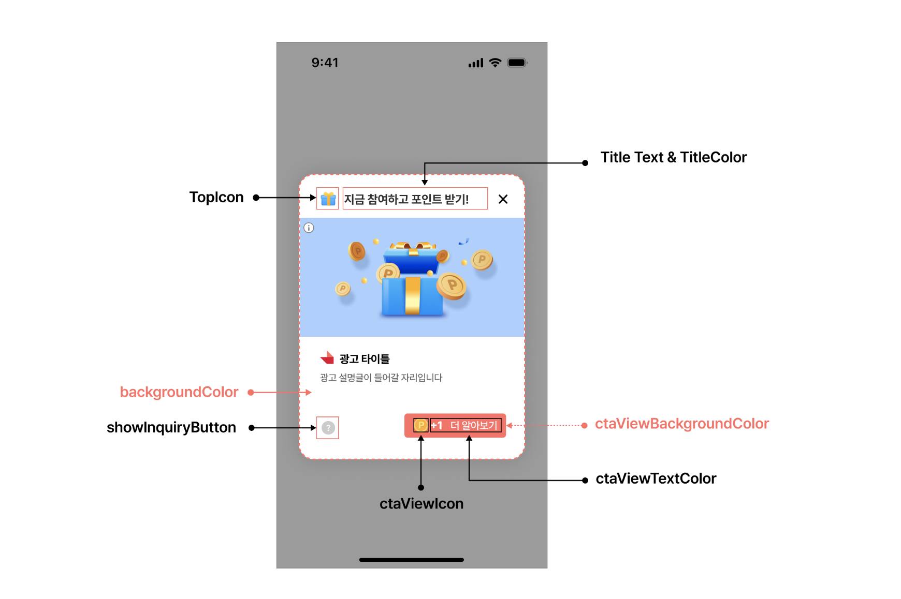

# 04-5. Interstitial 디자인 커스터마이징

> [!NOTE]
> **Interstitial 디자인 커스터마이징**은 SDK가 제공하는 Interstitial 지면 UI 구성을 유지한 채 타이틀·색상·아이콘 등 디자인 요소만 바꾸는 방법입니다.<br>이 문서를 따라 하면 Interstitial 지면의 상단 아이콘·타이틀·색상을 원하는 값으로 변경할 수 있습니다.

## 개요

본 가이드에서는 Planet AD SDK에서 제공하는 Interstitial 지면 UI의 구성을 지키며 디자인을 변경하기 위한 방법을 안내합니다.

<kbd></kbd>

## 커스터마이징 방법

Interstitial 지면 UI는 두 가지 방법으로 설정할 수 있습니다.

- **CTA 버튼 UI**는 테마 적용으로 변경할 수 있습니다. 자세한 내용은 [06. 디자인 커스터마이징](06_design-customizing.md)을 참고하세요.
- **타이틀 · 색상 · 아이콘**은 InterstitialAdConfig를 설정하여 변경할 수 있습니다.

### 타이틀 · 색상 · 아이콘 변경

InterstitialAdConfig.Builder로 원하는 값을 지정한 뒤, show()를 호출할 때 함께 전달합니다.

**Interstitial 디자인 변경 후 표시**

```java
InterstitialAdConfig interstitialAdConfig =
    new InterstitialAdConfig.Builder()
        .topIcon(R.drawable.your_drawable)
        .titleText("지금 바로 참여하고 포인트 받기")
        .textColor(android.R.color.your_color)
        .layoutBackgroundColor(R.color.your_color)
        .build();

final InterstitialAdHandler interstitialAdHandler = new InterstitialAdHandlerFactory()
    .create("YOUR_INTERSTITIAL_UNIT_ID", InterstitialAdHandler.Type.Dialog);
interstitialAdHandler.show(context, interstitialAdConfig);
```

각 설정 값의 의미는 다음과 같습니다.

| 설정 | 설명 |
|---|---|
| topIcon | Interstitial 지면 상단의 아이콘 |
| titleText | Interstitial 지면 상단의 타이틀 텍스트 |
| textColor | 타이틀 텍스트의 색상 |
| layoutBackgroundColor | Interstitial 지면 전체의 배경색 |

> **다음 단계**
>
> - [04-2. Interstitial 고급설정 - Dialog, BottomSheet](04-2_interstitial-advanced-dialog-bottomsheet.md) — CTA 색상·아이콘 등 상세 설정
> - [06. 디자인 커스터마이징](06_design-customizing.md) — CTA 버튼 테마 적용
