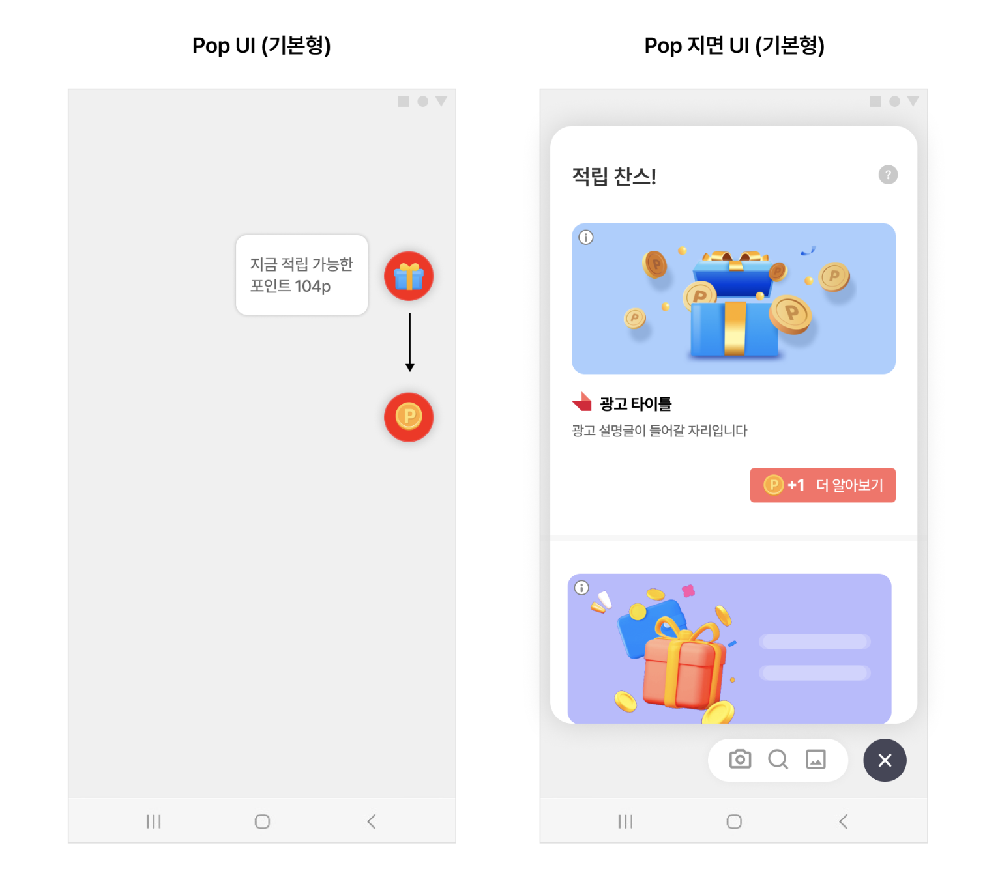
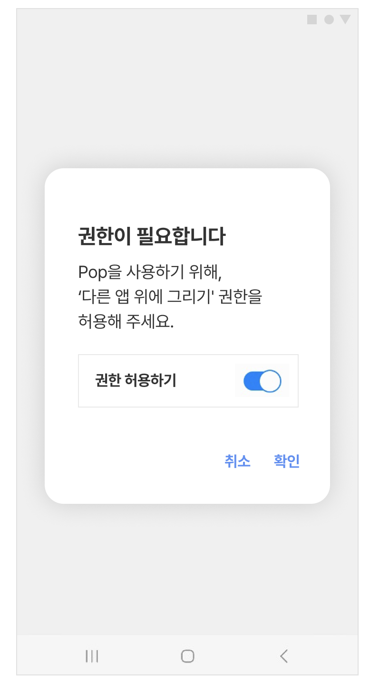

# 05-1. POP-기본설정

> [!NOTE]
> **POP**은 스크린 최상단에 항상 떠 있는 작은 UI로, 사용자를 광고 지면으로 자연스럽게 유도하는 확장 기능입니다.<br>이 문서를 순서대로 따라 하면 Pop을 준비하고, 다른 앱 위에 그리기 권한을 받아 Pop을 활성화·비활성화하는 것까지 완료할 수 있습니다.

## 개요

Pop은 스크린 최상단에 뜨는 UI를 통해 사용자를 광고 지면으로 유도합니다. Pop을 활성화하면 화면을 껐다 켤 때마다 팝이 화면에 보이게 됩니다.

Pop 버튼을 누르면 Feed와 유사한 광고 지면(Pop 지면)이 열립니다. 왼쪽이 화면 위에 떠 있는 Pop 버튼(기본형)이고, 오른쪽이 버튼을 눌렀을 때 열리는 Pop 지면(기본형)입니다.

<kbd></kbd>

> [!IMPORTANT]
> Android 12에 적용되는 오버레이의 터치 이벤트 차단에 대응하기 위해, 팝(Pop) 버튼에는 투명도가 적용되어 있습니다. 이를 통해 안정적인 앱 동작을 지원합니다.

## 사전 준비

시작하기 전에 아래 항목이 준비되어 있어야 합니다.

- [ ] [03-1. Feed-기본설정](03-1_feed-basic.md) 완료 — Feed 지면 기본 설정
- [ ] Pop 지면용 **Unit ID** 발급 — 이 문서에서는 YOUR_POP_UNIT_ID 로 표기합니다

## 연동 방법

### STEP 1. Pop 준비

Pop 지면용 Unit ID를 Feed 지면과 **같은 값**으로 사용한다면, 별도의 PopConfig 없이 FeedConfig에 optInFeatureList만 추가해 간편하게 Pop 지면을 도입할 수 있습니다. 이렇게 하면 FeedConfig의 설정 중 일부가 Pop 지면에도 그대로 적용됩니다.

**Application.onCreate() — FeedConfig로 Pop 도입**

```java
FeedConfig feedConfig = new FeedConfig.Builder(getApplicationContext(), "YOUR_POP_UNIT_ID")
    .optInFeatureList(Collections.singletonList(OptInFeature.Pop))
    .build();

final SKPAdBenefitConfig skpAdBenefitConfig = new SKPAdBenefitConfig.Builder(context)
    .setFeedConfig(feedConfig)
    .build();

SKPAdBenefit.init(this, skpAdBenefitConfig);
```

Pop이 준비되면 Feed 지면에 **Pop 활성화 버튼**이 노출됩니다. 활성화 버튼에 대한 자세한 내용은 [05-2. POP-고급설정](05-2_pop-advanced.md)의 "Pop 활성화 버튼"을 참고하세요.

> [!TIP]
> Pop 지면에서 Feed와 **다른 Unit ID**를 쓰거나 **다른 설정**을 적용하고 싶다면, PopConfig를 사용해야 합니다. 자세한 내용은 [05-2. POP-고급설정](05-2_pop-advanced.md)의 "PopConfig 설정"을 참고하세요.

### STEP 2. Pop 클래스 준비

마시멜로(Android API 23) 이상에서 Pop을 실행하려면 **다른 앱 위에 그리기** 권한이 필요합니다. Planet AD SDK는 사용자가 이 권한을 활성화하도록 유도하는 기능을 제공합니다.

먼저 Activity에 SKPAdPop 클래스를 멤버 변수로 추가합니다.

**Activity 멤버 변수**

```java
private SKPAdPop skpAdPop;
```

그리고 Activity의 onCreate에서 SKPAdPop 인스턴스를 생성합니다.

**Activity.onCreate()**

```java
this.skpAdPop = new SKPAdPop(context, "YOUR_POP_UNIT_ID");
```

### STEP 3. 권한 요청 및 Pop 실행

Pop 실행 전에는 다른 앱 위에 그리기 권한을 얻어야 합니다. 아래처럼 권한이 이미 있으면 바로 Pop을 실행하고, 없으면 requestPermissionWithDialog를 호출해 사용자에게 권한 부여를 유도합니다.

<kbd></kbd>

**권한 확인 후 Pop 실행**

```java
public static final int REQUEST_CODE_SHOW_POP = 1024;

public void showPopOrRequestPermissionWithDialog() {
    // 권한 확인
    if (SKPAdPop.hasPermission(context) || Build.VERSION.SDK_INT < Build.VERSION_CODES.M) {
        // Pop 실행
        skpAdPop.preloadAndShowPop();
    } else {
        // 권한 요청
        SKPAdPop.requestPermissionWithDialog((Activity) context,
            new PopOverlayPermissionConfig.Builder(R.string.pop_name)
                .settingsIntent(OverlayPermission.createIntentToRequestOverlayPermission(context))
                .requestCode(REQUEST_CODE_SHOW_POP)
                .build()
        );
    }
}
```

### STEP 4. 권한 결과 확인 후 Pop 실행

권한이 부여되면 자동으로 Activity로 돌아옵니다. 이때 전달된 Intent로 결과를 확인하고, 권한 획득이 확인되면 preloadAndShowPop을 호출해 Pop을 실행합니다.

**MainActivity — 권한 획득 결과 처리**

```java
import static com.skplanet.lib.settingsmonitor.SettingsMonitor.KEY_SETTINGS_REQUEST_CODE;
import static com.skplanet.lib.settingsmonitor.SettingsMonitor.KEY_SETTINGS_RESULT;

public class MainActivity extends AppCompatActivity {
    @Override
    public void onCreate(Bundle savedInstanceState) {
        super.onCreate(savedInstanceState);
        setContentView(R.layout.activity_main);

        if (getIntent().getBooleanExtra(KEY_SETTINGS_RESULT, false)
                && getIntent().getIntExtra(KEY_SETTINGS_REQUEST_CODE, 0) == REQUEST_CODE_SHOW_POP) {
            // 권한 획득 확인 후 pop 실행
            skpAdPop.preloadAndShowPop();
        }
    }
}
```

## Pop 비활성화

skpAdPop.removePop(context)를 호출하면 Pop을 비활성화할 수 있습니다. Pop이 비활성화되면 화면 위의 버튼과 함께 Service Notification도 사라집니다.

**Pop 비활성화**

```java
skpAdPop.removePop(context);
```

> **다음 단계**
>
> - [05-2. POP-고급설정](05-2_pop-advanced.md) — PopConfig, 활성화 버튼, Notification·툴바·유틸리티 영역 커스텀 구현
> - [05-3. POP-커스터마이징](05-3_pop-customizing.md) — 배경색·아이콘·버튼 문구·Notification 디자인 변경
