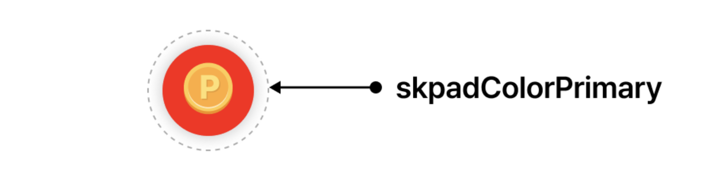
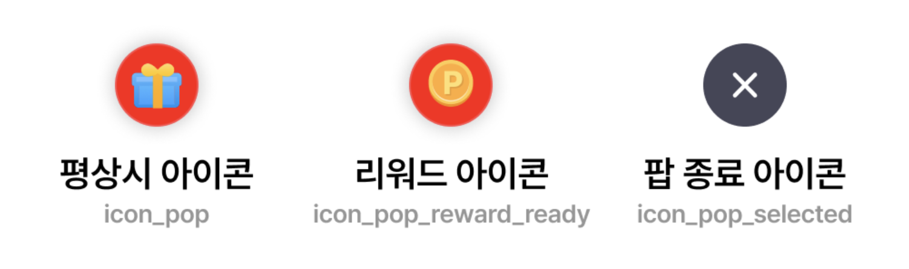
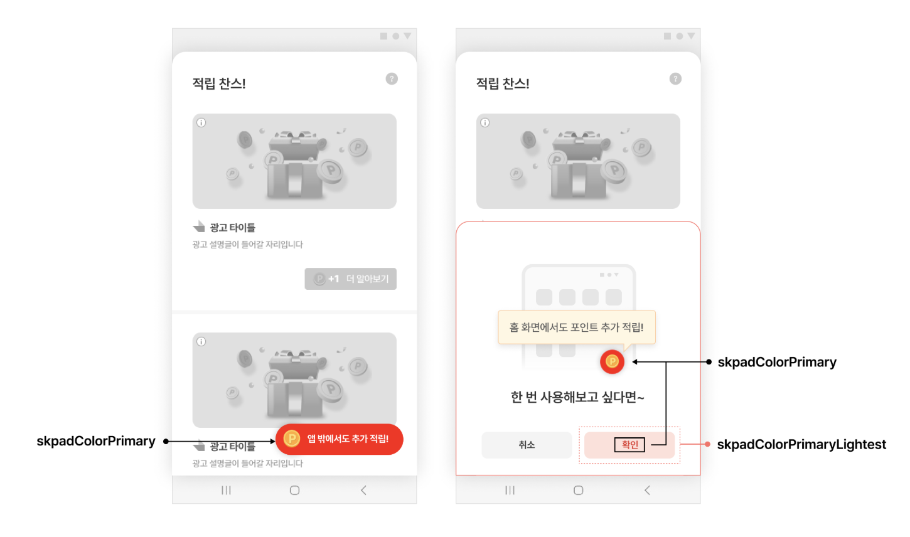
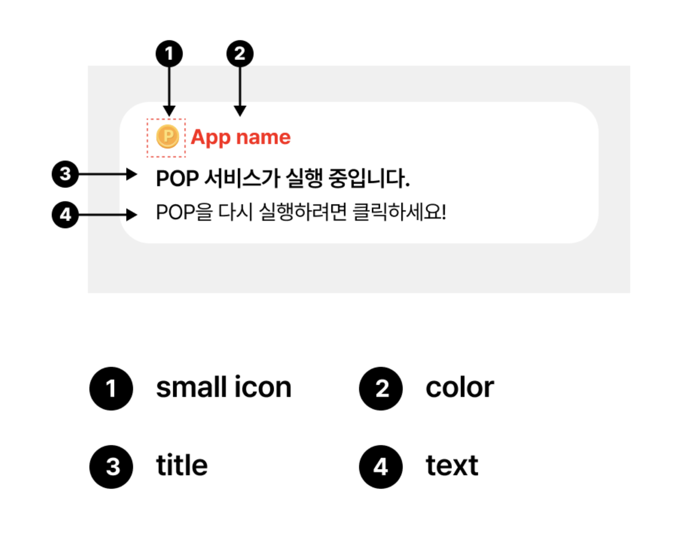
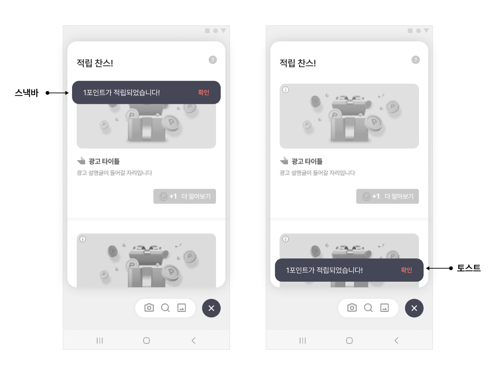

# 05-3. POP-커스터마이징

> [!NOTE]
> **POP 커스터마이징**에서는 SDK가 제공하는 UI 구성을 그대로 유지하면서, 색상·아이콘·문구 같은 디자인 요소만 손쉽게 바꾸는 방법을 안내합니다.<br>각 항목은 서로 독립적이므로, 필요한 부분만 골라 적용하면 됩니다.

## 개요

본 가이드에서는 Planet AD SDK에서 제공하는 UI의 구성을 지키며 디자인을 변경하기 위한 방법을 안내합니다.

> [!TIP]
> 더 폭넓은 디자인 변경(툴바·유틸리티 영역 UI 자체 구현 등)이 필요하다면, [05-2. POP-고급설정](05-2_pop-advanced.md)의 자체 구현 방법으로 진행할 수 있습니다.

## Pop 배경색 변경

Pop 아이콘의 배경색은 **테마 적용**을 통해 변경할 수 있습니다. 테마의 skpadColorPrimary 값이 Pop 버튼의 배경색으로 적용됩니다.

<kbd></kbd>

> [!IMPORTANT]
> 테마 적용 방법은 [06. 디자인 커스터마이징](06_design-customizing.md)을 참고하세요.

## Pop 아이콘 변경

PopConfig를 설정하여 Pop 아이콘 이미지를 변경할 수 있습니다. Pop 아이콘은 상태에 따라 **평상시 아이콘 / 리워드 아이콘 / 팝 종료 아이콘**으로 나뉩니다.

<kbd></kbd>

다음은 Pop 아이콘을 변경하는 예시입니다.

**Pop 아이콘 변경**

```java
PopConfig popConfig = new PopConfig.Builder(context, "YOUR_POP_UNIT_ID")
    .iconResId(R.drawable.your_pop_icon)
    .rewardReadyIconResId(R.drawable.you_pop_icon_reward_ready)
    .build();
```

### iconResId — 평상시 / 닫기 아이콘

iconResId에는 상태에 따라 평상시 아이콘과 팝 닫기 아이콘을 함께 지정해 주어야 합니다. selector로 state_selected 상태를 구분합니다.

**your_pop_icon.xml**

```xml
<!-- your_pop_icon.xml -->
<?xml version="1.0" encoding="utf-8"?>
<selector xmlns:android="http://schemas.android.com/apk/res/android">
    <!-- 닫기 아이콘 -->
    <item android:drawable="@drawable/icon_pop_selected" android:state_selected="true" />
    <!-- 평상시 팝 아이콘 -->
    <item android:drawable="@drawable/icon_pop"/>
</selector>
```

### rewardReadyIconResId — 적립 가능 상태 아이콘

rewardReadyIconResId는 적립 가능한 포인트가 있을 때 기본 아이콘 대신 다른 아이콘(예: 동전 아이콘)을 유저에게 보여줄 수 있습니다.

**you_pop_icon_reward_ready.xml**

```xml
<!-- you_pop_icon_reward_ready.xml -->
<?xml version="1.0" encoding="utf-8"?>
<selector xmlns:android="http://schemas.android.com/apk/res/android">
    <!-- 닫기 아이콘 -->
    <item android:drawable="@drawable/icon_pop_selected" android:state_selected="true" />
    <!-- 적립 가능 포인트가 있을 때 팝 아이콘 -->
    <item android:drawable="@drawable/icon_pop_reward_ready"/>
</selector>
```

> [!TIP]
> **팝 아이콘 권장 사이즈**
>
> - 56x56 dp (mdpi 기준)
> - 224x224 px (xxxhdpi까지 지원, 픽셀기준 최대 4배)

## Pop 활성화 버튼

Pop 활성화 버튼의 디자인은 아래 가이드에 따라 수정할 수 있습니다.

<kbd></kbd>

- 활성화 버튼의 **색상과 아이콘**은 테마 적용(skpadColorPrimary, skpadColorPrimaryLightest)을 통해 변경할 수 있습니다.
- 활성화 버튼의 **문구**는 DefaultOptInAndShowPopButtonHandler의 상속 클래스에서 설정합니다. 상속 클래스를 작성하고 FeedConfig에 설정합니다.

**활성화 버튼 문구 커스텀 핸들러**

```java
public class CustomOptInAndShowPopButtonHandler extends DefaultOptInAndShowPopButtonHandler {
    // 활성화 버튼에 보여지는 문구입니다.
    @Override
    public String getOptInAndShowPopButtonText(Context context) {
        return "YOUR_BUTTON_TEXT";
    }
}
```

**FeedConfig에 핸들러 연결**

```java
final FeedConfig feedConfig = new FeedConfig.Builder(context, "YOUR_FEED_UNIT_ID")
    .optInAndShowPopButtonHandlerClass(CustomOptInAndShowPopButtonHandler.class)
    .build();
```

## Notification UI 수정

Pop이 활성화되어 있는 동안에는 Service Notification이 보입니다. PopNotificationConfig를 설정하면 SDK가 제공하는 Notification의 UI 요소(**small icon / color / title / text**)를 변경할 수 있습니다.

<kbd></kbd>

**PopNotificationConfig로 Notification UI 변경**

```java
final PopNotificationConfig popNotificationConfig = new PopNotificationConfig.Builder(getApplicationContext())
    .smallIconResId(R.drawable.your_small_icon) // 흰색 아이콘, Adaptive Icon 이 설정하지 않도록 주의 요망
    .titleResId(R.string.your_pop_notification_title)
    .textResId(R.string.your_pop_notification_text)
    .colorResId(R.color.your_pop_notification_color)
    .notificationId(5000) // 기본값
    .build();

PopConfig popConfig = new PopConfig.Builder(context, "YOUR_POP_UNIT_ID")
    .popNotificationConfig(popNotificationConfig)
    .build();
```

> [!WARNING]
> smallIconResId에는 흰색 아이콘을 사용하고, Adaptive Icon이 설정되지 않도록 주의하세요.

> [!TIP]
> UI 레이아웃 혹은 Notification 전체를 수정하려면, [05-2. POP-고급설정](05-2_pop-advanced.md)의 "Pop Service Notification 자체 구현"을 참고하세요.

## 스낵바 및 토스트 메시지 커스터마이징

사용자에게 포인트를 지급할 때, 스낵바 혹은 토스트를 사용해 적립 내역을 표시합니다. 기본 문구는 광고 적립 포인트 n포인트 적립되었습니다. 입니다.

<kbd></kbd>

다음은 DefaultPopFeedbackHandler의 상속 클래스를 구현하여 문구를 수정한 예제입니다.

**적립 문구 커스텀 핸들러**

```java
public class CustomPopFeedbackHandler extends DefaultPopFeedbackHandler {

    // 광고 적립에 성공 시, 호출됩니다.
    @Override
    public void notifyNativeAdReward(
        @NotNull Context context,
        @NotNull View view,
        boolean canUseSnackbar, //snackbar 사용 가능 여부
        int reward // 적립된 리워드 양
    ) {
        String message = "Customized feed launch reward message";

        if (canUseSnackbar) {
            showSnackbar(message, view); // 구현 필요
        } else {
            showToast(message); // 구현 필요
        }
    }
}
```

> **다음 단계**
>
> - [05-2. POP-고급설정](05-2_pop-advanced.md) — 툴바·유틸리티 영역·Notification 자체 구현
> - [05-1. POP-기본설정](05-1_pop-basic.md) — Pop 준비·활성화·비활성화 기본 연동
> - [06. 디자인 커스터마이징](06_design-customizing.md) — 테마 적용 등 전체 디자인 커스터마이징
