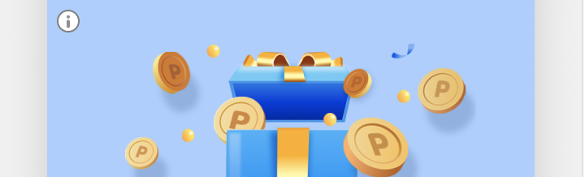
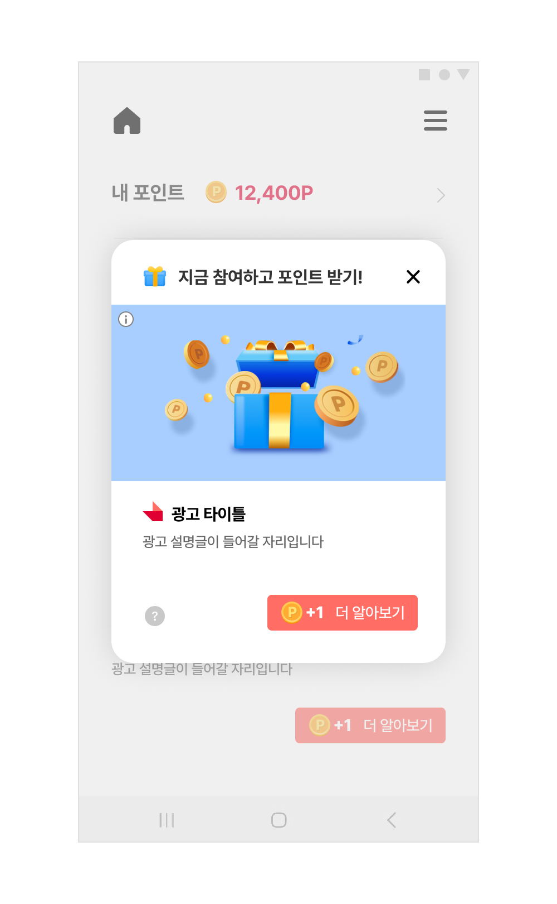
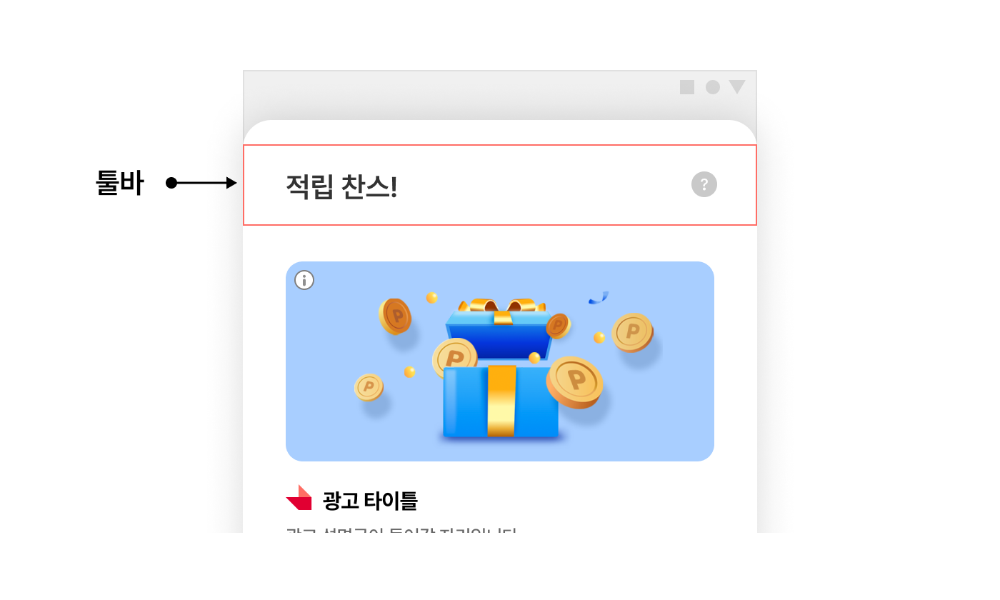
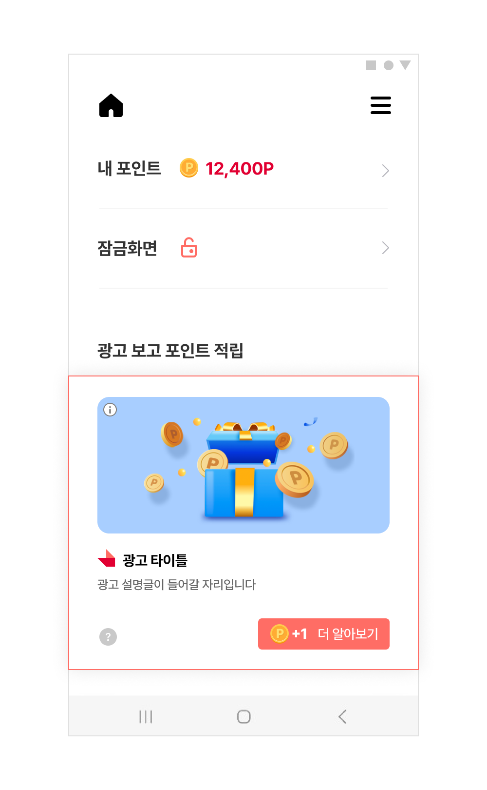

# 12. 맞춤형광고와문의하기

> [!NOTE]
> <strong>맞춤형 광고 고지(AdInfoView)</strong>와 **유저 문의하기** 기능을 다룹니다. 광고 소재에 맞춤형 광고임을 알리는 고지 UI를 추가하는 방법과, 사용자가 광고 관련 문의를 남길 수 있는 문의하기 버튼을 지면별로 적용하는 방법을 안내합니다.<br>이 문서를 참고하면 AdInfoView 연동, Interstitial·Native·Feed 지면별 문의하기 버튼 적용 방법을 확인할 수 있습니다.

## 개요

이 문서는 Planet AD SDK에서 제공하는 맞춤형 광고 고지에 관한 기능과, VOC지원을 위한 문의하기 기능에 대해 설명합니다.

## 맞춤형 광고를 위한 고지 추가하기

Planet AD는 개인별 맞춤형 광고를 제공하며, 그에 해당하는 사항을 필수적으로 사용자에게 고지해야합니다.

이러한 맞춤형 광고 고지를 위해 미리 만들어진 UI를 제공하고 있으며, 해당 UI로 진입하기 위한 방법은 아래와 같습니다.



### AdInfoView 추가하기

- SDK에서는 AdInfoView를 제공하며, APP에서는 해당 View를 광고 영역에 추가함으로서 맞춤형 광고에 대한 고지 기능을 제공할 수 있습니다.

**맞춤형 광고 Layout**

```xml
<com.skplanet.skpad.benefit.presentation.nativead.NativeAdView
    android:id="@+id/native_ad_view"
    ...생략... >
     
    // AdInfoView 는 NativeAdView의 하위 컴포넌트로 구현해야합니다.
    <com.skplanet.skpad.benefit.presentation.guide.AdInfoView
        android:id="@+id/information"
        ...생략... />
 
    ...생략...
</com.skplanet.skpad.benefit.presentation.nativead.NativeAdView>
```

**맞춤형광고 Sample code**

```java
public void populateAd(final NativeAd nativeAd) {
    final NativeAdView view = findViewById(R.id.your_native_ad_view);
 
    final Ad ad = nativeAd.getAd();
 
    final MediaView mediaView = view.findViewById(R.id.mediaView);
    final TextView titleTextView = view.findViewById(R.id.textTitle);
    final ImageView iconView = view.findViewById(R.id.imageIcon);
    final TextView descriptionTextView = view.findViewById(R.id.textDescription);
    final CtaView ctaView = view.findViewById(R.id.ctaView);
    final AdInfoView adInfoView = interstitialView.findViewById(R.id.information);
    final InquiryView inquiryView = interstitialView.findViewById(R.id.inquiryButton);

    final CtaPresenter ctaPresenter = new CtaPresenter(ctaView); // CtaView should not be null
    ctaPresenter.bind(nativeAd);
 

    ...생략...
    // NativeAdView에 AdInfoView를 설정해주어야 합니다.
    view.setAdInfoView(adInfoView);

    view.setMediaView(mediaView);
    view.setClickableViews(clickableViews);
    view.setNativeAd(nativeAd);
    ...생략...

}
```

## 유저 문의하기 사용하기

종종 리워드 미적립을 이유로 유저가 문의(VOC)를 보내기도 합니다.

이러한 유저 VOC에 대한 접수 및 처리를 자동화 하기 위해 SDK에서는 미리 만들어 놓은 웹 페이지를 제공하고 있습니다.

이 문의하기 페이지는 연동되어 있는 앱을 기준으로 조회하기 때문에, 유닛별로 구현할 필요가 없으며, VOC의 위치를 강제하지 않습니다.

아래의 단계를 통해 해당 기능을 사용하실 수 있습니다.

1. VOC 페이지 로드를 위한 유저 진입 Icon/ Tab을 디자인 합니다.
2. 1번의 Icon/Tab이 클릭될 때 코드에서 `SKPAdBenefit.getInstance().showInquiryPage()` 호출합니다.

### 문의하기 추가

#### Interstitial 타입에 추가하기

`InterstitialAdConfig`에 `showInquiryButton(true)` 설정하여 활성화가 가능합니다.

**Interstitial 지면 문의하기**

```java
InterstitialAdConfig config = new InterstitialAdConfig.Builder()
                .showInquiryButton(true)    // 문의하기 버튼 활성화
                                            // 단, 만14세 이상인 경우에만 VOC(문의하기) 기능을 노출해야합니다.
                .build();
```

<kbd></kbd>

#### Feed 타입에 추가하기

`FeedConfig`에 `showInquiryButton(true)` 설정하여 활성화가 가능합니다.

- 기본값이 True이며, 해당 API는 Default Toolbar를 사용 시에만 적용됩니다.
- false로 설정시 문의하기 버튼이 표시되지 않습니다.
- 해당 API는 Planet AD SDK v1.7.3부터 지원됩니다.

**Feed 지면 문의하기**

```java
FeedConfig builder = new FeedConfig.Builder(context, Constants.FEED_UNIT_ID)
                .showInquiryButton(true);   // 문의하기 버튼 활성화
                                            // 단, 만14세 이상인 경우에만 VOC(문의하기) 기능을 노출해야합니다.
                .build();
```

<kbd></kbd>

#### Native 타입에 추가하기

Native Type일 경우에는, 문의하기를 위해 제공되는 View를 사용하실 수 있습니다.



**Native 지면 문의하기**

```xml
<com.skplanet.skpad.benefit.presentation.nativead.NativeAdView
    android:id="@+id/native_ad_view"
    ...생략... >
     
    // InquiryView 는 NativeAdView의 하위 컴포넌트로 구현해야합니다.
   
    <com.skplanet.skpad.benefit.presentation.guide.InquiryView
        android:id="@+id/inquiryButton"
        ...생략... />
 
    ...생략...
</com.skplanet.skpad.benefit.presentation.nativead.NativeAdView>
```

**Native 지면 문의하기**

```java
public void populateAd(final NativeAd nativeAd) {
    final NativeAdView view = findViewById(R.id.your_native_ad_view);
 
    final Ad ad = nativeAd.getAd();
 
    final MediaView mediaView = view.findViewById(R.id.mediaView);
    final TextView titleTextView = view.findViewById(R.id.textTitle);
    final ImageView iconView = view.findViewById(R.id.imageIcon);
    final TextView descriptionTextView = view.findViewById(R.id.textDescription);
    final CtaView ctaView = view.findViewById(R.id.ctaView);
    final AdInfoView adInfoView = interstitialView.findViewById(R.id.information);
    final InquiryView inquiryView = interstitialView.findViewById(R.id.inquiryButton);

    final CtaPresenter ctaPresenter = new CtaPresenter(ctaView); // CtaView should not be null
    ctaPresenter.bind(nativeAd);
 

    ...생략...
    // NativeAdView에 InquiryView를 설정해주어야 합니다.
    view.setInquiryView(inquiryView);

    // 만 14세 이상인 경우에만 VOC(문의하기) 기능을 노출해야합니다.
    view.setVisibility(Constants.OLDER_14YEAR ? View.VISIBLE : View.INVISIBLE);

    view.setMediaView(mediaView);
    view.setClickableViews(clickableViews);
    view.setNativeAd(nativeAd);
    ...생략...

}
```

### 문의하기 기능 주의사항

Planet AD는 만 14세 미만 아동에게 (맞춤형) 리워드 광고를 송출하지 않습니다.

따라서, APP에서는 만 14세 미만의 고객에게는 Planet AD SDK에서 제공하는 VOC(문의하기) 기능을 제공해서는 안됩니다.

혹 제공 중일 경우, 앱에서는 고객이 만 14세 미만일 경우 Planet AD의 VOC(문의하기)로 진입할 수 있는 기능을 비활성화 혹은 숨김처리되어야 합니다.
